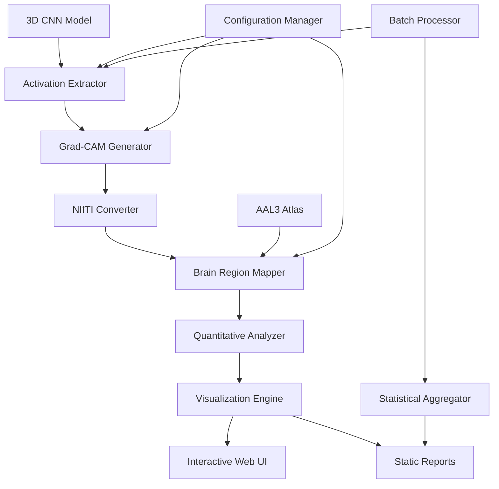
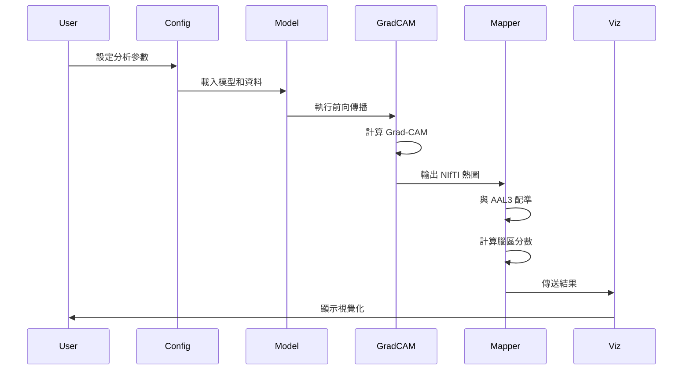

# 設計文件

## 概述

本設計文件描述如何為 3D CNN 模型建立完整的可解釋性分析系統，將模型的 activation maps 映射到具體腦區，並提供多種視覺化方式。系統將整合現有的 Grad-CAM 功能，並擴展腦區映射、互動式視覺化和批次處理能力。

設計目標：
- 重用現有的 `app/core/cnn_3d/xai.py` 中的 Grad-CAM 實作
- 整合 AAL3 腦區圖譜進行腦區識別
- 提供類似 Streamlit 的互動式介面
- 支援批次處理和統計分析
- 確保所有輸出可重現

## 架構

### 系統架構圖



### 資料流程



## 元件與介面

### 1. Activation Extractor (新增)

**職責**: 從 3D CNN 模型的指定層擷取 activation 和 gradient

**介面**:
```python
class ActivationExtractor:
    def __init__(self, model: nn.Module, target_layers: List[str]):
        """
        Args:
            model: 3D CNN 模型實例
            target_layers: 要擷取的層名稱列表，如 ['block4']
        """
        
    def register_hooks(self) -> None:
        """註冊 forward 和 backward hooks"""
        
    def extract(self, input_tensor: torch.Tensor, target_class: int) -> Dict[str, Dict]:
        """
        執行前向和反向傳播，擷取 activations 和 gradients
        
        Returns:
            {
                'layer_name': {
                    'activation': torch.Tensor,
                    'gradient': torch.Tensor
                }
            }
        """
        
    def save_to_disk(self, data: Dict, output_path: str) -> None:
        """儲存為 .pt 檔案"""
```

**實作細節**:
- 使用 PyTorch hooks 機制
- 支援多層同時擷取
- 自動處理 gradient 計算
- 包含 metadata (subject_id, layer_name, shape)

### 2. Grad-CAM Generator (重構現有)

**職責**: 基於 activation 和 gradient 生成 Grad-CAM 熱圖

**現有實作**: `app/core/cnn_3d/xai.py` 中的 `main()` 函式

**重構建議**:
```python
class GradCAMGenerator:
    def __init__(self, models: List[nn.Module], device: torch.device):
        """
        Args:
            models: 集成模型列表 (5-fold)
            device: 計算裝置
        """
        
    def generate_single_model(
        self, 
        model: nn.Module, 
        input_tensor: torch.Tensor,
        target_layer: nn.Module,
        target_class: int
    ) -> np.ndarray:
        """為單一模型生成 Grad-CAM"""
        
    def generate_ensemble(
        self,
        input_tensor: torch.Tensor,
        target_class: int,
        threshold_percentile: float = 95.0
    ) -> np.ndarray:
        """
        生成集成 Grad-CAM (平均 5 個模型)
        
        Returns:
            3D numpy array, shape (128, 128, 128)
        """
        
    def save_as_nifti(
        self,
        heatmap: np.ndarray,
        affine: np.ndarray,
        output_path: str
    ) -> None:
        """儲存為 NIfTI 格式"""
```

**改進點**:
- 將 `main()` 函式拆分為類別方法
- 分離單一模型和集成邏輯
- 提供更靈活的閾值控制
- 支援不同的聚合方法 (mean, max, weighted)

### 3. Brain Region Mapper (新增)

**職責**: 將 Grad-CAM 熱圖映射到 AAL3 腦區

**介面**:
```python
class BrainRegionMapper:
    def __init__(self, atlas_path: str = "data/aal3/AAL3v1_1mm.nii.gz"):
        """
        Args:
            atlas_path: AAL3 圖譜 NIfTI 檔案路徑
        """
        
    def load_atlas(self) -> Tuple[np.ndarray, Dict[int, str]]:
        """
        載入 AAL3 圖譜
        
        Returns:
            atlas_data: 3D array with region labels
            region_names: {label_id: region_name}
        """
        
    def register_to_atlas(
        self,
        heatmap_path: str,
        atlas_space: bool = True
    ) -> np.ndarray:
        """
        將熱圖配準到圖譜空間
        
        Args:
            heatmap_path: Grad-CAM NIfTI 路徑
            atlas_space: 是否已在圖譜空間 (1mm MNI152)
            
        Returns:
            Registered heatmap in atlas space
        """
        
    def compute_region_scores(
        self,
        heatmap: np.ndarray,
        atlas: np.ndarray,
        method: str = 'mean'
    ) -> pd.DataFrame:
        """
        計算每個腦區的激活分數
        
        Args:
            method: 'mean', 'max', 'weighted_mean'
            
        Returns:
            DataFrame with columns: [region_id, region_name, score, voxel_count]
        """
        
    def export_results(
        self,
        scores: pd.DataFrame,
        output_dir: str,
        subject_id: str
    ) -> None:
        """匯出為 CSV 和 JSON"""
```

**實作細節**:
- 使用 `nilearn` 進行影像配準
- 從 `AAL3v1_1mm.xml` 解析腦區名稱
- 支援多種聚合方法
- 處理部分體積效應 (partial volume)

### 4. Quantitative Analyzer (新增)

**職責**: 提供統計分析和排序功能

**介面**:
```python
class QuantitativeAnalyzer:
    def rank_regions(
        self,
        scores: pd.DataFrame,
        top_k: int = 20
    ) -> pd.DataFrame:
        """返回 top-K 重要腦區"""
        
    def compute_statistics(
        self,
        scores_list: List[pd.DataFrame]
    ) -> pd.DataFrame:
        """
        計算群組統計 (多個受試者)
        
        Returns:
            DataFrame with mean, std, confidence intervals per region
        """
        
    def compare_groups(
        self,
        ad_scores: List[pd.DataFrame],
        nc_scores: List[pd.DataFrame]
    ) -> pd.DataFrame:
        """比較 AD vs NC 的腦區激活差異"""
        
    def generate_summary_report(
        self,
        scores: pd.DataFrame,
        output_path: str
    ) -> None:
        """生成文字摘要報告"""
```

### 5. Visualization Engine (新增)

**職責**: 提供多種視覺化方式

**介面**:
```python
class VisualizationEngine:
    def plot_brain_slices(
        self,
        background_img: str,
        heatmap_img: str,
        output_path: str,
        cut_coords: Optional[Tuple] = None
    ) -> None:
        """使用 nilearn 繪製腦切片"""
        
    def plot_glass_brain(
        self,
        heatmap_img: str,
        output_path: str,
        threshold: float = 0.5
    ) -> None:
        """繪製玻璃腦視圖"""
        
    def plot_region_bar_chart(
        self,
        scores: pd.DataFrame,
        top_k: int = 20,
        output_path: str
    ) -> None:
        """繪製腦區重要性長條圖"""
        
    def create_interactive_viewer(
        self,
        background_img: str,
        heatmap_img: str,
        scores: pd.DataFrame
    ) -> str:
        """
        建立互動式 HTML 視圖
        
        Returns:
            HTML 檔案路徑
        """
```

**技術選擇**:
- `nilearn.plotting` 用於靜態腦影像視覺化
- `plotly` 用於互動式圖表
- `ipywidgets` 或 `panel` 用於互動式控制 (可選)

### 6. Interactive Web UI (新增)

**職責**: 提供類似現有 Streamlit 的使用者介面

**架構**:
```python
# app/ui/xai_viewer.py
import streamlit as st

def main():
    st.title("3D CNN Brain Region Visualization")
    
    # Sidebar: 配置
    with st.sidebar:
        subject_id = st.text_input("Subject ID")
        nifti_path = st.file_uploader("Upload NIfTI")
        target_class = st.selectbox("Target Class", ["AD", "NC"])
        threshold = st.slider("Threshold Percentile", 90, 99, 95)
        
        if st.button("Run Analysis"):
            run_analysis(...)
    
    # Main area: 結果顯示
    col1, col2 = st.columns(2)
    
    with col1:
        st.subheader("Grad-CAM Heatmap")
        # 顯示腦切片
        
    with col2:
        st.subheader("Top Brain Regions")
        # 顯示長條圖
        
    # 互動式 3D 視圖
    st.subheader("Interactive 3D Viewer")
    # 嵌入 plotly 或 nilearn HTML
    
    # 腦區詳細資訊
    st.subheader("Region Details")
    # 顯示 DataFrame
```

**功能**:
- 檔案上傳和參數設定
- 即時進度顯示
- 多視圖切換 (切片、玻璃腦、3D)
- 可下載結果 (CSV, PNG, NIfTI)

### 7. Batch Processor (新增)

**職責**: 批次處理多個受試者

**介面**:
```python
class BatchProcessor:
    def __init__(self, config: Dict):
        """
        Args:
            config: 包含模型路徑、輸出目錄等
        """
        
    def process_directory(
        self,
        input_dir: str,
        output_dir: str,
        target_class: str
    ) -> Dict[str, bool]:
        """
        批次處理資料夾中的所有 NIfTI 檔案
        
        Returns:
            {subject_id: success_status}
        """
        
    def generate_group_report(
        self,
        results_dir: str,
        output_path: str
    ) -> None:
        """生成群組層級的統計報告"""
```

### 8. Configuration Manager (新增)

**職責**: 管理所有配置參數

**配置檔案格式** (`config/xai_config.yaml`):
```yaml
# Model Configuration
model:
  architecture: "Simple3DCNN_InstanceNorm"
  weights_dir: "model/cnn_3d"
  num_folds: 5
  device: "cuda:0"

# Data Processing
data:
  patch_size: [128, 128, 128]
  target_voxel_size: [1.0, 1.0, 1.0]
  intensity_range: [0.0, 1000.0]

# Grad-CAM Settings
gradcam:
  target_layer: "block4"
  threshold_percentile: 95.0
  aggregation_method: "mean"  # mean, max, weighted

# Brain Atlas
atlas:
  name: "AAL3"
  path: "data/aal3/AAL3v1_1mm.nii.gz"
  labels_path: "data/aal3/AAL3v1_1mm.xml"

# Visualization
visualization:
  colormap: "hot"
  alpha: 0.7
  cut_coords: null  # auto
  display_mode: "ortho"

# Output
output:
  base_dir: "output/cnn_3d/xai_analysis"
  save_nifti: true
  save_csv: true
  save_plots: true
  save_html: true

# Batch Processing
batch:
  max_workers: 4
  continue_on_error: true
```

**介面**:
```python
class ConfigManager:
    def __init__(self, config_path: str):
        """載入 YAML 配置"""
        
    def validate(self) -> bool:
        """驗證配置有效性"""
        
    def get(self, key: str, default: Any = None) -> Any:
        """取得配置值"""
        
    def save_to_output(self, output_dir: str) -> None:
        """將配置複製到輸出目錄"""
```

## 資料模型

### Grad-CAM 輸出格式

**NIfTI 檔案**:
- 檔名: `{subject_id}_gradcam_ensemble_{class}.nii.gz`
- Shape: (128, 128, 128) 或原始影像大小
- Affine: 與原始 NIfTI 相同
- 數值範圍: [0, 1] (標準化後)

**Metadata JSON**:
```json
{
  "subject_id": "sub-01",
  "target_class": "AD",
  "target_class_idx": 1,
  "model_architecture": "Simple3DCNN_InstanceNorm",
  "num_models": 5,
  "target_layer": "block4",
  "threshold_percentile": 95.0,
  "processing_date": "2025-11-07T10:30:00",
  "config_hash": "a1b2c3d4"
}
```

### 腦區分數格式

**CSV 格式** (`{subject_id}_brain_regions.csv`):
```csv
region_id,region_name,mean_activation,max_activation,voxel_count,percentage
2001,Precentral_L,0.856,0.982,1234,2.5
2002,Precentral_R,0.823,0.971,1198,2.4
...
```

**JSON 格式** (`{subject_id}_brain_regions.json`):
```json
{
  "subject_id": "sub-01",
  "target_class": "AD",
  "top_regions": [
    {
      "rank": 1,
      "region_id": 2001,
      "region_name": "Precentral_L",
      "hemisphere": "Left",
      "mean_activation": 0.856,
      "max_activation": 0.982,
      "voxel_count": 1234,
      "percentage": 2.5
    }
  ],
  "statistics": {
    "total_activated_voxels": 49876,
    "num_regions_activated": 54,
    "mean_activation_all": 0.234
  }
}
```

## 錯誤處理

### 錯誤類型與處理策略

1. **檔案不存在**
   - 檢查: 模型權重、NIfTI 輸入、圖譜檔案
   - 處理: 提供清楚的錯誤訊息，建議正確路徑

2. **記憶體不足**
   - 檢查: GPU/CPU 記憶體使用
   - 處理: 降低 batch size，使用 CPU fallback

3. **影像配準失敗**
   - 檢查: Affine 矩陣有效性，影像尺寸
   - 處理: 記錄警告，使用最近鄰插值

4. **模型載入失敗**
   - 檢查: 權重檔案完整性，架構匹配
   - 處理: 驗證 state_dict keys

5. **批次處理中斷**
   - 檢查: 個別檔案錯誤
   - 處理: 記錄失敗檔案，繼續處理其他

### 日誌系統

```python
import logging

# 配置日誌
logging.basicConfig(
    level=logging.INFO,
    format='%(asctime)s - %(name)s - %(levelname)s - %(message)s',
    handlers=[
        logging.FileHandler('output/xai_analysis.log'),
        logging.StreamHandler()
    ]
)

logger = logging.getLogger('xai_pipeline')
```

## 測試策略

### 單元測試

**測試範圍**:
1. `ActivationExtractor`: Hook 註冊、資料擷取
2. `GradCAMGenerator`: 熱圖計算、標準化
3. `BrainRegionMapper`: 圖譜載入、配準、分數計算
4. `QuantitativeAnalyzer`: 統計計算、排序
5. `ConfigManager`: 配置載入、驗證

**測試檔案結構**:
```
tests/
├── test_activation_extractor.py
├── test_gradcam_generator.py
├── test_brain_region_mapper.py
├── test_quantitative_analyzer.py
├── test_config_manager.py
└── fixtures/
    ├── mock_model.pth
    ├── mock_nifti.nii.gz
    └── mock_config.yaml
```

### 整合測試

**測試場景**:
1. 端到端流程: NIfTI 輸入 → 腦區分數輸出
2. 批次處理: 多個受試者
3. 視覺化生成: 所有圖表類型
4. 配置變更: 不同參數組合

### 驗證測試

**驗證方法**:
1. **視覺檢查**: 熱圖是否合理覆蓋腦區
2. **數值驗證**: 分數總和、範圍檢查
3. **空間對齊**: 熱圖與圖譜是否對齊
4. **可重現性**: 相同輸入產生相同輸出

## 效能考量

### 最佳化策略

1. **記憶體管理**
   - 使用 `torch.no_grad()` 在推論時
   - 及時釋放不需要的 tensors
   - 批次處理時限制並行數量

2. **計算效率**
   - GPU 加速 Grad-CAM 計算
   - 快取圖譜資料 (只載入一次)
   - 使用 `multiprocessing` 進行批次處理

3. **I/O 最佳化**
   - 使用 `nibabel` 的 lazy loading
   - 壓縮輸出 NIfTI (`.nii.gz`)
   - 非同步寫入檔案

### 效能指標

**目標**:
- 單一受試者分析: < 30 秒 (GPU)
- 批次處理 (10 受試者): < 5 分鐘
- 記憶體使用: < 8GB (GPU), < 16GB (RAM)

## 部署考量

### 環境需求

**必要套件** (新增到 `requirements.txt`):
```
nilearn>=0.11.1
nibabel>=5.3.2
pandas>=2.0.0
plotly>=6.3.0
pyyaml>=6.0
scikit-image>=0.25.2
```

### 目錄結構

```
output/cnn_3d/xai_analysis/
├── {subject_id}/
│   ├── gradcam_heatmap.nii.gz
│   ├── brain_regions.csv
│   ├── brain_regions.json
│   ├── metadata.json
│   ├── config.yaml
│   └── visualizations/
│       ├── slices.png
│       ├── glass_brain.png
│       ├── region_bar_chart.png
│       └── interactive_viewer.html
└── group_analysis/
    ├── group_statistics.csv
    ├── ad_vs_nc_comparison.csv
    └── group_report.html
```

### 整合到現有系統

**與 LangGraph 整合**:
- 新增 `XAIAnalysisNode` 到 workflow
- 在 `PostprocessingNode` 之後執行
- 將腦區資訊傳遞給 `EntityLinkingNode`

**與 Streamlit 整合**:
- 在現有 `app.py` 新增 "XAI Analysis" 頁面
- 重用現有的進度條和狀態管理
- 整合到側邊欄的模型選擇

## 設計決策與理由

### 1. 為什麼使用 AAL3 圖譜？

**理由**:
- 已存在於專案中 (`data/aal3/`)
- 廣泛使用於阿茲海默症研究
- 提供細緻的腦區劃分 (170 個區域)
- 有標準的 MNI152 空間

**替代方案**: Harvard-Oxford, Desikan-Killiany (未來可擴展)

### 2. 為什麼重構現有 XAI 程式碼？

**理由**:
- 現有 `xai.py` 是單一腳本，難以測試和擴展
- 需要支援多種使用場景 (單一、批次、互動)
- 類別化設計提供更好的可維護性

**保留內容**: 核心 Grad-CAM 計算邏輯、集成平均方法

### 3. 為什麼選擇 Streamlit 而非 FastAPI？

**理由**:
- 專案已使用 Streamlit (`app.py`)
- 研究工具優先考慮快速原型和視覺化
- 不需要 RESTful API (內部使用)

**未來擴展**: 可以同時提供 API 端點

### 4. 為什麼使用 YAML 配置而非 .env？

**理由**:
- 支援巢狀結構和複雜配置
- 更易於版本控制和分享
- 可以包含註解說明

**保留 .env**: 敏感資訊 (API keys) 仍使用 .env

## 未來擴展

### Phase 2 功能 (本次不實作)

1. **多圖譜支援**
   - Harvard-Oxford Atlas
   - Desikan-Killiany Atlas
   - 自訂 ROI

2. **進階視覺化**
   - 3D 表面渲染
   - 動畫展示 (不同層的激活)
   - VR/AR 支援

3. **統計分析**
   - 群組比較 (AD vs NC)
   - 相關性分析 (激活 vs 認知分數)
   - 機器學習特徵重要性

4. **整合到 LangGraph**
   - 自動化腦區解釋生成
   - 與知識圖譜連結
   - 納入臨床報告

5. **效能最佳化**
   - 分散式處理 (多 GPU)
   - 模型量化
   - 快取機制

### 技術債務

1. 現有 `xai.py` 的硬編碼參數需要移到配置
2. 缺少完整的錯誤處理和日誌
3. 沒有自動化測試
4. 文件不完整

這些將在實作過程中逐步解決。
