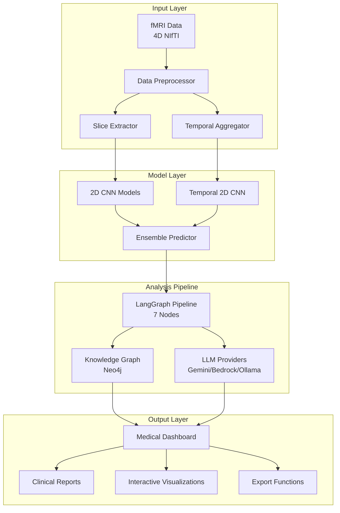
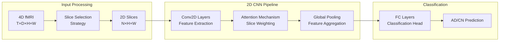
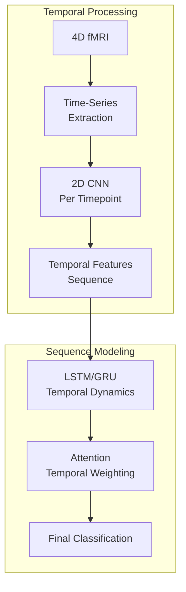
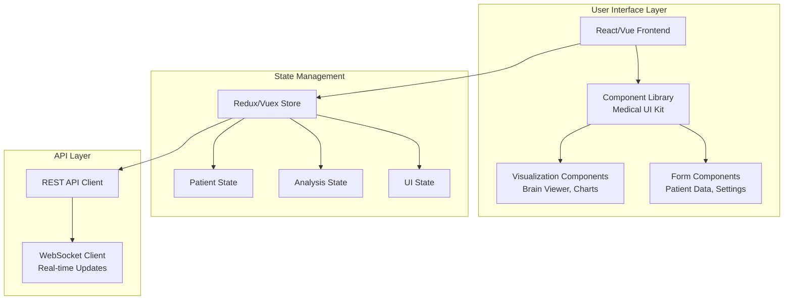
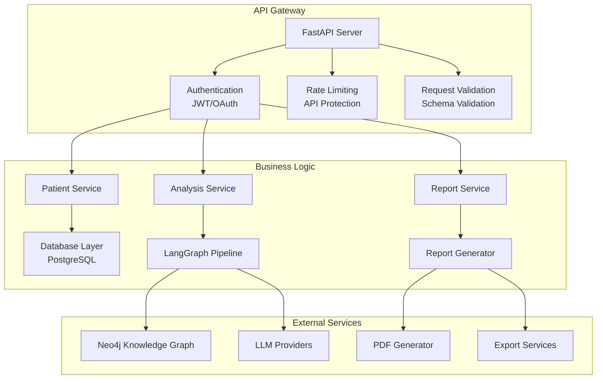

# Design Document

## Overview

This design document outlines the comprehensive migration strategy from 3DCNN to 2DCNN models in the Cognivex system, along with the development of a medical-grade dashboard interface. The design focuses on maintaining clinical accuracy while improving computational efficiency and user experience for medical professionals.

## Architecture

### System Architecture Overview



### 2DCNN Model Architecture Design

#### Slice-Based 2DCNN Architecture



#### Temporal-Aware 2DCNN Architecture



### Medical Dashboard Architecture

#### Frontend Architecture



#### Backend Architecture



## Components and Interfaces

### 2DCNN Model Components

#### 1. Enhanced MCADNNet (Primary 2DCNN Model)

```python
class Enhanced2DCNN(nn.Module):
    """
    Enhanced 2D CNN model with attention mechanism and multi-scale feature extraction
    """
    def __init__(self, num_classes=2, input_channels=1, dropout_p=0.3):
        # Multi-scale convolutional blocks
        # Spatial attention mechanism
        # Feature pyramid network
        # Classification head with uncertainty estimation
```

#### 2. Temporal-Aware 2DCNN

```python
class Temporal2DCNN(nn.Module):
    """
    2D CNN with temporal modeling for time-series fMRI analysis
    """
    def __init__(self, sequence_length=100, num_classes=2):
        # 2D CNN feature extractor
        # LSTM/GRU temporal modeling
        # Temporal attention mechanism
        # Multi-task learning head
```

#### 3. Slice Selection Strategy

```python
class SliceSelector:
    """
    Intelligent slice selection for optimal 2D representation
    """
    def select_slices(self, fmri_volume, strategy='entropy_based'):
        # Entropy-based selection
        # Anatomical landmark-based selection
        # Learned selection via reinforcement learning
        # Multi-plane selection (axial, coronal, sagittal)
```

### Medical Dashboard Components

#### 1. Patient Management Interface

```typescript
interface PatientDashboard {
  patientInfo: PatientInfo;
  scanHistory: ScanRecord[];
  currentAnalysis: AnalysisResult;
  
  // Methods
  loadPatient(patientId: string): Promise<PatientInfo>;
  startAnalysis(scanPath: string): Promise<AnalysisJob>;
  exportReport(format: 'pdf' | 'json' | 'dicom'): Promise<Blob>;
}
```

#### 2. Brain Visualization Component

```typescript
interface BrainViewer {
  anatomicalTemplate: NiftiVolume;
  activationOverlay: ActivationMap;
  viewMode: '2d' | '3d' | 'glass_brain';
  
  // Interactive controls
  setSlicePosition(axis: 'x' | 'y' | 'z', position: number): void;
  toggleRegion(regionId: string): void;
  adjustThreshold(min: number, max: number): void;
  exportVisualization(format: 'png' | 'svg' | 'interactive'): Promise<Blob>;
}
```

#### 3. Analysis Results Interface

```typescript
interface AnalysisResults {
  classification: {
    prediction: 'AD' | 'CN';
    confidence: number;
    uncertainty: number;
  };
  
  activatedRegions: BrainRegion[];
  temporalPatterns: TimeSeriesData[];
  comparativeAnalysis: ComparisonResult;
  
  // Clinical insights
  clinicalSignificance: ClinicalInsight[];
  recommendations: ClinicalRecommendation[];
}
```

### Data Processing Pipeline

#### 1. fMRI Data Preprocessor

```python
class fMRIPreprocessor:
    """
    Preprocessing pipeline for 2DCNN-compatible data preparation
    """
    def __init__(self):
        self.slice_extractors = {
            'axial': AxialSliceExtractor(),
            'coronal': CoronalSliceExtractor(),
            'sagittal': SagittalSliceExtractor(),
            'multi_plane': MultiPlaneExtractor()
        }
    
    def preprocess_for_2dcnn(self, fmri_path: str, strategy: str = 'multi_plane'):
        # Load 4D fMRI data
        # Apply preprocessing (normalization, denoising)
        # Extract 2D slices based on strategy
        # Generate temporal features if needed
        # Return preprocessed data for 2DCNN input
```

#### 2. Model Integration Layer

```python
class ModelManager:
    """
    Manages both 2DCNN and legacy 3DCNN models
    """
    def __init__(self):
        self.models = {
            '2dcnn_enhanced': Enhanced2DCNN(),
            '2dcnn_temporal': Temporal2DCNN(),
            'legacy_capsnet': CapsNetRNN(),  # For comparison
            'legacy_mcadnnet': MCADNNet()    # For comparison
        }
    
    def predict(self, data, model_name: str = '2dcnn_enhanced'):
        # Route to appropriate model
        # Handle different input formats
        # Return standardized prediction format
```

## Data Models

### Enhanced AgentState for 2DCNN Support

```python
class Enhanced2DCNNState(AgentState):
    """
    Extended state management for 2DCNN pipeline
    """
    # Additional fields for 2DCNN support
    slice_selection_strategy: Optional[str]
    selected_slices: Optional[List[Dict]]
    temporal_features: Optional[Dict]
    model_comparison_results: Optional[Dict]
    
    # Dashboard-specific fields
    dashboard_config: Optional[Dict]
    visualization_settings: Optional[Dict]
    export_preferences: Optional[Dict]
```

### Medical Dashboard Data Models

```python
class PatientRecord:
    """
    Comprehensive patient data model
    """
    patient_id: str
    demographics: PatientDemographics
    medical_history: MedicalHistory
    scan_sessions: List[ScanSession]
    analysis_results: List[AnalysisResult]

class ScanSession:
    """
    Individual fMRI scan session data
    """
    session_id: str
    scan_date: datetime
    scan_parameters: ScanParameters
    data_quality_metrics: QualityMetrics
    preprocessing_log: List[ProcessingStep]

class AnalysisResult:
    """
    Comprehensive analysis results
    """
    analysis_id: str
    model_used: str
    classification_result: ClassificationResult
    activation_maps: List[ActivationMap]
    statistical_analysis: StatisticalResults
    clinical_interpretation: ClinicalInterpretation
```

## Error Handling

### Model Migration Error Handling

```python
class ModelMigrationHandler:
    """
    Handles errors during 3DCNN to 2DCNN migration
    """
    def handle_dimension_mismatch(self, error: DimensionError):
        # Automatic data reshaping
        # Fallback to compatible preprocessing
        # Log migration issues
    
    def handle_performance_degradation(self, metrics: PerformanceMetrics):
        # Alert if accuracy drops significantly
        # Suggest model retraining
        # Provide comparison reports
```

### Dashboard Error Handling

```python
class DashboardErrorHandler:
    """
    Comprehensive error handling for medical dashboard
    """
    def handle_visualization_error(self, error: VisualizationError):
        # Fallback to alternative visualization
        # Provide error context to user
        # Log for debugging
    
    def handle_data_loading_error(self, error: DataError):
        # Retry with exponential backoff
        # Provide progress feedback
        # Graceful degradation
```

## Testing Strategy

### Model Testing Framework

#### 1. Performance Validation Tests

```python
class ModelPerformanceTests:
    """
    Comprehensive testing for 2DCNN vs 3DCNN performance
    """
    def test_classification_accuracy(self):
        # Compare accuracy between 2DCNN and 3DCNN
        # Statistical significance testing
        # Cross-validation results
    
    def test_computational_efficiency(self):
        # Memory usage comparison
        # Inference time benchmarks
        # GPU utilization metrics
    
    def test_activation_map_consistency(self):
        # Compare activation patterns
        # Spatial correlation analysis
        # Clinical relevance validation
```

#### 2. Integration Testing

```python
class PipelineIntegrationTests:
    """
    End-to-end testing for LangGraph pipeline with 2DCNN
    """
    def test_full_pipeline_2dcnn(self):
        # Test complete workflow with 2DCNN models
        # Validate state transitions
        # Check output consistency
    
    def test_model_switching(self):
        # Test dynamic model selection
        # Validate configuration changes
        # Check backward compatibility
```

### Dashboard Testing Framework

#### 1. User Interface Testing

```javascript
describe('Medical Dashboard UI Tests', () => {
  test('Patient data loading and display', async () => {
    // Test patient information rendering
    // Validate data accuracy
    // Check responsive design
  });
  
  test('Brain visualization interactions', async () => {
    // Test 3D viewer controls
    // Validate slice navigation
    // Check overlay rendering
  });
  
  test('Report generation and export', async () => {
    // Test PDF generation
    // Validate export formats
    // Check data integrity
  });
});
```

#### 2. Clinical Workflow Testing

```python
class ClinicalWorkflowTests:
    """
    Testing clinical workflow integration
    """
    def test_batch_analysis_workflow(self):
        # Test multiple patient processing
        # Validate queue management
        # Check resource allocation
    
    def test_real_time_analysis_updates(self):
        # Test WebSocket connections
        # Validate progress updates
        # Check error propagation
```

### Performance Benchmarking

#### 1. Model Performance Metrics

```python
class PerformanceBenchmark:
    """
    Comprehensive performance benchmarking
    """
    def benchmark_inference_speed(self):
        # Measure inference time for different batch sizes
        # Compare 2DCNN vs 3DCNN performance
        # Generate performance reports
    
    def benchmark_memory_usage(self):
        # Monitor GPU memory consumption
        # Track CPU memory usage
        # Identify memory bottlenecks
    
    def benchmark_accuracy_metrics(self):
        # Calculate sensitivity, specificity
        # ROC curve analysis
        # Cross-validation performance
```

#### 2. Dashboard Performance Metrics

```javascript
class DashboardPerformanceMonitor {
  measurePageLoadTime() {
    // Track initial page load
    // Monitor component rendering time
    // Measure data fetching latency
  }
  
  measureVisualizationPerformance() {
    // Track 3D rendering performance
    // Monitor interaction responsiveness
    // Measure memory usage in browser
  }
}
```

This comprehensive design provides a robust foundation for migrating from 3DCNN to 2DCNN while developing a medical-grade dashboard that meets clinical requirements for Alzheimer's disease fMRI analysis.