# Agent.md

This document provides comprehensive guidance for AI assistants working with the **Neuro-Compass** (semantic-KG) project - an explainable AI agent framework for fMRI-based Alzheimer's Disease classification.

## 🎯 Project Overview

**Neuro-Compass** is a cutting-edge explainable AI system that transforms fMRI neuroimaging data into clinically relevant, interpretable reports for Alzheimer's Disease diagnosis. The system solves the "black box" problem in medical AI by combining deep learning models with knowledge graph reasoning.

### Core Architecture
- **LangGraph Workflow System**: Built on LangChain's LangGraph for state-based pipeline orchestration
- **7-Node Sequential Pipeline**: Inference → Filtering → Post-processing → Entity Linking → Knowledge Reasoning → Image Explanation → Report Generation
- **Knowledge Integration**: Neo4j graph database with semantic medical knowledge
- **Deep Learning**: CapsNet-RNN and MCADNNet models for AD classification
- **State Management**: Comprehensive AgentState tracking all intermediate and final results

## 📁 Project Structure

```
semantic-KG/
├── agents/                    # Legacy Google ADK system (dual architecture support)
│   ├── agent.py              # Root SequentialAgent (fMRIAlzheimerPipeline)
│   └── sub_agents/           # Individual pipeline stages
├── app/                      # NEW: LangGraph-based analysis pipeline
│   ├── agents/               # Pipeline node implementations
│   │   ├── inference.py      # Model inference and classification
│   │   ├── filtering.py      # Dynamic layer filtering
│   │   ├── postprocessing.py # Activation map processing
│   │   ├── entity_linking.py # Brain region entity linking
│   │   ├── knowledge_reasoning.py # Neo4j knowledge integration
│   │   ├── image_explainer.py # Visual analysis of brain maps
│   │   └── report_generator.py # Final clinical report synthesis
│   ├── core/                 # Core processing utilities
│   │   ├── fmri_processing/  # fMRI analysis pipelines
│   │   ├── knowledge_graph/  # KG query and entity tools
│   │   └── vision/           # Image explanation tools
│   ├── graph/                # LangGraph workflow definition
│   │   ├── state.py          # AgentState schema and types
│   │   └── workflow.py       # Complete pipeline workflow
│   └── services/             # External service connectors
│       ├── llm_provider.py   # Gemini/Ollama LLM services
│       └── neo4j_connector.py # Neo4j database interface
├── app.py                    # Streamlit web interface (LangGraph integration)
├── backend/                  # Async analysis runner (legacy)
├── data/                     # fMRI datasets (AD/CN subjects)
├── graphql/                  # Neo4j knowledge graphs
├── model/                    # Trained neural network weights
├── scripts/                  # Data processing and training
├── tests/                    # Component validation tests
└── tools/                    # Neo4j and utility scripts
```

## 🚀 Key Development Commands

### Environment Setup
```bash
# Install PyTorch with CUDA support
python -m pip install light-the-torch
python -m light_the_torch install --upgrade torch torchaudio torchvision

# Or use poethepoet task
poetry run poe autoinstall-torch-cuda

# Install dependencies
pip install -r requirements.txt
```

### 🤖 LangGraph Pipeline
```bash
# Run LangGraph workflow directly
python -m app.graph.workflow

# Launch Streamlit interface (LangGraph integration)
streamlit run app.py

# Legacy: Run Google ADK pipeline (still supported)
python -m agents.agent

# Legacy: Run backend analysis (async/sync wrapper)
python -m backend.backend_runner
```

### 🧪 Model Training & Inference
```bash
# Train CapsNet-RNN (primary model)
python -m scripts.capsnet.train

# Train MCADNNet (alternative model)
python -m scripts.macadnnet.train

# Single model inference
python -m scripts.capsnet.infer
python -m scripts.macadnnet.inference --model model/mcadnnet.pth --input data/raw/AD/sub-14/...
```

### 🧠 Group Analysis Pipeline
```bash
# Complete activation analysis workflow (run in sequence)
python -m scripts.group.infer          # Generate activations
python -m scripts.group.act_nii        # Convert to NIfTI
python -m scripts.group.resample       # Atlas registration
python -m scripts.group.brain_map      # Region statistics
python -m scripts.group.get_avg_act    # Group averages (optional)
```

### 🕸️ Knowledge Graph Operations
```bash
# Build Neo4j database
python -m tools.build_neo4j

# Generate Cypher queries
python -m tools.generate_cypher

# Test connection
python -c "from agents.client.neo4j_client import Neo4jClient; client = Neo4jClient(); print('Neo4j connected')"
```

## 🔧 Technical Configuration

### Python Environment
- **Python Version**: 3.11+ (configured as `>=3.11,<3.14`)
- **Build System**: Poetry package manager
- **Task Runner**: poethepoet for automation

### Key Dependencies
```toml
# Core Workflow & AI
langgraph = ">=0.4.5,<0.5.0"                # Primary workflow orchestration
google-adk = ">=1.3.0,<2.0.0"              # Legacy support (dual architecture)
google-generativeai = ">=0.7.0,<0.9.0"     # Gemini LLM services
google-cloud-aiplatform = ">=1.98.0,<2.0.0" # Vertex AI integration

# Deep Learning
torch = "2.8.0"                             # PyTorch for neural networks
torchinfo = ">=1.8.0,<2.0.0"               # Model inspection tools
torchsummary = ">=1.5.1,<2.0.0"            # Model architecture summary

# Neuroimaging Processing
nibabel = ">=5.3.2,<6.0.0"                 # NIfTI file handling
nilearn = ">=0.11.1,<0.12.0"               # fMRI analysis tools
scikit-image = ">=0.25.2,<0.26.0"          # Image processing
opencv-python = ">=4.11.0.86,<5.0.0"       # Computer vision

# Knowledge Graph & Database
neo4j = ">=5.28.1,<6.0.0"                  # Graph database connector

# LLM Services & APIs
groq = ">=0.31.1,<0.32.0"                  # Groq API client
litellm = ">=1.76.3,<2.0.0"                # Multi-LLM provider interface
ollama = ">=0.5.3,<0.6.0"                  # Local LLM server

# Web Interface
streamlit = ">=1.49.1,<2.0.0"              # Web app framework

# Scientific Computing
numpy = ">=2.2.5,<3.0.0"                   # Numerical computing
scikit-learn = ">=1.6.1,<2.0.0"            # Machine learning utilities
matplotlib = ">=3.10.3,<4.0.0"             # Plotting and visualization
seaborn = ">=0.13.2,<0.14.0"               # Statistical data visualization
```

### Required Environment Variables
```bash
# .env file setup
NEO4J_URI=bolt://localhost:7687
NEO4J_USERNAME=neo4j
NEO4J_PASSWORD=your_neo4j_password
GOOGLE_API_KEY=your_google_api_key

# Optional cloud deployment
PROJECT_ID=your_gcp_project_id
LOCATION=your_gcp_location
BUCKET_ID=your_gcp_bucket
```

## 🧩 Agent Architecture Details

### LangGraph Workflow Architecture
- **Framework**: LangChain's LangGraph for state-based workflow orchestration
- **State Management**: Comprehensive `AgentState` with typed data flow
- **Execution Model**: Sequential node execution with state persistence
- **Location**: `app/graph/workflow.py`

### 7-Node Sequential Pipeline
1. **Inference Node**: `run_inference_and_classification` - Deep learning model inference and AD classification
2. **Filtering Node**: `filter_layers_dynamically` - LLM-based dynamic layer selection
3. **Post-processing Node**: `run_post_processing` - Activation map processing and NIfTI conversion
4. **Entity Linking Node**: `link_entities` - Brain region entity extraction and linking
5. **Knowledge Reasoning Node**: `enrich_with_knowledge_graph` - Neo4j knowledge graph integration
6. **Image Explanation Node**: `explain_image` - Visual analysis of brain activation maps
7. **Report Generation Node**: `generate_final_report` - Clinical report synthesis in English/Chinese

### Legacy Google ADK Architecture (Still Supported)
- **Root Agent**: `fMRIAlzheimerPipeline` (SequentialAgent)
- **Location**: `agents/agent.py`
- **Sub-Agents**: 5-stage pipeline for backward compatibility

### AgentState Schema
```python
class AgentState(TypedDict):
    # === 1. Inputs ===
    subject_id: str                           # Subject identifier
    fmri_scan_path: str                       # Path to NIfTI file
    model_path: Optional[str]                 # Path to model weights
    
    # === 2. Intermediate Data ===
    validated_layers: Optional[List[Dict]]    # Validated model layers
    final_layers: Optional[List[Dict]]        # Filtered layers
    post_processing_results: Optional[List]   # Processed activations
    clean_region_names: Optional[List[str]]   # Cleaned region names
    
    # === 3. Final Outputs ===
    classification_result: Optional[str]      # AD/CN prediction
    activated_regions: Optional[List[BrainRegionInfo]] # Brain regions
    visualization_paths: Optional[List[str]]  # Image paths
    image_explanation: Optional[Dict]         # Visual analysis
    rag_summary: Optional[str]               # Knowledge summary
    generated_reports: Optional[Dict[str, str]] # EN/ZH reports
    
    # === 4. System & Tracing ===
    error_log: List[str]                     # Error tracking
    trace_log: List[str]                     # Execution tracing
```

## 🎨 System Architecture Diagrams

### 🆕 **NEW: Enhanced Generic Model System Architecture**

```mermaid
graph TB
    subgraph "📊 Data Input"
        A1[fMRI Scan<br/>.nii.gz]
        A2[Subject ID<br/>sub-01]
        A3[Model Selection<br/>CapsNet/MCADNNet]
    end
    
    subgraph "🗺️ Model Configuration Layer"
        B1[Model Factory]
        B2[CapsNet Adapter]
        B3[MCADNNet Adapter]
        B4[Model Config<br/>Architecture-specific]
        
        B1 --> B2
        B1 --> B3
        B2 --> B4
        B3 --> B4
    end
    
    subgraph "🚀 Generic Inference Pipeline"
        C1[Model Structure<br/>Inspection]
        C2[Layer Selection<br/>Strategy-based]
        C3[Layer Validation<br/>Existence Check]
        C4[Model Preparation<br/>Hook Attachment]
        C5[Inference Execution<br/>Forward Pass]
        C6[Dynamic Filtering<br/>LLM-based]
        
        C1 --> C2 --> C3 --> C4 --> C5 --> C6
    end
    
    subgraph "🧠 Brain Analysis (FIXED)"
        D1[Activation Extraction<br/>Channel Selection]
        D2[🔧 Coordinate Transform<br/>CORRECTED: D→X, H→Y, W→Z]
        D3[Atlas Resampling<br/>AAL3 Space]
        D4[✨ Brain Region Analysis<br/>54 Regions Detected]
        
        D1 --> D2 --> D3 --> D4
        
        D2 -.- D2X[❌ OLD: D→Z, H→X, W→Y<br/>✅ NEW: D→X, H→Y, W→Z]
    end
    
    subgraph "📄 Knowledge Integration"
        E1[Entity Linking<br/>Region Names]
        E2[Neo4j Knowledge<br/>Graph Query]
        E3[Clinical Context<br/>AD-specific Knowledge]
    end
    
    subgraph "🎨 Visualization & Reporting"
        F1[Activation Maps<br/>Brain Overlays]
        F2[Progress Tracking<br/>Real-time Updates]
        F3[Clinical Reports<br/>EN/ZH Languages]
    end
    
    A1 --> B1
    A2 --> C1
    A3 --> B1
    
    B4 --> C1
    C6 --> D1
    D4 --> E1
    E1 --> E2 --> E3
    
    D4 --> F1
    C5 --> F2
    E3 --> F3
    
    style A1 fill:#e3f2fd
    style B1 fill:#f3e5f5
    style C2 fill:#e8f5e8,stroke:#4caf50,stroke-width:3px
    style D2 fill:#ffcdd2,stroke:#f44336,stroke-width:3px
    style D4 fill:#c8e6c9,stroke:#4caf50,stroke-width:3px
    style F2 fill:#fff3e0,stroke:#ff9800,stroke-width:2px
```


### LangGraph Workflow Architecture


### 🔄 **Before vs After: System Improvements**

```mermaid
flowchart TB
    subgraph "❌ BEFORE: Issues"
        OLD1[Hard-coded Model Logic<br/>🚫 Specific to CapsNet]
        OLD2[Wrong Layer Selection<br/>🚫 conv2 instead of conv3]
        OLD3[Coordinate Bug<br/>🚫 D→Z, H→X, W→Y]
        OLD4[No UI Lock<br/>🚫 User can change settings]
        OLD5[Poor Brain Analysis<br/>🚫 Only 1 region detected]
        
        OLD1 --> OLD2 --> OLD3 --> OLD4 --> OLD5
    end
    
    subgraph "✅ AFTER: Improvements"
        NEW1[Generic Model System<br/>✨ Supports Multiple Models]
        NEW2[Smart Layer Strategy<br/>✨ Prioritizes conv3]
        NEW3[Fixed Coordinates<br/>✨ D→X, H→Y, W→Z]
        NEW4[UI State Management<br/>✨ Complete Lock System]
        NEW5[Enhanced Analysis<br/>✨ 54 regions detected]
        
        NEW1 --> NEW2 --> NEW3 --> NEW4 --> NEW5
    end
    
    subgraph "📊 Impact Metrics"
        M1[Brain Region Detection<br/>1 → 54 regions<br/>📈 5400% improvement]
        M2[Model Support<br/>1 → Multiple models<br/>🎆 Extensible architecture]
        M3[User Experience<br/>Confusing → Clear<br/>🎉 Professional interface]
    end
    
    OLD5 -.-> M1
    NEW5 -.-> M1
    OLD1 -.-> M2
    NEW1 -.-> M2
    OLD4 -.-> M3
    NEW4 -.-> M3
    
    style OLD1 fill:#ffcdd2
    style OLD2 fill:#ffcdd2
    style OLD3 fill:#ffcdd2
    style OLD4 fill:#ffcdd2
    style OLD5 fill:#ffcdd2
    
    style NEW1 fill:#c8e6c9
    style NEW2 fill:#c8e6c9
    style NEW3 fill:#c8e6c9
    style NEW4 fill:#c8e6c9
    style NEW5 fill:#c8e6c9
    
    style M1 fill:#e1f5fe,stroke:#2196f3,stroke-width:3px
    style M2 fill:#f3e5f5,stroke:#9c27b0,stroke-width:3px
    style M3 fill:#fff3e0,stroke:#ff9800,stroke-width:3px
```


### Data Flow Architecture


### 🔒 **NEW: Enhanced UI State Management Architecture**

```mermaid
graph LR
    subgraph "🖥️ Frontend State Management"
        A1[✅ Ready State<br/>Controls Enabled]
        A2[🔒 Analysis State<br/>Controls Locked]
        A3[🏁 Complete State<br/>Results Display]
        
        A1 -->|🚀 Start Analysis| A2
        A2 -->|✅ Success| A3
        A2 -->|⚠️ Force Stop| A1
        A3 -->|♾️ Reset| A1
    end
    
    subgraph "📊 Progress Tracking"
        B1[Stage Indicators<br/>📁 Preparing...]
        B2[Progress Bar<br/>0% → 100%]
        B3[Status Messages<br/>Real-time Updates]
        
        B1 --> B2 --> B3
    end
    
    subgraph "🔧 Control States"
        C1[Subject Selector<br/>Enabled/Disabled]
        C2[Model Selector<br/>Enabled/Disabled]
        C3[Start Button<br/>Enabled/Locked/Emergency]
        
        C1 -.-> C2 -.-> C3
    end
    
    A2 --> B1
    A2 --> C1
    A2 --> C2 
    A2 --> C3
    
    style A1 fill:#c8e6c9
    style A2 fill:#ffcdd2
    style A3 fill:#e1f5fe
    style B2 fill:#fff3e0,stroke:#ff9800,stroke-width:2px
    style C3 fill:#ffebee,stroke:#f44336,stroke-width:2px
```


### Component Integration Architecture


## 🔬 Data Structure

### Input Data Format
- **fMRI Files**: NIfTI format (`.nii.gz`)
- **Directory Structure**: 
  - `data/raw/AD/sub-XX/` - Alzheimer's patients
  - `data/raw/CN/sub-XX/` - Healthy controls
- **Model Weights**: PyTorch format (`.pth`)
  - Primary: `model/capsnet/best_capsnet_rnn.pth`
  - Alternative: `model/macadnnet/`

### Output Formats
- **Activation Maps**: NIfTI format in atlas space
- **Visualizations**: PNG/JPG brain overlay images
- **Reports**: JSON structure with English/Chinese content
- **Brain Statistics**: CSV files with region-level metrics

## 🖥️ Web Interface Features

### Streamlit App (`app.py`)
- **Subject Selection**: Automatic detection from data directory
- **Model Selection**: CapsNet-RNN (primary), MCADNNet (alternative)
- **Interactive Viewer**: 3D brain slice exploration with nilearn
- **Real-time Analysis**: Async backend integration
- **Bilingual Reports**: English and Traditional Chinese output

### Key UI Components
```python
# Subject detection
subject_folders = glob.glob("data/raw/*/sub-*")

# Model execution
result_json = run_analysis_sync(subject_id, nii_path, model_path)

# Interactive brain viewer with sliders
plotting.plot_anat(img_3d, display_mode='x', cut_coords=[x])
```

## 🧪 Testing & Validation

### Component Tests (`tests/` directory)
```bash
# Core component validation
python -m tests.brain_region     # Brain atlas mapping
python -m tests.model_info        # Network architecture
python -m tests.image_explain     # Activation interpretation
python -m tests.vertex            # Google ADK integration
python -m tests.nii_check         # fMRI data loading
```

### Integration Testing
- **Full Pipeline**: End-to-end agent execution with real data
- **Knowledge Graph**: Neo4j connectivity and query validation
- **Model Integration**: Both CapsNet-RNN and MCADNNet testing

## 🚨 Common Issues & Solutions

### CUDA/GPU Setup
```bash
# Recommended installation method
python -m pip install light-the-torch
python -m light_the_torch install --upgrade torch torchaudio torchvision
```

### Neo4j Database
```bash
# Service management
sudo systemctl status neo4j
sudo systemctl restart neo4j
```

### Agent Execution Requirements
- Valid Google API key in `.env`
- Running Neo4j database instance
- Model weights downloaded and accessible
- Proper fMRI data organization in `data/raw/`

## 📈 Recent Development Progress

### ⚡ Latest System Improvements (2025-07)

#### 🧠 **Generic Model Inference System**
- **Multi-Model Architecture**: Completely abstracted model-specific inference logic
- **Model Configuration System**: Unified configuration interface for different neural network architectures
- **Model Factory Pattern**: Seamless switching between CapsNet and MCADNNet without code changes
- **Layer Selection Strategy**: Improved layer selection with model-specific strategies (conv3 prioritization)
- **Dynamic Filtering Integration**: Complete workflow with LLM-based layer filtering

#### 🎯 **Critical Bug Fixes**
- **Brain Activation Analysis**: Fixed coordinate transformation in `activation_to_nifti` function
  - **Issue**: Wrong dimension mapping (D→Z, H→X, W→Y) causing zero brain region detection
  - **Solution**: Correct mapping (D→X, H→Y, W→Z) based on model architecture analysis
  - **Impact**: Increased brain region detection from 1 to 54 regions (5400% improvement)
- **Layer Selection**: Fixed CapsNet layer strategy to prioritize conv3 over conv2
  - **Result**: More meaningful spatial features for visualization and analysis

#### 🖥️ **Enhanced User Interface**
- **Analysis Lock System**: Complete UI lockdown during analysis execution
  - Prevents configuration changes during processing
  - Real-time progress tracking with stage-specific updates
  - Emergency stop functionality with force termination
- **Improved Status Display**: Clear visual indicators for system state
- **Progress Visualization**: Step-by-step progress bars and status messages

#### 🔧 **Architecture Improvements**
- **Coordinate System Validation**: Comprehensive analysis proving NEW transformation method correctness
- **Model Adapter Pattern**: Clean abstraction for different model types
- **Backward Compatibility**: All legacy functionality maintained while adding new features
- **Testing Infrastructure**: Comprehensive test suite for validating system improvements

### Major Architecture Migration: Google ADK → LangGraph
- **Framework Migration**: Transitioned from Google ADK multi-agent system to LangChain's LangGraph
- **State Management**: Implemented comprehensive AgentState schema for data flow tracking
- **Pipeline Optimization**: Expanded from 5-node to 7-node sequential pipeline
- **Dual Architecture Support**: Maintained backward compatibility with legacy Google ADK system

### Key Recent Changes
- **Generic Inference Pipeline**: Model-agnostic processing with automatic adapter selection
- **Enhanced Pipeline**: Added Entity Linking and Post-processing as dedicated nodes
- **Improved Services**: Centralized LLM provider services (Gemini/Ollama) in `app/services/`
- **Core Utilities**: Modularized fMRI processing, knowledge graph, and vision tools
- **Streamlit Integration**: Updated web interface to use LangGraph workflow execution
- **State Persistence**: Comprehensive state tracking through all pipeline stages

## 🎯 Development Guidelines for AI Assistants

### When Working with This Project:
1. **Choose Architecture**: Decide between LangGraph (primary) or Google ADK (legacy) workflows
2. **Environment Setup**: Always check environment variables and service connectivity
3. **State Management**: Understand AgentState schema for LangGraph workflow debugging
4. **Service Dependencies**: Verify Neo4j, LLM providers (Gemini/Ollama) are running
5. **Model Paths**: Use appropriate model weights based on selected architecture
6. **Data Structure**: Ensure fMRI data follows expected directory structure
7. **Resource Monitoring**: Monitor GPU memory during training/inference
8. **Modular Testing**: Test individual nodes/services before full pipeline execution
9. **Dual Architecture Support**: Be aware of both execution paths (app/graph vs agents/)

### LangGraph Workflow Debugging
```python
# Direct workflow execution with state inspection
from app.graph.workflow import app

initial_state = {
    "subject_id": "sub-01",
    "fmri_scan_path": "data/raw/CN/sub-01/scan.nii.gz",
    "model_path": "model/capsnet/best_capsnet_rnn.pth",
    "trace_log": [],
    "error_log": [],
}

# Stream execution to see each node's output
for step in app.stream(initial_state):
    node_name = list(step.keys())[0]
    node_output = step[node_name]
    print(f"--- Node: {node_name} completed ---")
    print(f"Current state keys: {list(node_output.keys())}")

# Or invoke for direct final result
final_state = app.invoke(initial_state)
print("Final reports:", final_state.get("generated_reports"))
```

### Individual Node Testing
```python
# Test specific nodes independently
from app.agents.inference import run_inference_and_classification
from app.agents.report_generator import generate_final_report

# Mock state for testing
test_state = {"subject_id": "test", "fmri_scan_path": "path/to/scan.nii.gz"}
result = run_inference_and_classification(test_state)
```

### Common Debugging Steps:
1. Check `.env` file configuration
2. Verify Neo4j service status
3. Confirm model weight file existence
4. Validate fMRI data file paths
5. Test Google ADK authentication
6. Monitor system resource usage

### File Path Patterns:
- Models: `model/capsnet/best_capsnet_rnn.pth`
- Data: `data/raw/AD/sub-14/dswausub-098_S_6601_task-rest_bold.nii.gz`
- Output: `output/activations/`, `output/visualizations/`
- Knowledge: `graphql/semantic_graph.graphml`

## 🗺️ Latest Testing & Validation (2025-07)

### 🧠 Generic Model System Testing
```bash
# Test model configuration system
poetry run python tests/model_system/test_model_config.py

# Test layer selection strategies
poetry run python tests/model_system/test_layer_selection.py

# Test coordinate transformation fix
poetry run python compare_coordinate_transforms.py

# Verify brain region analysis improvement
poetry run python test_complete_workflow.py
```

### 🖥️ UI State Management Testing
```bash
# Start the enhanced Streamlit app
poetry run streamlit run app.py

# Test scenarios:
# 1. Normal analysis flow with UI lock
# 2. Emergency stop functionality
# 3. Progress tracking accuracy
# 4. State persistence across sessions
```

### 🔍 System Validation Commands
```bash
# Verify coordinate transformation correctness
poetry run python verify_dimension_mapping.py

# Test layer selection logic
poetry run python debug_layer_selection.py

# Analyze spatial distribution accuracy
poetry run python analyze_coordinate_methods.py

# Complete workflow validation
poetry run python test_complete_workflow.py
```

### 🏆 Expected Results After Improvements
- **Brain Region Detection**: 54 regions (vs. 1 previously)
- **Model Support**: Both CapsNet and MCADNNet working seamlessly
- **UI Experience**: Complete lockdown during analysis with progress tracking
- **Coordinate Accuracy**: 69.4% brain coverage (vs. 47.5% previously)
- **Layer Selection**: Prioritizes conv3 for optimal visualization

### 🚑 Emergency Debugging
If the system shows regression:
1. Check coordinate transformation in `app/core/fmri_processing/pipelines/act_to_nii.py`
2. Verify layer strategy in `app/core/fmri_processing/pipelines/choose_layer.py` (line 85)
3. Confirm UI state management in `app.py` (analysis_running flag)
4. Test with known working configuration: CapsNet + conv3 + correct coordinates

This framework represents a state-of-the-art approach to explainable AI in medical neuroimaging, combining the latest in multi-agent architectures with domain-specific knowledge integration. The recent improvements have significantly enhanced both system reliability and user experience, making it production-ready for clinical research applications.
