# Agent.md

This document provides comprehensive guidance for AI assistants working with the **Neuro-Compass** (semantic-KG) project - an explainable AI agent framework for fMRI-based Alzheimer's Disease classification.

## 🎯 Project Overview

**Neuro-Compass** is a cutting-edge explainable AI system that transforms fMRI neuroimaging data into clinically relevant, interpretable reports for Alzheimer's Disease diagnosis. The system solves the "black box" problem in medical AI by combining deep learning models with knowledge graph reasoning.

### Core Architecture
- **LangGraph Workflow System**: Built on LangChain's LangGraph for state-based pipeline orchestration
- **7-Node Sequential Pipeline**: Inference → Filtering → Post-processing → Entity Linking → Knowledge Reasoning → Image Explanation → Report Generation
- **Knowledge Integration**: Neo4j graph database with semantic medical knowledge
- **Deep Learning**: CapsNet-RNN and MCADNNet models for AD classification
- **State Management**: Comprehensive AgentState tracking all intermediate and final results

## 📁 Project Structure

```
semantic-KG/
├── agents/                    # Legacy Google ADK system (dual architecture support)
│   ├── agent.py              # Root SequentialAgent (fMRIAlzheimerPipeline)
│   └── sub_agents/           # Individual pipeline stages
├── app/                      # NEW: LangGraph-based analysis pipeline
│   ├── agents/               # Pipeline node implementations
│   │   ├── inference.py      # Model inference and classification
│   │   ├── filtering.py      # Dynamic layer filtering
│   │   ├── postprocessing.py # Activation map processing
│   │   ├── entity_linking.py # Brain region entity linking
│   │   ├── knowledge_reasoning.py # Neo4j knowledge integration
│   │   ├── image_explainer.py # Visual analysis of brain maps
│   │   └── report_generator.py # Final clinical report synthesis
│   ├── core/                 # Core processing utilities
│   │   ├── fmri_processing/  # fMRI analysis pipelines
│   │   ├── knowledge_graph/  # KG query and entity tools
│   │   └── vision/           # Image explanation tools
│   ├── graph/                # LangGraph workflow definition
│   │   ├── state.py          # AgentState schema and types
│   │   └── workflow.py       # Complete pipeline workflow
│   └── services/             # External service connectors
│       ├── llm_provider.py   # Gemini/Ollama LLM services
│       └── neo4j_connector.py # Neo4j database interface
├── app.py                    # Streamlit web interface (LangGraph integration)
├── backend/                  # Async analysis runner (legacy)
├── data/                     # fMRI datasets (AD/CN subjects)
├── graphql/                  # Neo4j knowledge graphs
├── model/                    # Trained neural network weights
├── scripts/                  # Data processing and training
├── tests/                    # Component validation tests
└── tools/                    # Neo4j and utility scripts
```

## 🚀 Key Development Commands

### Environment Setup
```bash
# Install PyTorch with CUDA support
python -m pip install light-the-torch
python -m light_the_torch install --upgrade torch torchaudio torchvision

# Or use poethepoet task
poetry run poe autoinstall-torch-cuda

# Install dependencies
pip install -r requirements.txt
```

### 🤖 LangGraph Pipeline
```bash
# Run LangGraph workflow directly
python -m app.graph.workflow

# Launch Streamlit interface (LangGraph integration)
streamlit run app.py

# Legacy: Run Google ADK pipeline (still supported)
python -m agents.agent

# Legacy: Run backend analysis (async/sync wrapper)
python -m backend.backend_runner
```

### 🧪 Model Training & Inference
```bash
# Train CapsNet-RNN (primary model)
python -m scripts.capsnet.train

# Train MCADNNet (alternative model)
python -m scripts.macadnnet.train

# Single model inference
python -m scripts.capsnet.infer
python -m scripts.macadnnet.inference --model model/mcadnnet.pth --input data/raw/AD/sub-14/...
```

### 🧠 Group Analysis Pipeline
```bash
# Complete activation analysis workflow (run in sequence)
python -m scripts.group.infer          # Generate activations
python -m scripts.group.act_nii        # Convert to NIfTI
python -m scripts.group.resample       # Atlas registration
python -m scripts.group.brain_map      # Region statistics
python -m scripts.group.get_avg_act    # Group averages (optional)
```

### 🕸️ Knowledge Graph Operations
```bash
# Build Neo4j database
python -m tools.build_neo4j

# Generate Cypher queries
python -m tools.generate_cypher

# Test connection
python -c "from agents.client.neo4j_client import Neo4jClient; client = Neo4jClient(); print('Neo4j connected')"
```

## 🔧 Technical Configuration

### Python Environment
- **Python Version**: 3.11+ (configured as `>=3.11,<3.14`)
- **Build System**: Poetry package manager
- **Task Runner**: poethepoet for automation

### Key Dependencies
```toml
# Core Workflow & AI
langgraph = ">=0.4.5,<0.5.0"                # Primary workflow orchestration
google-adk = ">=1.3.0,<2.0.0"              # Legacy support (dual architecture)
google-generativeai = ">=0.7.0,<0.9.0"     # Gemini LLM services
google-cloud-aiplatform = ">=1.98.0,<2.0.0" # Vertex AI integration

# Deep Learning
torch = "2.8.0"                             # PyTorch for neural networks
torchinfo = ">=1.8.0,<2.0.0"               # Model inspection tools
torchsummary = ">=1.5.1,<2.0.0"            # Model architecture summary

# Neuroimaging Processing
nibabel = ">=5.3.2,<6.0.0"                 # NIfTI file handling
nilearn = ">=0.11.1,<0.12.0"               # fMRI analysis tools
scikit-image = ">=0.25.2,<0.26.0"          # Image processing
opencv-python = ">=4.11.0.86,<5.0.0"       # Computer vision

# Knowledge Graph & Database
neo4j = ">=5.28.1,<6.0.0"                  # Graph database connector

# LLM Services & APIs
groq = ">=0.31.1,<0.32.0"                  # Groq API client
litellm = ">=1.76.3,<2.0.0"                # Multi-LLM provider interface
ollama = ">=0.5.3,<0.6.0"                  # Local LLM server

# Web Interface
streamlit = ">=1.49.1,<2.0.0"              # Web app framework

# Scientific Computing
numpy = ">=2.2.5,<3.0.0"                   # Numerical computing
scikit-learn = ">=1.6.1,<2.0.0"            # Machine learning utilities
matplotlib = ">=3.10.3,<4.0.0"             # Plotting and visualization
seaborn = ">=0.13.2,<0.14.0"               # Statistical data visualization
```

### Required Environment Variables
```bash
# .env file setup
NEO4J_URI=bolt://localhost:7687
NEO4J_USERNAME=neo4j
NEO4J_PASSWORD=your_neo4j_password
GOOGLE_API_KEY=your_google_api_key

# Optional cloud deployment
PROJECT_ID=your_gcp_project_id
LOCATION=your_gcp_location
BUCKET_ID=your_gcp_bucket
```

## 🧩 Agent Architecture Details

### LangGraph Workflow Architecture
- **Framework**: LangChain's LangGraph for state-based workflow orchestration
- **State Management**: Comprehensive `AgentState` with typed data flow
- **Execution Model**: Sequential node execution with state persistence
- **Location**: `app/graph/workflow.py`

### 7-Node Sequential Pipeline
1. **Inference Node**: `run_inference_and_classification` - Deep learning model inference and AD classification
2. **Filtering Node**: `filter_layers_dynamically` - LLM-based dynamic layer selection
3. **Post-processing Node**: `run_post_processing` - Activation map processing and NIfTI conversion
4. **Entity Linking Node**: `link_entities` - Brain region entity extraction and linking
5. **Knowledge Reasoning Node**: `enrich_with_knowledge_graph` - Neo4j knowledge graph integration
6. **Image Explanation Node**: `explain_image` - Visual analysis of brain activation maps
7. **Report Generation Node**: `generate_final_report` - Clinical report synthesis in English/Chinese

### Legacy Google ADK Architecture (Still Supported)
- **Root Agent**: `fMRIAlzheimerPipeline` (SequentialAgent)
- **Location**: `agents/agent.py`
- **Sub-Agents**: 5-stage pipeline for backward compatibility

### AgentState Schema
```python
class AgentState(TypedDict):
    # === 1. Inputs ===
    subject_id: str                           # Subject identifier
    fmri_scan_path: str                       # Path to NIfTI file
    model_path: Optional[str]                 # Path to model weights
    
    # === 2. Intermediate Data ===
    validated_layers: Optional[List[Dict]]    # Validated model layers
    final_layers: Optional[List[Dict]]        # Filtered layers
    post_processing_results: Optional[List]   # Processed activations
    clean_region_names: Optional[List[str]]   # Cleaned region names
    
    # === 3. Final Outputs ===
    classification_result: Optional[str]      # AD/CN prediction
    activated_regions: Optional[List[BrainRegionInfo]] # Brain regions
    visualization_paths: Optional[List[str]]  # Image paths
    image_explanation: Optional[Dict]         # Visual analysis
    rag_summary: Optional[str]               # Knowledge summary
    generated_reports: Optional[Dict[str, str]] # EN/ZH reports
    
    # === 4. System & Tracing ===
    error_log: List[str]                     # Error tracking
    trace_log: List[str]                     # Execution tracing
```

## 🎨 System Architecture Diagrams

### LangGraph Workflow Architecture


### Data Flow Architecture


### Component Integration Architecture

```mermaid
graph TB
    subgraph "🖥️ Frontend Layer"
        A[Streamlit Web App<br/>User Interface & Visualization]
    end
    
    subgraph "🔀 Workflow Orchestration Layer"
        B[LangGraph Workflow<br/>State Management]
        C[AgentState<br/>Data Persistence]
        B <--> C
    end
    
    subgraph "⚙️ Processing Nodes Layer"
        D1[Inference<br/>Node]
        D2[Filtering<br/>Node]
        D3[Post-Processing<br/>Node]
        D4[Entity Linking<br/>Node]
        D5[Knowledge<br/>Reasoning]
        D6[Image<br/>Explanation]
        D7[Report<br/>Generation]
        
        D1 --> D2 --> D3 --> D4 --> D5 --> D6 --> D7
    end
    
    subgraph "🔧 Core Services Layer"
        E1[Deep Learning Models<br/>CapsNet/MCADNNet]
        E2[Neo4j Knowledge<br/>Graph Database]
        E3[LLM Services<br/>Gemini/Ollama]
    end
    
    subgraph "💾 Data Layer"
        F1[fMRI Data<br/>NIfTI Files]
        F2[Brain Atlas<br/>AAL3]
        F3[Model Weights<br/>.pth Files]
    end
    
    A --> B
    B --> D1
    D1 --> E1
    D2 --> E3
    D4 --> E2
    D5 --> E2
    D6 --> E3
    D7 --> E3
    
    E1 --> F1
    E1 --> F3
    E2 --> F2
    
    style A fill:#e3f2fd
    style B fill:#f3e5f5
    style C fill:#fff3e0
    style D1 fill:#e1f5fe
    style D2 fill:#f3e5f5
    style D3 fill:#e8f5e8
    style D4 fill:#fff3e0
    style D5 fill:#fce4ec
    style D6 fill:#f1f8e9
    style D7 fill:#e3f2fd
    style E1 fill:#ffebee
    style E2 fill:#f1f8e9
    style E3 fill:#e8f5e8
    style F1 fill:#fafafa
    style F2 fill:#fafafa
    style F3 fill:#fafafa
```


## 🔬 Data Structure

### Input Data Format
- **fMRI Files**: NIfTI format (`.nii.gz`)
- **Directory Structure**: 
  - `data/raw/AD/sub-XX/` - Alzheimer's patients
  - `data/raw/CN/sub-XX/` - Healthy controls
- **Model Weights**: PyTorch format (`.pth`)
  - Primary: `model/capsnet/best_capsnet_rnn.pth`
  - Alternative: `model/macadnnet/`

### Output Formats
- **Activation Maps**: NIfTI format in atlas space
- **Visualizations**: PNG/JPG brain overlay images
- **Reports**: JSON structure with English/Chinese content
- **Brain Statistics**: CSV files with region-level metrics

## 🖥️ Web Interface Features

### Streamlit App (`app.py`)
- **Subject Selection**: Automatic detection from data directory
- **Model Selection**: CapsNet-RNN (primary), MCADNNet (alternative)
- **Interactive Viewer**: 3D brain slice exploration with nilearn
- **Real-time Analysis**: Async backend integration
- **Bilingual Reports**: English and Traditional Chinese output

### Key UI Components
```python
# Subject detection
subject_folders = glob.glob("data/raw/*/sub-*")

# Model execution
result_json = run_analysis_sync(subject_id, nii_path, model_path)

# Interactive brain viewer with sliders
plotting.plot_anat(img_3d, display_mode='x', cut_coords=[x])
```

## 🧪 Testing & Validation

### Component Tests (`tests/` directory)
```bash
# Core component validation
python -m tests.brain_region     # Brain atlas mapping
python -m tests.model_info        # Network architecture
python -m tests.image_explain     # Activation interpretation
python -m tests.vertex            # Google ADK integration
python -m tests.nii_check         # fMRI data loading
```

### Integration Testing
- **Full Pipeline**: End-to-end agent execution with real data
- **Knowledge Graph**: Neo4j connectivity and query validation
- **Model Integration**: Both CapsNet-RNN and MCADNNet testing

## 🚨 Common Issues & Solutions

### CUDA/GPU Setup
```bash
# Recommended installation method
python -m pip install light-the-torch
python -m light_the_torch install --upgrade torch torchaudio torchvision
```

### Neo4j Database
```bash
# Service management
sudo systemctl status neo4j
sudo systemctl restart neo4j
```

### Agent Execution Requirements
- Valid Google API key in `.env`
- Running Neo4j database instance
- Model weights downloaded and accessible
- Proper fMRI data organization in `data/raw/`

## 📈 Recent Development Progress

### Major Architecture Migration: Google ADK → LangGraph
- **Framework Migration**: Transitioned from Google ADK multi-agent system to LangChain's LangGraph
- **State Management**: Implemented comprehensive AgentState schema for data flow tracking
- **Pipeline Optimization**: Expanded from 5-node to 7-node sequential pipeline
- **Dual Architecture Support**: Maintained backward compatibility with legacy Google ADK system

### Key Recent Changes
- **LangGraph Integration**: Complete workflow redesign using LangChain's state graph framework
- **Enhanced Pipeline**: Added Entity Linking and Post-processing as dedicated nodes
- **Improved Services**: Centralized LLM provider services (Gemini/Ollama) in `app/services/`
- **Core Utilities**: Modularized fMRI processing, knowledge graph, and vision tools
- **Streamlit Integration**: Updated web interface to use LangGraph workflow execution
- **State Persistence**: Comprehensive state tracking through all pipeline stages

## 🎯 Development Guidelines for AI Assistants

### When Working with This Project:
1. **Choose Architecture**: Decide between LangGraph (primary) or Google ADK (legacy) workflows
2. **Environment Setup**: Always check environment variables and service connectivity
3. **State Management**: Understand AgentState schema for LangGraph workflow debugging
4. **Service Dependencies**: Verify Neo4j, LLM providers (Gemini/Ollama) are running
5. **Model Paths**: Use appropriate model weights based on selected architecture
6. **Data Structure**: Ensure fMRI data follows expected directory structure
7. **Resource Monitoring**: Monitor GPU memory during training/inference
8. **Modular Testing**: Test individual nodes/services before full pipeline execution
9. **Dual Architecture Support**: Be aware of both execution paths (app/graph vs agents/)

### LangGraph Workflow Debugging
```python
# Direct workflow execution with state inspection
from app.graph.workflow import app

initial_state = {
    "subject_id": "sub-01",
    "fmri_scan_path": "data/raw/CN/sub-01/scan.nii.gz",
    "model_path": "model/capsnet/best_capsnet_rnn.pth",
    "trace_log": [],
    "error_log": [],
}

# Stream execution to see each node's output
for step in app.stream(initial_state):
    node_name = list(step.keys())[0]
    node_output = step[node_name]
    print(f"--- Node: {node_name} completed ---")
    print(f"Current state keys: {list(node_output.keys())}")

# Or invoke for direct final result
final_state = app.invoke(initial_state)
print("Final reports:", final_state.get("generated_reports"))
```

### Individual Node Testing
```python
# Test specific nodes independently
from app.agents.inference import run_inference_and_classification
from app.agents.report_generator import generate_final_report

# Mock state for testing
test_state = {"subject_id": "test", "fmri_scan_path": "path/to/scan.nii.gz"}
result = run_inference_and_classification(test_state)
```

### Common Debugging Steps:
1. Check `.env` file configuration
2. Verify Neo4j service status
3. Confirm model weight file existence
4. Validate fMRI data file paths
5. Test Google ADK authentication
6. Monitor system resource usage

### File Path Patterns:
- Models: `model/capsnet/best_capsnet_rnn.pth`
- Data: `data/raw/AD/sub-14/dswausub-098_S_6601_task-rest_bold.nii.gz`
- Output: `output/activations/`, `output/visualizations/`
- Knowledge: `graphql/semantic_graph.graphml`

This framework represents a state-of-the-art approach to explainable AI in medical neuroimaging, combining the latest in multi-agent architectures with domain-specific knowledge integration.