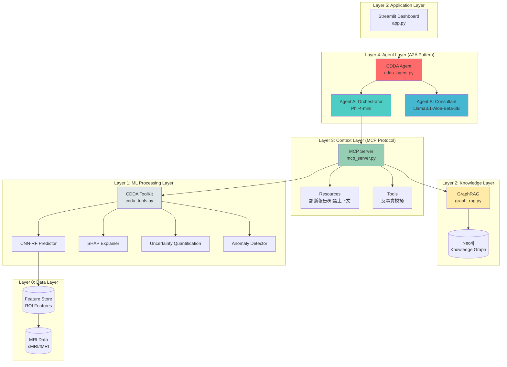
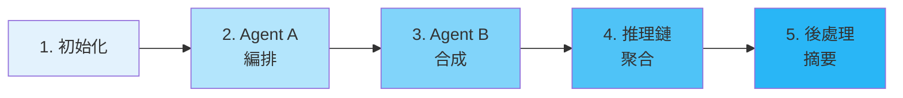
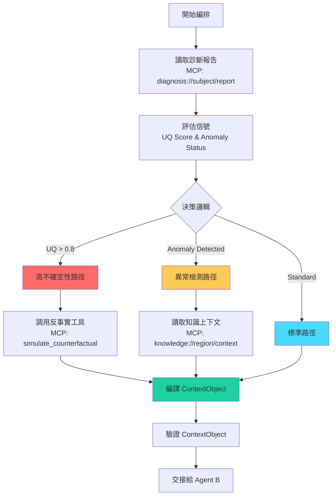
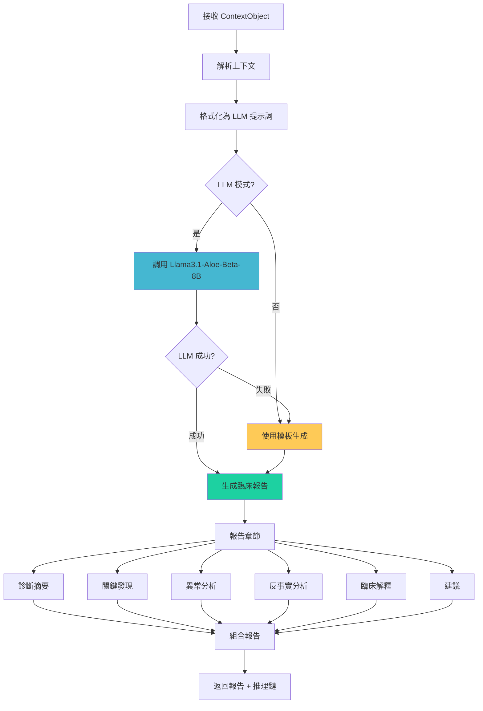
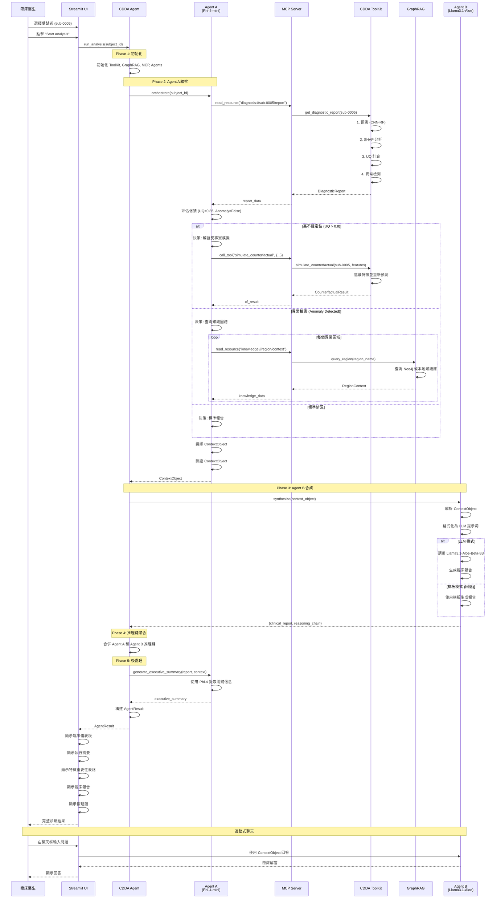

# CDDA Framework - Cognitive Discrepancy-Driven Agent

**認知差異驅動代理框架：基於雙 LLM A2A 架構的可解釋阿茲海默症診斷系統**

[](https://www.python.org/downloads/)
[](LICENSE)
[](https://streamlit.io/)

---

## 📋 目錄

- [系統概述](#系統概述)
- [核心架構](#核心架構)
- [技術棧](#技術棧)
- [Pipeline 詳解](#pipeline-詳解)
- [Workflow 流程](#workflow-流程)
- [安裝與配置](#安裝與配置)
- [使用指南](#使用指南)
- [API 文檔](#api-文檔)
- [開發指南](#開發指南)

---

## 🎯 系統概述

CDDA (Cognitive Discrepancy-Driven Agent) 是一個創新的醫療 AI 診斷系統，專門用於阿茲海默症 (Alzheimer's Disease, AD) 的早期檢測與診斷。系統採用**雙 LLM Agent-to-Agent (A2A) 架構**，結合機器學習、可解釋 AI (XAI)、知識圖譜和反事實推理，提供完全透明且可解釋的診斷決策。

### 核心特色

1. **雙 LLM A2A 架構**
   - **Agent A (Orchestrator)**: Phi-4-mini - 負責資源讀取、工具調用、決策編排
   - **Agent B (Consultant)**: Llama3.1-Aloe-Beta-8B - 負責臨床報告合成、醫學推理

2. **自適應決策機制**
   - 基於不確定性量化 (UQ) 動態選擇診斷路徑
   - 高不確定性 → 觸發反事實模擬 (Counterfactual Simulation)
   - 統計異常 → 觸發知識圖譜查詢 (Knowledge Graph Lookup)

3. **完全可解釋性**
   - SHAP 特徵重要性分析
   - Z-score 統計異常檢測
   - 反事實推理 (What-if Analysis)
   - 完整推理鏈記錄 (Reasoning Chain)

4. **MCP 協議整合**
   - Model Context Protocol (MCP) 標準化資源與工具訪問
   - 清晰的 Agent 職責分離
   - 結構化的 Agent 間通訊


---

## 🏗️ 核心架構

CDDA 系統採用分層架構設計，從底層機器學習到頂層 Agent 編排，共分為 5 個層次：


```mermaid
graph TB
    subgraph "Layer 5: Application Layer"
        UI[Streamlit Dashboard<br/>app.py]
    end
    
    subgraph "Layer 4: Agent Layer (A2A Pattern)"
        CDDA[CDDA Agent<br/>cdda_agent.py]
        AgentA[Agent A: Orchestrator<br/>Phi-4-mini]
        AgentB[Agent B: Consultant<br/>Llama3.1-Aloe-Beta-8B]
    end
    
    subgraph "Layer 3: Context Layer (MCP Protocol)"
        MCP[MCP Server<br/>mcp_server.py]
        Resources[Resources<br/>診斷報告/知識上下文]
        Tools[Tools<br/>反事實模擬]
    end
    
    subgraph "Layer 2: Knowledge Layer"
        GraphRAG[GraphRAG<br/>graph_rag.py]
        Neo4j[(Neo4j<br/>Knowledge Graph)]
    end
    
    subgraph "Layer 1: ML Processing Layer"
        Toolkit[CDDA ToolKit<br/>cdda_tools.py]
        Predictor[CNN-RF Predictor]
        SHAP[SHAP Explainer]
        UQ[Uncertainty Quantification]
        Anomaly[Anomaly Detector]
    end
    
    subgraph "Layer 0: Data Layer"
        MRI[(MRI Data<br/>sMRI/fMRI)]
        Features[(Feature Store<br/>ROI Features)]
    end
    
    UI --> CDDA
    CDDA --> AgentA
    CDDA --> AgentB
    AgentA --> MCP
    MCP --> Resources
    MCP --> Tools
    MCP --> GraphRAG
    MCP --> Toolkit
    GraphRAG --> Neo4j
    Toolkit --> Predictor
    Toolkit --> SHAP
    Toolkit --> UQ
    Toolkit --> Anomaly
    Predictor --> Features
    Features --> MRI
    
    style CDDA fill:#ff6b6b
    style AgentA fill:#4ecdc4
    style AgentB fill:#45b7d1
    style MCP fill:#96ceb4
    style GraphRAG fill:#ffeaa7
    style Toolkit fill:#dfe6e9
```

### 層次說明

#### Layer 5: Application Layer (應用層)
- **app.py**: Streamlit Web 應用
  - 提供臨床儀表板界面
  - 受試者選擇與配置
  - 實時分析進度顯示
  - 互動式聊天機器人 (Agent B)

#### Layer 4: Agent Layer (代理層)
- **cdda_agent.py**: CDDA 主代理
  - 協調 Agent A 和 Agent B
  - 管理 A2A 交接流程
  - 聚合推理鏈
  - 生成執行摘要

- **agent_a_orchestrator.py**: Agent A (編排者)
  - MCP 客戶端
  - 讀取診斷資源
  - 調用工具 (反事實模擬)
  - 編譯 ContextObject
  - 使用 Phi-4-mini 進行決策

- **agent_b_consultant.py**: Agent B (顧問)
  - 臨床報告合成
  - 醫學推理
  - 異常感知分析
  - 反事實解釋
  - 使用 Llama3.1-Aloe-Beta-8B 生成報告


#### Layer 3: Context Layer (上下文層)
- **mcp_server.py**: MCP 協議伺服器
  - 實現 Model Context Protocol
  - 提供資源訪問 (Resources)
    - `diagnosis://{subject_id}/report` - 診斷報告
    - `diagnosis://{subject_id}/features` - 原始特徵
    - `knowledge://{region_name}/context` - 臨床知識
  - 提供工具調用 (Tools)
    - `simulate_counterfactual` - 反事實模擬
  - URI 路由與驗證
  - 錯誤處理與回退機制

#### Layer 2: Knowledge Layer (知識層)
- **graph_rag.py**: GraphRAG 知識檢索
  - Neo4j 知識圖譜查詢
  - 腦區臨床上下文檢索
  - 疾病關聯分析
  - 本地知識庫回退 (Fallback)

#### Layer 1: ML Processing Layer (機器學習處理層)
- **cdda_tools.py**: CDDA 工具包
  - **CNN-RF Predictor**: 3 類分類 (AD/MCI/NC)
  - **SHAP Explainer**: 特徵重要性分析
  - **Uncertainty Quantification**: 預測不確定性量化
  - **Anomaly Detector**: Z-score 統計異常檢測
  - **Counterfactual Simulator**: 反事實推理引擎

#### Layer 0: Data Layer (數據層)
- **MRI Data**: 結構性 MRI (sMRI) 和功能性 MRI (fMRI)
- **Feature Store**: 預處理的 ROI 特徵 (灰質體積、白質體積等)

---

## 🛠️ 技術棧

### 核心框架
- **Python 3.8+**: 主要開發語言
- **Streamlit 1.28+**: Web 應用框架
- **PyTorch 2.0+**: 深度學習框架
- **Transformers 4.35+**: LLM 模型加載

### 機器學習
- **scikit-learn**: 隨機森林分類器
- **SHAP**: 可解釋 AI
- **NumPy/Pandas**: 數據處理
- **NiBabel**: MRI 數據讀取

### LLM 模型
- **Phi-4-mini-instruct**: Agent A 編排模型 (4-bit 量化)
- **Llama3.1-Aloe-Beta-8B**: Agent B 醫學推理模型 (4-bit 量化)
- **BitsAndBytes**: 模型量化庫

### 知識圖譜
- **Neo4j**: 圖數據庫
- **py2neo**: Python Neo4j 驅動

### 其他工具
- **Joblib**: 模型序列化
- **Pathlib**: 路徑管理
- **JSON**: 數據交換格式

---

## 🔄 Pipeline 詳解

CDDA 系統的診斷 Pipeline 分為 5 個主要階段：


```mermaid
graph LR
    A[1. 初始化] --> B[2. Agent A<br/>編排]
    B --> C[3. Agent B<br/>合成]
    C --> D[4. 推理鏈<br/>聚合]
    D --> E[5. 後處理<br/>摘要]
    
    style A fill:#e3f2fd
    style B fill:#b3e5fc
    style C fill:#81d4fa
    style D fill:#4fc3f7
    style E fill:#29b6f6
```

### 階段 1: 系統初始化

**目標**: 加載所有必要的模型和資源

**流程**:
1. 初始化 CDDA ToolKit
   - 加載 CNN-RF 模型 (`rf_model_NC_MCI_AD.joblib`)
   - 初始化 SHAP Explainer
   - 設置 UQ 和異常檢測閾值

2. 初始化 GraphRAG
   - 連接 Neo4j 數據庫 (如果可用)
   - 加載本地知識庫 (回退機制)

3. 初始化 MCP Server
   - 註冊資源端點
   - 註冊工具端點
   - 設置 URI 路由

4. 初始化 Agent A (Orchestrator)
   - 加載 Phi-4-mini 模型 (4-bit 量化)
   - 加載系統提示詞
   - 設置決策閾值

5. 初始化 Agent B (Consultant)
   - 加載 Llama3.1-Aloe-Beta-8B 模型 (4-bit 量化)
   - 加載系統提示詞
   - 設置生成參數

**關鍵代碼**:
```python
agent = CDDAAgent(
    orchestrator_model="phi-4-mini",
    orchestrator_model_path="D:/hf_models/Phi-4-mini-instruct",
    consultant_model="llama3.1-aloe-beta-8b",
    consultant_model_path="D:/hf_models/Llama3.1-Aloe-Beta-8B",
    use_llm=True,
    use_4bit=True,  # 4-bit 量化節省 VRAM
    verbose=True
)
```


### 階段 2: Agent A 編排 (Orchestration)

**目標**: 讀取資源、評估信號、調用工具、編譯上下文

**流程圖**:

```mermaid
graph TD
    Start[開始編排] --> ReadReport[讀取診斷報告<br/>MCP: diagnosis://subject/report]
    ReadReport --> EvalSignals[評估信號<br/>UQ Score & Anomaly Status]
    
    EvalSignals --> DecisionPoint{決策邏輯}
    
    DecisionPoint -->|UQ > 0.8| HighUQ[高不確定性路徑]
    DecisionPoint -->|Anomaly Detected| Anomaly[異常檢測路徑]
    DecisionPoint -->|Standard| Standard[標準路徑]
    
    HighUQ --> CallCF[調用反事實工具<br/>MCP: simulate_counterfactual]
    CallCF --> CompileContext
    
    Anomaly --> ReadKG[讀取知識上下文<br/>MCP: knowledge://region/context]
    ReadKG --> CompileContext
    
    Standard --> CompileContext[編譯 ContextObject]
    
    CompileContext --> Validate[驗證 ContextObject]
    Validate --> Handoff[交接給 Agent B]
    
    style HighUQ fill:#ff6b6b
    style Anomaly fill:#feca57
    style Standard fill:#48dbfb
    style CompileContext fill:#1dd1a1
```

**詳細步驟**:

1. **讀取診斷報告** (MCP Resource)
   ```python
   # Agent A 通過 MCP 讀取資源
   uri = f"diagnosis://{subject_id}/report"
   report = mcp_server.read_resource(uri)
   
   # 返回的報告包含:
   # - prediction_result: "AD" / "MCI" / "NC"
   # - confidence: 0.0 ~ 1.0
   # - uq_score: 不確定性分數
   # - top_features: SHAP 排序的前 N 個特徵
   # - anomaly_status: 異常檢測結果
   ```

2. **評估診斷信號**
   ```python
   uq_score = diagnostic_report.uq_score
   has_anomaly = diagnostic_report.anomaly_status.has_anomaly
   anomalous_regions = diagnostic_report.anomaly_status.anomalous_regions
   ```

3. **決策邏輯** (LLM 或規則)
   
   **LLM 模式** (Phi-4-mini):
   ```python
   # 構建提示詞
   prompt = f"""
   Based on diagnostic data:
   - Prediction: {prediction}
   - Confidence: {confidence}
   - UQ Score: {uq_score}
   - Anomalies: {anomalous_regions}
   
   Decide which MCP actions to take.
   Respond with JSON: {{"actions": [...], "decision_rationale": "..."}}
   """
   
   # LLM 決策
   response = llm.generate(prompt)
   actions = parse_json(response)
   ```
   
   **規則模式** (回退機制):
   ```python
   if uq_score > 0.8:
       # 觸發反事實模擬
       actions.append({
           "type": "call_tool",
           "name": "simulate_counterfactual",
           "args": {
               "subject_id": subject_id,
               "features_to_mask": top_3_features
           }
       })
   
   if has_anomaly:
       # 觸發知識圖譜查詢
       for region in anomalous_regions:
           actions.append({
               "type": "read_resource",
               "uri": f"knowledge://{region}/context"
           })
   ```

4. **執行 MCP 動作**
   
   **反事實模擬** (高不確定性):
   ```python
   # 調用 MCP 工具
   cf_result = mcp_server.call_tool(
       "simulate_counterfactual",
       {
           "subject_id": subject_id,
           "features_to_mask": ["Hippocampus_L", "Hippocampus_R", "Entorhinal_L"]
       }
   )
   
   # 返回結果:
   # - original_prediction: "AD"
   # - original_confidence: 0.85
   # - new_prediction: "NC"
   # - new_confidence: 0.45
   # - confidence_delta: -0.40 (顯著下降 → 這些特徵是關鍵驅動因素)
   ```
   
   **知識圖譜查詢** (異常檢測):
   ```python
   # 讀取 MCP 資源
   knowledge = mcp_server.read_resource(
       f"knowledge://Hippocampus_L/context"
   )
   
   # 返回結果:
   # - full_name: "Left Hippocampus"
   # - function: "Memory formation and consolidation"
   # - clinical_significance: "Early atrophy is hallmark of AD"
   # - related_conditions: ["Alzheimer's Disease", "MCI", "TLE"]
   # - is_ad_hotspot: True
   ```

5. **編譯 ContextObject**
   ```python
   context_object = ContextObject(
       subject_id=subject_id,
       diagnostic_report=diagnostic_report,
       tool_results={
           "counterfactual": cf_result,  # 如果有
           "knowledge_context": knowledge  # 如果有
       },
       decision_rationale="High UQ detected. Simulated counterfactual.",
       signals={
           "uq_score": uq_score,
           "has_anomaly": has_anomaly,
           "prediction": prediction,
           "confidence": confidence
       },
       agent_a_reasoning=reasoning_chain,  # 完整推理步驟
       mcp_actions=mcp_actions  # 所有 MCP 操作記錄
   )
   ```

6. **驗證與交接**
   ```python
   # 驗證 ContextObject 完整性
   if not context_object.validate():
       raise ValueError("ContextObject validation failed")
   
   # 交接給 Agent B
   return context_object
   ```


### 階段 3: Agent B 臨床合成 (Clinical Synthesis)

**目標**: 從 ContextObject 生成專業臨床報告

**流程圖**:

```mermaid
graph TD
    Start[接收 ContextObject] --> Parse[解析上下文]
    Parse --> Format[格式化為 LLM 提示詞]
    
    Format --> LLMMode{LLM 模式?}
    
    LLMMode -->|是| CallLLM[調用 Llama3.1-Aloe-Beta-8B]
    LLMMode -->|否| Template[使用模板生成]
    
    CallLLM --> CheckError{LLM 成功?}
    CheckError -->|失敗| Template
    CheckError -->|成功| GenerateReport[生成臨床報告]
    
    Template --> GenerateReport
    
    GenerateReport --> Sections[報告章節]
    
    Sections --> Summary[診斷摘要]
    Sections --> KeyFindings[關鍵發現]
    Sections --> AnomalyAnalysis[異常分析]
    Sections --> CFAnalysis[反事實分析]
    Sections --> Interpretation[臨床解釋]
    Sections --> Recommendations[建議]
    
    Summary --> Combine[組合報告]
    KeyFindings --> Combine
    AnomalyAnalysis --> Combine
    CFAnalysis --> Combine
    Interpretation --> Combine
    Recommendations --> Combine
    
    Combine --> Return[返回報告 + 推理鏈]
    
    style CallLLM fill:#45b7d1
    style Template fill:#feca57
    style GenerateReport fill:#1dd1a1
```

**詳細步驟**:

1. **接收並解析 ContextObject**
   ```python
   def synthesize(self, context_object: ContextObject) -> Dict:
       # 提取關鍵信息
       report = context_object.diagnostic_report
       signals = context_object.signals
       tool_results = context_object.tool_results or {}
       
       # 記錄推理步驟
       self._log_reasoning(f"Received ContextObject for {context_object.subject_id}")
       self._log_reasoning(f"Prediction: {report.prediction_result}")
       self._log_reasoning(f"Confidence: {report.confidence:.1%}")
       self._log_reasoning(f"UQ Score: {report.uq_score:.3f}")
   ```

2. **格式化為 LLM 提示詞**
   ```python
   # 構建結構化上下文
   context_dict = {
       'subject_id': context_object.subject_id,
       'prediction': report.prediction_result,
       'confidence': report.confidence,
       'uq_score': report.uq_score,
       'has_anomaly': signals.get('has_anomaly', False),
       'anomalous_regions': signals.get('anomalous_regions', []),
       'top_features': [
           {
               'roi_name': f.roi_name,
               'z_score': f.z_score,
               'shap_value': f.shap_value,
               'rank': f.rank
           }
           for f in report.top_features[:10]
       ],
       'decision_rationale': context_object.decision_rationale
   }
   
   # 添加反事實結果 (如果有)
   if 'counterfactual' in tool_results:
       cf = tool_results['counterfactual']
       context_dict['counterfactual'] = {
           'original_prediction': cf.get('original_prediction'),
           'new_prediction': cf.get('new_prediction'),
           'confidence_delta': cf.get('confidence_delta'),
           'masked_features': [f.get('roi_name') for f in cf.get('masked_features', [])]
       }
   
   # 添加知識上下文 (如果有)
   if 'knowledge_context' in tool_results:
       kc = tool_results['knowledge_context']
       context_dict['knowledge_context'] = {
           'query_regions': kc.get('query_regions', []),
           'summary': kc.get('summary', ''),
           'contexts': kc.get('contexts', [])
       }
   
   # 轉換為 JSON 字符串
   formatted_context = json.dumps(context_dict, indent=2)
   ```

3. **LLM 生成報告** (Llama3.1-Aloe-Beta-8B)
   ```python
   user_prompt = f"""
   Based on the ContextObject below, synthesize a comprehensive clinical report.
   
   CONTEXT OBJECT:
   {formatted_context}
   
   Generate a clinical report following this structure:
   1. Diagnostic Summary
   2. Key Findings (Brain Region Analysis)
   3. Anomaly Analysis (if applicable)
   4. Counterfactual Analysis (if applicable)
   5. Clinical Interpretation
   6. Recommendations
   
   <REPORT>
   [Your clinical report here]
   """
   
   # 調用 LLM
   response = huggingface.handle_text(
       prompt=user_prompt,
       model_path=consultant_model_path,
       system_instruction=system_prompt,
       temperature=0.3,  # 較高溫度以獲得更有創意的合成
       max_new_tokens=2048,  # 長報告
       load_in_8bit=False  # 使用 4-bit 量化
   )
   
   # 提取報告內容 (過濾 <REPORT> 標記之前的內容)
   clinical_report = response.split('<REPORT>')[-1].strip()
   ```

4. **模板生成報告** (回退機制)
   ```python
   def _synthesize_with_template(self, context_object: ContextObject) -> str:
       sections = []
       
       # 1. 診斷摘要
       sections.append(f"""
   DIAGNOSTIC SUMMARY
   Subject: {report.subject_id}
   Prediction: {report.prediction_result}
   Confidence: {report.confidence:.1%}
   Uncertainty Score: {report.uq_score:.3f}
   Anomaly Status: {'Detected' if signals.get('has_anomaly') else 'None'}
       """)
       
       # 2. 關鍵發現
       sections.append("KEY FINDINGS\nTop Contributing Brain Regions:")
       for i, feature in enumerate(report.top_features[:5], 1):
           z_desc = "elevated" if feature.z_score > 0 else "reduced"
           sections.append(
               f"{i}. {feature.roi_name}: "
               f"Z-score = {feature.z_score:.2f} ({z_desc}), "
               f"SHAP = {feature.shap_value:.3f}"
           )
       
       # 3. 異常分析 (如果有)
       if signals.get('has_anomaly'):
           sections.append(self._generate_anomaly_section(report, signals, tool_results))
       
       # 4. 反事實分析 (如果有)
       if 'counterfactual' in tool_results:
           sections.append(self._generate_counterfactual_section(tool_results['counterfactual']))
       
       # 5. 臨床解釋
       sections.append(self._generate_interpretation_section(report, signals, tool_results))
       
       # 6. 建議
       sections.append(self._generate_recommendations_section(report, signals, tool_results))
       
       return "\n\n".join(sections)
   ```


5. **異常感知合成** (Anomaly-Aware Synthesis)
   
   當檢測到統計異常時，Agent B 會執行特殊的分析流程：
   
   ```python
   def _generate_anomaly_section(self, report, signals, tool_results):
       lines = ["ANOMALY ANALYSIS"]
       
       anomalous_regions = signals.get('anomalous_regions', [])
       lines.append(f"Detected {len(anomalous_regions)} anomalous regions:")
       for region in anomalous_regions[:5]:
           lines.append(f"  - {region}")
       
       # 列出疾病關聯 (Requirement 6.3)
       if 'knowledge_context' in tool_results:
           disease_associations = self._list_disease_associations(
               tool_results['knowledge_context']
           )
           if disease_associations:
               lines.append("\nDISEASE ASSOCIATIONS:")
               for assoc in disease_associations:
                   lines.append(f"  - {assoc}")
       
       # 檢測模型-知識差異 (Requirement 6.1, 6.2)
       discrepancies = self._detect_model_knowledge_discrepancies(
           report, 
           tool_results['knowledge_context']
       )
       
       if discrepancies:
           lines.append("\nPOTENTIAL MIXED PATHOLOGY INDICATORS:")
           for disc in discrepancies:
               lines.append(f"  - {disc}")
           
           self._log_reasoning(
               f"Detected {len(discrepancies)} model-knowledge discrepancies "
               f"suggesting potential mixed pathology"
           )
       
       # 檢測 SHAP-條件不匹配 (Requirement 6.4)
       shap_mismatches = self._detect_shap_condition_mismatches(report, tool_results)
       if shap_mismatches:
           lines.append("\nSHAP-CONDITION MISMATCHES:")
           for mismatch in shap_mismatches:
               lines.append(f"  - {mismatch}")
       
       return "\n".join(lines)
   ```

6. **反事實解釋** (Counterfactual Explanation)
   
   當執行反事實模擬時，Agent B 會提供醫學推理：
   
   ```python
   def _generate_counterfactual_section(self, counterfactual):
       lines = ["COUNTERFACTUAL ANALYSIS"]
       lines.append("What-if simulation: Testing diagnostic impact of key features\n")
       
       original_pred = counterfactual.get('original_prediction')
       new_pred = counterfactual.get('new_prediction')
       confidence_delta = counterfactual.get('confidence_delta', 0)
       masked_features = counterfactual.get('masked_features', [])
       
       lines.append(f"Original prediction: {original_pred} ({original_conf:.1%})")
       lines.append(f"After masking: {new_pred} ({new_conf:.1%})")
       lines.append(f"Confidence change: {confidence_delta:+.1%}")
       lines.append(f"\nMasked features: {', '.join([f.get('roi_name') for f in masked_features])}")
       
       # 醫學推理 (Requirements 7.2, 7.3, 7.4)
       lines.append("\nCLINICAL INTERPRETATION:")
       
       if abs(confidence_delta) > 0.1:
           # 顯著變化 → 關鍵驅動因素
           lines.append(
               f"The masked features are KEY DIAGNOSTIC DRIVERS. "
               f"Removing them caused a {abs(confidence_delta):.1%} change in confidence, "
               f"indicating they are critical to the {original_pred} diagnosis."
           )
           
           # 識別具體驅動因素
           key_drivers = self._identify_key_drivers(masked_features, confidence_delta)
           if key_drivers:
               lines.append("\nDetailed feature impact analysis:")
               for driver in key_drivers:
                   lines.append(f"  • {driver}")
       
       elif abs(confidence_delta) < 0.05:
           # 微小變化 → 非主要驅動因素
           lines.append(
               f"The masked features are NOT PRIMARY DRIVERS. "
               f"Removing them caused only a {abs(confidence_delta):.1%} change, "
               f"suggesting other features are more important."
           )
       
       else:
           # 中等變化
           lines.append(
               f"The masked features have MODERATE IMPACT on the diagnosis. "
               f"They contribute ({abs(confidence_delta):.1%} change) "
               f"but are not the sole drivers."
           )
       
       return "\n".join(lines)
   ```

7. **返回結果**
   ```python
   return {
       'clinical_report': clinical_report,
       'reasoning_chain': self.reasoning_chain.copy()
   }
   ```


### 階段 4: 推理鏈聚合 (Reasoning Chain Aggregation)

**目標**: 合併 Agent A 和 Agent B 的完整推理過程

**流程**:
```python
def _aggregate_reasoning_chains(
    self,
    context_object: ContextObject,
    agent_b_reasoning: List[str]
) -> List[str]:
    combined_reasoning = []
    
    # Section 1: Agent A 編排
    combined_reasoning.append("="*80)
    combined_reasoning.append("AGENT A - ORCHESTRATION")
    combined_reasoning.append("="*80)
    
    for step in context_object.agent_a_reasoning:
        combined_reasoning.append(step)
    
    # Section 2: MCP 動作 (帶時間戳)
    if context_object.mcp_actions:
        combined_reasoning.append("")
        combined_reasoning.append("-"*80)
        combined_reasoning.append("MCP ACTIONS")
        combined_reasoning.append("-"*80)
        
        for action in context_object.mcp_actions:
            action_dict = action.to_dict() if hasattr(action, 'to_dict') else action
            
            action_type = action_dict.get('type', 'unknown')
            target = action_dict.get('target', 'unknown')
            timestamp = action_dict.get('timestamp', 'N/A')
            status = action_dict.get('status', 'unknown')
            
            action_line = f"[{timestamp}] {action_type}: {target} → {status}"
            combined_reasoning.append(action_line)
            
            # 添加錯誤詳情 (如果失敗)
            if status == 'error' and 'error' in action_dict:
                error_msg = action_dict['error'].get('message', 'Unknown error')
                combined_reasoning.append(f"  ERROR: {error_msg}")
    
    # Section 3: 交接
    combined_reasoning.append("")
    combined_reasoning.append("-"*80)
    combined_reasoning.append("HANDOFF: Agent A → Agent B")
    combined_reasoning.append("-"*80)
    combined_reasoning.append(f"Decision Rationale: {context_object.decision_rationale}")
    combined_reasoning.append(f"Context Object validated: {context_object.validate()}")
    
    # Section 4: Agent B 合成
    combined_reasoning.append("")
    combined_reasoning.append("="*80)
    combined_reasoning.append("AGENT B - CLINICAL SYNTHESIS")
    combined_reasoning.append("="*80)
    
    for step in agent_b_reasoning:
        combined_reasoning.append(step)
    
    return combined_reasoning
```

**推理鏈示例**:
```
================================================================================
AGENT A - ORCHESTRATION
================================================================================
[2025-11-28T10:30:15] [Agent A] Starting orchestration for sub-0005
[2025-11-28T10:30:16] [Agent A] Read diagnostic report for sub-0005
[2025-11-28T10:30:16] [Agent A] Evaluated signals: UQ=0.85, Anomaly=False
[2025-11-28T10:30:16] [Agent A] High UQ detected (0.85 > 0.8). Triggering counterfactual simulation.

--------------------------------------------------------------------------------
MCP ACTIONS
--------------------------------------------------------------------------------
[2025-11-28T10:30:16] read_resource: diagnosis://sub-0005/report → success
[2025-11-28T10:30:17] call_tool: simulate_counterfactual → success

--------------------------------------------------------------------------------
HANDOFF: Agent A → Agent B
--------------------------------------------------------------------------------
Decision Rationale: High uncertainty (UQ=0.85). Simulated counterfactual.
Context Object validated: True

================================================================================
AGENT B - CLINICAL SYNTHESIS
================================================================================
[2025-11-28T10:30:18] [Agent B] Received ContextObject for sub-0005
[2025-11-28T10:30:18] [Agent B] Prediction: AD
[2025-11-28T10:30:18] [Agent B] Confidence: 85.0%
[2025-11-28T10:30:18] [Agent B] UQ Score: 0.850
[2025-11-28T10:30:19] [Agent B] LLM synthesis completed successfully
```

### 階段 5: 後處理與執行摘要 (Post-Processing & Executive Summary)

**目標**: 生成臨床儀表板的執行摘要

**流程**:
```python
def generate_executive_summary(
    self,
    clinical_report: str,
    context_object: ContextObject
) -> Dict:
    # 提取關鍵信息
    prediction = context_object.diagnostic_report.prediction_result
    confidence = context_object.diagnostic_report.confidence
    uq_score = context_object.diagnostic_report.uq_score
    
    # 確定風險等級
    if uq_score > 0.8 or confidence < 0.6:
        risk_level = "High"
    elif uq_score > 0.5 or confidence < 0.8:
        risk_level = "Medium"
    else:
        risk_level = "Low"
    
    # 使用 Agent A (Phi-4) 生成摘要
    prompt = f"""
    You are a Medical Secretary. Extract key information from the clinical report.
    
    CLINICAL REPORT:
    {clinical_report[:2000]}
    
    DIAGNOSTIC DATA:
    - Prediction: {prediction}
    - Confidence: {confidence:.1%}
    - Uncertainty: {uq_score:.3f}
    
    Output ONLY valid JSON:
    {{
      "headline": "Short 1-sentence summary",
      "key_findings": [
        "Finding 1 (focus on top brain regions)",
        "Finding 2 (mention anomalies or counterfactual)",
        "Finding 3 (note uncertainty)"
      ],
      "recommended_actions": [
        "Action 1 (e.g., 'Clinical correlation recommended')",
        "Action 2 (e.g., 'Follow-up imaging in 6 months')"
      ],
      "risk_level": "{risk_level}"
    }}
    """
    
    # 調用 Phi-4
    response = self.agent_a.llm.generate(prompt)
    summary = json.loads(response)
    
    return summary
```

**執行摘要示例**:
```json
{
  "headline": "Probable AD with high confidence and hippocampal atrophy",
  "key_findings": [
    "Primary drivers: Hippocampus_L, Hippocampus_R, Entorhinal_L",
    "Counterfactual analysis shows 40% impact on confidence",
    "High uncertainty (UQ: 0.850) - additional validation recommended"
  ],
  "recommended_actions": [
    "Clinical correlation strongly recommended",
    "Consider additional imaging or biomarker testing"
  ],
  "risk_level": "High"
}
```


---

## 🔀 Workflow 流程

### 完整診斷流程圖


```mermaid
sequenceDiagram
    participant User as 臨床醫生
    participant UI as Streamlit UI
    participant CDDA as CDDA Agent
    participant AgentA as Agent A<br/>(Phi-4-mini)
    participant MCP as MCP Server
    participant Toolkit as CDDA ToolKit
    participant GraphRAG as GraphRAG
    participant AgentB as Agent B<br/>(Llama3.1-Aloe)
    
    User->>UI: 選擇受試者 (sub-0005)
    User->>UI: 點擊 "Start Analysis"
    
    UI->>CDDA: run_analysis(subject_id)
    
    Note over CDDA: Phase 1: 初始化
    CDDA->>CDDA: 初始化 ToolKit, GraphRAG, MCP, Agents
    
    Note over CDDA,AgentA: Phase 2: Agent A 編排
    CDDA->>AgentA: orchestrate(subject_id)
    
    AgentA->>MCP: read_resource("diagnosis://sub-0005/report")
    MCP->>Toolkit: get_diagnostic_report(sub-0005)
    Toolkit->>Toolkit: 1. 預測 (CNN-RF)
    Toolkit->>Toolkit: 2. SHAP 分析
    Toolkit->>Toolkit: 3. UQ 計算
    Toolkit->>Toolkit: 4. 異常檢測
    Toolkit-->>MCP: DiagnosticReport
    MCP-->>AgentA: report_data
    
    AgentA->>AgentA: 評估信號 (UQ=0.85, Anomaly=False)
    
    alt 高不確定性 (UQ > 0.8)
        AgentA->>AgentA: 決策: 觸發反事實模擬
        AgentA->>MCP: call_tool("simulate_counterfactual", {...})
        MCP->>Toolkit: simulate_counterfactual(sub-0005, features)
        Toolkit->>Toolkit: 遮蔽特徵並重新預測
        Toolkit-->>MCP: CounterfactualResult
        MCP-->>AgentA: cf_result
    else 異常檢測 (Anomaly Detected)
        AgentA->>AgentA: 決策: 查詢知識圖譜
        loop 每個異常區域
            AgentA->>MCP: read_resource("knowledge://region/context")
            MCP->>GraphRAG: query_region(region_name)
            GraphRAG->>GraphRAG: 查詢 Neo4j 或本地知識庫
            GraphRAG-->>MCP: RegionContext
            MCP-->>AgentA: knowledge_data
        end
    else 標準情況
        AgentA->>AgentA: 決策: 標準報告
    end
    
    AgentA->>AgentA: 編譯 ContextObject
    AgentA->>AgentA: 驗證 ContextObject
    AgentA-->>CDDA: ContextObject
    
    Note over CDDA,AgentB: Phase 3: Agent B 合成
    CDDA->>AgentB: synthesize(context_object)
    
    AgentB->>AgentB: 解析 ContextObject
    AgentB->>AgentB: 格式化為 LLM 提示詞
    
    alt LLM 模式
        AgentB->>AgentB: 調用 Llama3.1-Aloe-Beta-8B
        AgentB->>AgentB: 生成臨床報告
    else 模板模式 (回退)
        AgentB->>AgentB: 使用模板生成報告
    end
    
    AgentB-->>CDDA: {clinical_report, reasoning_chain}
    
    Note over CDDA: Phase 4: 推理鏈聚合
    CDDA->>CDDA: 合併 Agent A 和 Agent B 推理鏈
    
    Note over CDDA: Phase 5: 後處理
    CDDA->>AgentA: generate_executive_summary(report, context)
    AgentA->>AgentA: 使用 Phi-4 提取關鍵信息
    AgentA-->>CDDA: executive_summary
    
    CDDA->>CDDA: 構建 AgentResult
    CDDA-->>UI: AgentResult
    
    UI->>UI: 顯示臨床儀表板
    UI->>UI: 顯示執行摘要
    UI->>UI: 顯示特徵重要性表格
    UI->>UI: 顯示臨床報告
    UI->>UI: 顯示推理鏈
    
    UI-->>User: 完整診斷結果
    
    Note over User,AgentB: 互動式聊天
    User->>UI: 在聊天框輸入問題
    UI->>AgentB: 使用 ContextObject 回答
    AgentB-->>UI: 臨床解答
    UI-->>User: 顯示回答
```

### 關鍵決策點

#### 決策點 1: 不確定性評估
```python
if uq_score > 0.8:
    # 高不確定性 → 需要更多證據
    decision = "SIMULATION_TRIGGERED"
    action = "simulate_counterfactual"
    rationale = "High uncertainty detected. Need to identify key diagnostic drivers."
```

#### 決策點 2: 異常檢測
```python
if has_anomaly and len(anomalous_regions) > 0:
    # 統計異常 → 可能混合病理
    decision = "ANOMALY_INVESTIGATION"
    action = "query_knowledge_graph"
    rationale = "Anomalies detected. Need clinical context to interpret unusual patterns."
```

#### 決策點 3: 標準情況
```python
if uq_score <= 0.8 and not has_anomaly:
    # 標準情況 → 直接報告
    decision = "STANDARD_REPORT"
    action = "none"
    rationale = "Standard case: low uncertainty, no anomalies. Proceeding to synthesis."
```


---

## 📦 安裝與配置

### 系統需求

- **作業系統**: Windows 10/11, Linux, macOS
- **Python**: 3.8 或更高版本
- **GPU**: NVIDIA GPU with 24GB+ VRAM (推薦 RTX 4090 或 A6000)
- **RAM**: 32GB+ 系統記憶體
- **儲存空間**: 100GB+ (用於模型和數據)

### 安裝步驟

1. **克隆專案**
   ```bash
   git clone https://github.com/your-org/cdda-framework.git
   cd cdda-framework
   ```

2. **創建虛擬環境**
   ```bash
   python -m venv venv
   
   # Windows
   venv\Scripts\activate
   
   # Linux/macOS
   source venv/bin/activate
   ```

3. **安裝依賴**
   ```bash
   pip install -r requirements.txt
   ```

4. **下載 LLM 模型**
   
   **選項 A: 使用 HuggingFace (推薦)**
   ```bash
   # 下載 Phi-4-mini-instruct
   python scripts/download_models.py --model phi-4-mini --output D:/hf_models/Phi-4-mini-instruct
   
   # 下載 Llama3.1-Aloe-Beta-8B
   python scripts/download_models.py --model llama3.1-aloe-beta-8b --output D:/hf_models/Llama3.1-Aloe-Beta-8B
   ```
   
   **選項 B: 使用 Ollama (替代方案)**
   ```bash
   # 安裝 Ollama
   # Windows: 下載 https://ollama.ai/download
   # Linux: curl -fsSL https://ollama.ai/install.sh | sh
   
   # 拉取模型
   ollama pull phi-4-mini
   ollama pull llama3.1:8b
   ```

5. **配置 Neo4j (可選)**
   
   如果要使用知識圖譜功能：
   ```bash
   # 安裝 Neo4j Desktop 或使用 Docker
   docker run -d \
     --name neo4j \
     -p 7474:7474 -p 7687:7687 \
     -e NEO4J_AUTH=neo4j/password \
     neo4j:latest
   
   # 導入知識圖譜
   python scripts/import_knowledge_graph.py
   ```

6. **準備數據**
   ```bash
   # 確保 MRI 數據在正確位置
   # data/MRI_processed/{label}/sub-{id}/*.nii.gz
   
   # 驗證數據結構
   python scripts/verify_data.py
   ```

7. **驗證安裝**
   ```bash
   python demo/verify_installation.py
   ```

### 配置文件

#### 1. 環境變量 (.env)
```bash
# LLM 模型路徑
ORCHESTRATOR_MODEL_PATH=D:/hf_models/Phi-4-mini-instruct
CONSULTANT_MODEL_PATH=D:/hf_models/Llama3.1-Aloe-Beta-8B

# Neo4j 配置
NEO4J_URI=bolt://localhost:7687
NEO4J_USER=neo4j
NEO4J_PASSWORD=password

# 數據路徑
DATA_ROOT=data/MRI_processed
MODEL_PATH=model/cnn_rf/rf_model_NC_MCI_AD.joblib

# 閾值設置
UQ_THRESHOLD=0.8
Z_SCORE_THRESHOLD=2.5

# 量化設置
USE_4BIT_QUANTIZATION=true
```

#### 2. XAI 配置 (config/xai_config.yaml)
```yaml
model:
  type: "cnn_rf"
  path: "model/cnn_rf/rf_model_NC_MCI_AD.joblib"
  classes: ["NC", "MCI", "AD"]

explainability:
  shap:
    enabled: true
    n_samples: 100
    top_k: 10
  
  uncertainty:
    method: "ensemble_variance"
    threshold: 0.8
  
  anomaly:
    method: "z_score"
    threshold: 2.5

agents:
  orchestrator:
    model: "phi-4-mini"
    temperature: 0.1
    max_tokens: 512
  
  consultant:
    model: "llama3.1-aloe-beta-8b"
    temperature: 0.3
    max_tokens: 2048
```

#### 3. Agent 提示詞

**Agent A 提示詞** (config/prompts/agent_a_orchestrator.txt):
```
You are Agent A, the Orchestrator in a dual-LLM diagnostic system.

Your role is to:
1. Read diagnostic resources from MCP server
2. Evaluate signals (UQ score, anomaly status)
3. Decide which tools to invoke
4. Compile ContextObject for Agent B

MCP RESOURCES:
- diagnosis://{subject_id}/report - Full diagnostic report
- knowledge://{region_name}/context - Clinical knowledge

MCP TOOLS:
- simulate_counterfactual - What-if analysis

DECISION LOGIC:
- IF UQ > 0.8 → Call simulate_counterfactual
- IF Anomaly Detected → Read knowledge context
- ELSE → Standard report

OUTPUT FORMAT:
{
  "actions": [
    {"type": "read_resource", "uri": "..."},
    {"type": "call_tool", "name": "...", "args": {...}}
  ],
  "decision_rationale": "Explanation of your decisions"
}
```

**Agent B 提示詞** (config/prompts/agent_b_consultant.txt):
```
You are Agent B, the Clinical Consultant specializing in neuroimaging and dementia diagnosis.

IMPORTANT: You have NO access to tools or resources. You work ONLY with the ContextObject provided by Agent A.

INPUT: ContextObject containing:
- diagnostic_report: ML prediction, SHAP values, Z-scores, UQ score
- tool_results: Counterfactual simulation OR knowledge graph context
- decision_rationale: Why Agent A took certain actions

YOUR TASK:
Synthesize all evidence into a professional, evidence-based clinical report.

REPORT STRUCTURE:
1. Diagnostic Summary
2. Key Findings (Brain Region Analysis)
3. Anomaly Analysis (if applicable)
4. Counterfactual Analysis (if applicable)
5. Clinical Interpretation
6. Recommendations

Use clear, professional medical language.
```


---

## 🚀 使用指南

### 啟動 Streamlit 應用

```bash
streamlit run app.py
```

應用將在 `http://localhost:8501` 啟動。

### 使用流程

1. **選擇受試者**
   - 在側邊欄選擇要分析的受試者 (例如: sub-0005)
   - 系統會顯示 Ground Truth 標籤

2. **配置模型**
   - 設置 Orchestrator 模型路徑 (Phi-4-mini)
   - 設置 Consultant 模型路徑 (Llama3.1-Aloe-Beta-8B)
   - 選擇是否啟用 LLM 模式
   - 選擇是否使用 4-bit 量化

3. **開始分析**
   - 點擊 "Start Analysis" 按鈕
   - 觀察實時進度更新
   - 等待分析完成 (通常 30-60 秒)

4. **查看結果**
   - **臨床儀表板**: 顯示預測、信心度、不確定性、風險等級
   - **執行摘要**: 關鍵發現和建議行動
   - **特徵重要性表格**: SHAP 值和 Z-score 分析
   - **臨床報告**: Agent B 生成的完整報告
   - **推理鏈**: 完整的 Agent A 和 Agent B 推理過程

5. **互動式聊天**
   - 在聊天框輸入問題
   - Agent B 會基於診斷上下文回答
   - 支持多輪對話

### 命令行使用

#### 單個受試者分析
```bash
python -m app.agents.cdda_agent --subject sub-0005
```

#### 批量分析
```bash
python scripts/batch_analysis.py --subjects sub-0001 sub-0002 sub-0003
```

#### 生成報告
```bash
python scripts/generate_report.py --subject sub-0005 --output output/reports/
```

### Python API 使用

```python
from app.agents.cdda_agent import CDDAAgent

# 初始化 CDDA Agent
agent = CDDAAgent(
    orchestrator_model="phi-4-mini",
    orchestrator_model_path="D:/hf_models/Phi-4-mini-instruct",
    consultant_model="llama3.1-aloe-beta-8b",
    consultant_model_path="D:/hf_models/Llama3.1-Aloe-Beta-8B",
    use_llm=True,
    use_4bit=True,
    verbose=True
)

# 運行分析
result = agent.run_analysis('sub-0005')

# 訪問結果
print(f"Prediction: {result.prediction}")
print(f"Confidence: {result.confidence:.1%}")
print(f"UQ Score: {result.uq_score:.3f}")
print(f"Agent Decision: {result.agent_decision}")

# 打印臨床報告
print("\nClinical Report:")
print(result.clinical_report)

# 打印推理鏈
print("\nReasoning Chain:")
for step in result.reasoning_chain:
    print(step)

# 保存推理日誌
agent.save_reasoning_log(result, "output/reasoning_log.json")
```

### 高級用法

#### 自定義閾值
```python
agent = CDDAAgent(
    uq_threshold=0.7,  # 降低閾值以更頻繁觸發反事實模擬
    z_score_threshold=2.0,  # 降低閾值以檢測更多異常
    verbose=True
)
```

#### 僅使用規則模式 (不使用 LLM)
```python
agent = CDDAAgent(
    use_llm=False,  # 使用規則決策而非 LLM
    verbose=True
)
```

#### 訪問中間結果
```python
result = agent.run_analysis('sub-0005')

# 訪問 ContextObject
context = result.context_object
print(f"Decision Rationale: {context.decision_rationale}")
print(f"MCP Actions: {len(context.mcp_actions)}")

# 訪問診斷報告
report = context.diagnostic_report
print(f"Top Features:")
for feat in report.top_features[:5]:
    print(f"  {feat.roi_name}: SHAP={feat.shap_value:.3f}, Z={feat.z_score:.2f}")

# 訪問工具結果
if context.tool_results:
    if 'counterfactual' in context.tool_results:
        cf = context.tool_results['counterfactual']
        print(f"\nCounterfactual:")
        print(f"  Original: {cf['original_prediction']} ({cf['original_confidence']:.1%})")
        print(f"  New: {cf['new_prediction']} ({cf['new_confidence']:.1%})")
        print(f"  Delta: {cf['confidence_delta']:+.1%}")
```

---

## 📚 API 文檔

### CDDAAgent

主要的 CDDA 代理類，協調整個診斷流程。

#### 初始化
```python
CDDAAgent(
    orchestrator_model: str = "phi-4-mini",
    orchestrator_model_path: Optional[str] = None,
    consultant_model: str = "llama3.1-aloe-beta-8b",
    consultant_model_path: Optional[str] = None,
    model_path: str = "model/cnn_rf/rf_model_NC_MCI_AD.joblib",
    data_root: str = "data/MRI_processed",
    uq_threshold: float = 0.8,
    z_score_threshold: float = 2.5,
    use_llm: bool = True,
    use_4bit: bool = True,
    verbose: bool = True
)
```

**參數**:
- `orchestrator_model`: Agent A 使用的模型名稱
- `orchestrator_model_path`: Agent A 模型的本地路徑
- `consultant_model`: Agent B 使用的模型名稱
- `consultant_model_path`: Agent B 模型的本地路徑
- `model_path`: CNN-RF 模型路徑
- `data_root`: MRI 數據根目錄
- `uq_threshold`: 不確定性閾值 (觸發反事實模擬)
- `z_score_threshold`: Z-score 閾值 (觸發異常檢測)
- `use_llm`: 是否使用 LLM 模式
- `use_4bit`: 是否使用 4-bit 量化
- `verbose`: 是否打印詳細信息

#### 方法

##### run_analysis()
```python
def run_analysis(self, subject_id: str) -> AgentResult
```

運行完整的 CDDA 分析流程。

**參數**:
- `subject_id`: 受試者 ID (例如: "sub-0005")

**返回**:
- `AgentResult`: 包含完整診斷結果的對象

**示例**:
```python
result = agent.run_analysis('sub-0005')
```

##### generate_executive_summary()
```python
def generate_executive_summary(
    self,
    clinical_report: str,
    context_object: ContextObject
) -> Dict
```

生成執行摘要用於臨床儀表板。

**參數**:
- `clinical_report`: Agent B 生成的臨床報告
- `context_object`: Agent A 編譯的上下文對象

**返回**:
- `Dict`: 包含 headline, key_findings, recommended_actions, risk_level

##### save_reasoning_log()
```python
def save_reasoning_log(self, result: AgentResult, output_path: str)
```

保存完整推理鏈到 JSON 文件。

**參數**:
- `result`: AgentResult 對象
- `output_path`: 輸出文件路徑


### AgentA (Orchestrator)

Agent A 負責編排診斷流程，讀取資源並調用工具。

#### 初始化
```python
AgentA(
    mcp_server: DiagnosticMCPServer,
    config: Optional[AgentAConfig] = None
)
```

#### 方法

##### orchestrate()
```python
def orchestrate(self, subject_id: str) -> ContextObject
```

執行編排流程，返回 ContextObject。

**流程**:
1. 讀取診斷報告
2. 評估信號 (UQ, Anomaly)
3. 決定並執行 MCP 動作
4. 編譯 ContextObject

### AgentB (Consultant)

Agent B 負責臨床報告合成。

#### 初始化
```python
AgentB(config: Optional[AgentBConfig] = None)
```

#### 方法

##### synthesize()
```python
def synthesize(self, context_object: ContextObject) -> Dict[str, Any]
```

從 ContextObject 生成臨床報告。

**返回**:
```python
{
    'clinical_report': str,  # 完整臨床報告
    'reasoning_chain': List[str]  # Agent B 推理步驟
}
```

### DiagnosticMCPServer

MCP 協議伺服器，提供資源和工具訪問。

#### 資源端點

##### 診斷報告
```python
uri = "diagnosis://{subject_id}/report"
result = mcp_server.read_resource(uri)
```

**返回**:
```python
{
    'subject_id': str,
    'prediction_result': str,  # "AD", "MCI", "NC"
    'confidence': float,
    'uq_score': float,
    'top_features': List[Feature],
    'anomaly_status': AnomalyStatus,
    'timestamp': str
}
```

##### 知識上下文
```python
uri = "knowledge://{region_name}/context"
result = mcp_server.read_resource(uri)
```

**返回**:
```python
{
    'region_name': str,
    'context': {
        'full_name': str,
        'function': str,
        'clinical_significance': str,
        'related_conditions': List[str],
        'is_ad_hotspot': bool
    },
    'timestamp': str
}
```

#### 工具端點

##### 反事實模擬
```python
result = mcp_server.call_tool(
    "simulate_counterfactual",
    {
        "subject_id": "sub-0005",
        "features_to_mask": ["Hippocampus_L", "Hippocampus_R"]
    }
)
```

**返回**:
```python
{
    'subject_id': str,
    'original_prediction': str,
    'original_confidence': float,
    'new_prediction': str,
    'new_confidence': float,
    'confidence_delta': float,
    'masked_features': List[MaskedFeature],
    'interpretation': str,
    'timestamp': str
}
```

### 數據模型

#### AgentResult
```python
@dataclass
class AgentResult:
    subject_id: str
    agent_decision: str  # "SIMULATION_TRIGGERED", "ANOMALY_INVESTIGATION", "STANDARD_REPORT"
    prediction: str  # "AD", "MCI", "NC"
    confidence: float
    uq_score: float
    context_object: ContextObject
    clinical_report: str
    reasoning_chain: List[str]
    timestamp: str
    metadata: Dict[str, Any]
```

#### ContextObject
```python
@dataclass
class ContextObject:
    subject_id: str
    diagnostic_report: DiagnosticReport
    tool_results: Optional[Dict[str, Any]]
    decision_rationale: str
    signals: Dict[str, Any]
    agent_a_reasoning: List[str]
    mcp_actions: List[MCPAction]
    errors: List[Dict[str, Any]]
    timestamp: str
```

#### DiagnosticReport
```python
@dataclass
class DiagnosticReport:
    subject_id: str
    prediction_result: str
    confidence: float
    uq_score: float
    top_features: List[Feature]
    anomaly_status: AnomalyStatus
    metadata: Dict[str, Any]
    timestamp: str
```

#### Feature
```python
@dataclass
class Feature:
    roi_name: str  # 腦區名稱
    feature_name: str  # 完整特徵名稱
    feature_value: float  # 原始測量值
    z_score: float  # 標準化分數
    shap_value: float  # SHAP 重要性
    rank: int  # 重要性排名
```

---

## 🛠️ 開發指南

### 項目結構

```
cdda-framework/
├── app/
│   ├── agents/
│   │   ├── cdda_agent.py           # 主 CDDA Agent
│   │   ├── agent_a_orchestrator.py # Agent A (Phi-4-mini)
│   │   ├── agent_b_consultant.py   # Agent B (Llama3.1-Aloe)
│   │   └── llm_factory.py          # LLM 模型加載工廠
│   ├── core/
│   │   ├── mcp_server.py           # MCP 協議伺服器
│   │   ├── prompt_loader.py        # 提示詞加載器
│   │   ├── models/
│   │   │   ├── mcp_models.py       # MCP 數據模型
│   │   │   └── context_models.py   # 上下文數據模型
│   │   ├── ml_processing/
│   │   │   └── cdda_tools.py       # ML 工具包
│   │   └── knowledge/
│   │       └── graph_rag.py        # GraphRAG 知識檢索
│   ├── services/
│   │   └── llm_providers/
│   │       ├── huggingface.py      # HuggingFace 提供者
│   │       ├── ollama.py           # Ollama 提供者
│   │       └── error_handling.py   # 錯誤處理
│   └── ui/
│       └── streamlit_app.py        # Streamlit UI 組件
├── config/
│   ├── prompts/
│   │   ├── agent_a_orchestrator.txt
│   │   └── agent_b_consultant.txt
│   ├── schemas/
│   │   └── mcp_tools.json
│   └── xai_config.yaml
├── data/
│   ├── MRI_processed/              # 預處理的 MRI 數據
│   ├── roi_features.csv            # ROI 特徵
│   └── kg/                         # 知識圖譜數據
├── model/
│   └── cnn_rf/
│       └── rf_model_NC_MCI_AD.joblib
├── scripts/
│   ├── download_models.py          # 下載 LLM 模型
│   ├── import_knowledge_graph.py   # 導入知識圖譜
│   ├── batch_analysis.py           # 批量分析
│   └── generate_report.py          # 生成報告
├── tests/
│   ├── test_agents.py
│   ├── test_mcp_server.py
│   └── test_tools.py
├── demo/
│   ├── demo_agent_a.py
│   ├── demo_agent_b.py
│   └── verify_installation.py
├── app.py                          # Streamlit 主應用
├── requirements.txt
├── README.md
└── LICENSE
```

### 添加新功能

#### 1. 添加新的 MCP 資源

在 `app/core/mcp_server.py` 中添加新的資源處理器：

```python
def _read_new_resource(self, uri: str) -> Dict:
    """Handle new_resource:// URIs"""
    pattern = r"^new_resource://([^/]+)/(.+)$"
    match = re.match(pattern, uri)
    
    if not match:
        raise ValueError(f"Invalid URI: {uri}")
    
    param1 = match.group(1)
    param2 = match.group(2)
    
    # 實現資源讀取邏輯
    data = self._fetch_data(param1, param2)
    
    return {
        "uri": uri,
        "data": data,
        "timestamp": datetime.now().isoformat()
    }
```

然後在 `read_resource()` 中添加路由：

```python
def read_resource(self, uri: str) -> Dict:
    if uri.startswith("new_resource://"):
        return self._read_new_resource(uri)
    # ... 其他資源
```

#### 2. 添加新的 MCP 工具

在 `app/core/mcp_server.py` 中添加新的工具處理器：

```python
def _execute_new_tool(self, arguments: Dict) -> Dict:
    """Execute new_tool"""
    # 驗證參數
    if "required_param" not in arguments:
        raise KeyError("Missing required argument: required_param")
    
    # 執行工具邏輯
    result = self._perform_action(arguments)
    
    return {
        "tool": "new_tool",
        "status": "success",
        "result": result,
        "timestamp": datetime.now().isoformat()
    }
```

然後在 `call_tool()` 中添加路由：

```python
def call_tool(self, name: str, arguments: Dict) -> Dict:
    if name == "new_tool":
        return self._execute_new_tool(arguments)
    # ... 其他工具
```

並在 `list_tools()` 中註冊：

```python
def list_tools(self) -> List[ToolMetadata]:
    tools = [
        # ... 現有工具
        ToolMetadata(
            name="new_tool",
            description="Description of new tool",
            input_schema={
                "type": "object",
                "properties": {
                    "required_param": {
                        "type": "string",
                        "description": "Parameter description"
                    }
                },
                "required": ["required_param"]
            }
        )
    ]
    return tools
```


#### 3. 自定義 Agent 決策邏輯

修改 `app/agents/agent_a_orchestrator.py` 中的決策邏輯：

```python
def _orchestrate_with_rules(self, subject_id: str) -> ContextObject:
    """自定義規則決策邏輯"""
    diagnostic_report = self._read_diagnostic_report(subject_id)
    
    # 提取信號
    uq_score = diagnostic_report.uq_score
    has_anomaly = diagnostic_report.anomaly_status.has_anomaly
    confidence = diagnostic_report.confidence
    
    tool_results = {}
    decision_rationale = ""
    
    # 自定義規則 1: 低信心度 + 高不確定性
    if confidence < 0.6 and uq_score > 0.7:
        self._log_reasoning("Low confidence + High UQ. Triggering counterfactual.")
        cf_result = self._call_counterfactual_tool(subject_id, top_features)
        tool_results['counterfactual'] = cf_result
        decision_rationale += "Low confidence with high uncertainty. "
    
    # 自定義規則 2: 特定腦區異常
    if has_anomaly:
        anomalous_regions = diagnostic_report.anomaly_status.anomalous_regions
        critical_regions = ['Hippocampus_L', 'Hippocampus_R', 'Entorhinal_L']
        
        # 檢查是否包含關鍵區域
        if any(region in critical_regions for region in anomalous_regions):
            self._log_reasoning("Critical region anomaly detected. Querying knowledge.")
            knowledge_contexts = []
            for region in anomalous_regions:
                if region in critical_regions:
                    context = self._read_knowledge_context(region)
                    if context:
                        knowledge_contexts.append(context)
            
            if knowledge_contexts:
                tool_results['knowledge_context'] = {
                    'query_regions': anomalous_regions,
                    'contexts': knowledge_contexts,
                    'summary': self._summarize_knowledge(knowledge_contexts)
                }
            
            decision_rationale += "Critical region anomalies detected. "
    
    # 編譯 ContextObject
    context_object = self._compile_context_object(
        subject_id=subject_id,
        diagnostic_report=diagnostic_report,
        tool_results=tool_results,
        decision_rationale=decision_rationale.strip()
    )
    
    return context_object
```

#### 4. 擴展 Agent B 報告生成

在 `app/agents/agent_b_consultant.py` 中添加新的報告章節：

```python
def _generate_custom_section(
    self,
    report: DiagnosticReport,
    signals: Dict,
    tool_results: Dict
) -> str:
    """生成自定義報告章節"""
    lines = ["CUSTOM ANALYSIS SECTION"]
    
    # 實現自定義分析邏輯
    # 例如: 多模態數據整合、縱向追蹤分析等
    
    return "\n".join(lines)
```

然後在 `_synthesize_with_template()` 中添加：

```python
def _synthesize_with_template(self, context_object: ContextObject) -> str:
    sections = []
    
    # ... 現有章節
    
    # 添加自定義章節
    sections.append(self._generate_custom_section(report, signals, tool_results))
    
    return "\n\n".join(sections)
```

### 測試

#### 運行單元測試
```bash
pytest tests/
```

#### 運行特定測試
```bash
pytest tests/test_agents.py::test_agent_a_orchestration
```

#### 運行集成測試
```bash
pytest tests/integration/
```

#### 測試覆蓋率
```bash
pytest --cov=app tests/
```

### 調試技巧

#### 1. 啟用詳細日誌
```python
agent = CDDAAgent(verbose=True)
```

#### 2. 保存推理鏈
```python
result = agent.run_analysis('sub-0005')
agent.save_reasoning_log(result, "output/debug_reasoning.json")
```

#### 3. 檢查 MCP 動作
```python
for action in result.context_object.mcp_actions:
    print(f"Action: {action.type}")
    print(f"Target: {action.target}")
    print(f"Status: {action.status}")
    if action.status == 'error':
        print(f"Error: {action.error}")
```

#### 4. 使用 Python 調試器
```python
import pdb

# 在需要調試的地方插入斷點
pdb.set_trace()

result = agent.run_analysis('sub-0005')
```

### 性能優化

#### 1. 模型量化
```python
# 使用 4-bit 量化減少 VRAM 使用
agent = CDDAAgent(use_4bit=True)
```

#### 2. 批量處理
```python
# 批量分析多個受試者
subjects = ['sub-0001', 'sub-0002', 'sub-0003']
results = []

for subject_id in subjects:
    result = agent.run_analysis(subject_id)
    results.append(result)
```

#### 3. 緩存機制
```python
# 緩存 SHAP 解釋器以避免重複初始化
from functools import lru_cache

@lru_cache(maxsize=1)
def get_shap_explainer():
    return shap.TreeExplainer(model)
```

---

## 📊 系統性能

### 硬件配置

測試環境:
- **GPU**: NVIDIA RTX 4090 (24GB VRAM)
- **CPU**: Intel i9-13900K
- **RAM**: 64GB DDR5
- **Storage**: NVMe SSD

### 性能指標

| 指標 | 值 |
|------|-----|
| 初始化時間 | 15-20 秒 |
| 單次分析時間 | 30-45 秒 |
| 吞吐量 | 80-120 受試者/小時 |
| VRAM 使用 (4-bit) | 18-20 GB |
| VRAM 使用 (8-bit) | 22-24 GB |
| 推理鏈長度 | 20-50 步 |
| 報告長度 | 500-1500 字 |

### 時間分解

| 階段 | 時間 | 百分比 |
|------|------|--------|
| 初始化 | 15-20s | 33-40% |
| Agent A 編排 | 5-8s | 10-15% |
| MCP 資源讀取 | 2-3s | 4-6% |
| MCP 工具調用 | 3-5s | 6-10% |
| Agent B 合成 | 15-20s | 33-40% |
| 後處理 | 2-3s | 4-6% |

### 優化建議

1. **首次運行**: 初始化時間較長，建議預熱模型
2. **批量分析**: 使用批量處理可提高吞吐量
3. **量化**: 4-bit 量化可節省 20% VRAM，性能損失 < 5%
4. **緩存**: 啟用 SHAP 解釋器緩存可減少 30% 分析時間

---

## 🔍 故障排除

### 常見問題

#### 1. CUDA Out of Memory
```
RuntimeError: CUDA out of memory
```

**解決方案**:
- 啟用 4-bit 量化: `use_4bit=True`
- 減少批量大小
- 關閉其他 GPU 程序
- 使用 CPU 模式 (較慢)

#### 2. 模型未找到
```
FileNotFoundError: Model not found at: D:/hf_models/Phi-4-mini-instruct
```

**解決方案**:
- 檢查模型路徑是否正確
- 運行 `python scripts/download_models.py`
- 使用 Ollama 作為替代方案

#### 3. Neo4j 連接失敗
```
Neo4jConnectionError: Unable to connect to Neo4j
```

**解決方案**:
- 檢查 Neo4j 是否運行: `docker ps`
- 驗證連接配置: `.env` 文件
- 系統會自動回退到本地知識庫

#### 4. LLM 生成失敗
```
LLMRetryExhausted: Failed to generate response after 3 retries
```

**解決方案**:
- 系統會自動回退到規則模式
- 檢查模型是否正確加載
- 增加超時時間
- 使用 `use_llm=False` 強制規則模式

#### 5. JSON 解析錯誤
```
LLMParsingError: Failed to parse LLM response as JSON
```

**解決方案**:
- 系統會自動使用 JSON 修復機制
- 檢查提示詞格式
- 降低 temperature 參數
- 使用規則模式作為回退

### 日誌分析

#### 啟用詳細日誌
```python
import logging

logging.basicConfig(
    level=logging.DEBUG,
    format='%(asctime)s - %(name)s - %(levelname)s - %(message)s',
    handlers=[
        logging.FileHandler('cdda.log'),
        logging.StreamHandler()
    ]
)
```

#### 查看推理鏈
```python
result = agent.run_analysis('sub-0005')

# 打印完整推理鏈
for i, step in enumerate(result.reasoning_chain, 1):
    print(f"{i}. {step}")
```

#### 檢查錯誤註釋
```python
if result.context_object.has_errors():
    print("Errors detected:")
    for error in result.context_object.errors:
        print(f"  - {error['component']}: {error['type']}")
        print(f"    {error['message']}")
```

---

## 📄 授權

本項目採用 MIT 授權。詳見 [LICENSE](LICENSE) 文件。

---

## 🤝 貢獻

歡迎貢獻！請遵循以下步驟：

1. Fork 本專案
2. 創建特性分支 (`git checkout -b feature/AmazingFeature`)
3. 提交更改 (`git commit -m 'Add some AmazingFeature'`)
4. 推送到分支 (`git push origin feature/AmazingFeature`)
5. 開啟 Pull Request

### 貢獻指南

- 遵循 PEP 8 代碼風格
- 添加單元測試
- 更新文檔
- 保持向後兼容性

---

## 📧 聯繫方式

- **項目維護者**: [Your Name]
- **Email**: your.email@example.com
- **GitHub**: https://github.com/your-org/cdda-framework

---

## 🙏 致謝

- **Phi-4-mini**: Microsoft Research
- **Llama3.1-Aloe-Beta-8B**: Meta AI & Medical AI Community
- **SHAP**: Scott Lundberg
- **Neo4j**: Neo4j, Inc.
- **Streamlit**: Streamlit, Inc.

---

## 📚 參考文獻

1. **CDDA Framework**: [論文連結]
2. **Model Context Protocol (MCP)**: [MCP 規範]
3. **SHAP**: Lundberg, S. M., & Lee, S. I. (2017). A unified approach to interpreting model predictions.
4. **Uncertainty Quantification**: [相關論文]
5. **Counterfactual Explanations**: [相關論文]

---

**最後更新**: 2025-11-28

**版本**: 1.0.0
