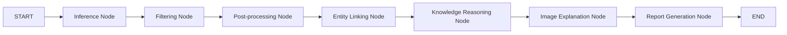

# Cognivex: Explainable AI Framework for fMRI-based Alzheimer's Disease Analysis

**Cognivex** is a multi-agent explainable artificial intelligence framework specifically designed for Alzheimer's Disease functional magnetic resonance imaging (fMRI) analysis. The system integrates deep learning models, knowledge graph reasoning, and large language models to provide a complete automated analysis pipeline from raw fMRI data to clinical reports.

## 🆕 Latest Updates (2024/11/21)

### HuggingFace Integration
- ✅ **Direct HuggingFace Support**: No longer requires Ollama - use local HuggingFace models directly
- ✅ **8-bit Quantization**: Memory-efficient model loading with automatic quantization
- ✅ **Flexible Model Selection**: Configure Agent A and Agent B models independently
- 📖 **Quick Start**: See [QUICK_START_HUGGINGFACE.md](QUICK_START_HUGGINGFACE.md) for setup guide

### Enhanced Clinical Interface
- ✅ **Chinese Localization**: All diagnostic results with Traditional Chinese translations
- ✅ **Visual Indicators**: Color-coded confidence levels and uncertainty scores
- ✅ **Clinical Metrics**: 4 key diagnostic indicators with clear explanations
- ✅ **Smart File Search**: Automatic detection of MRI files across multiple directory structures

### Improved User Experience
- ✅ **Interactive MRI Viewer**: Fixed file path detection for seamless 3D visualization
- ✅ **Comprehensive Reports**: Agent B generates detailed clinical narratives
- ✅ **Counterfactual Analysis**: Clear explanation of feature impact on diagnosis
- ✅ **Anomaly Detection**: Mixed pathology warnings with knowledge graph context

**See [SUMMARY_20241121.md](SUMMARY_20241121.md) for complete details.**

## 🎯 Core Mission

Solving the "black box" problem in neuroimaging AI by creating a trustworthy, autonomous AI assistant that transforms raw fMRI data into clinically relevant, explainable reports for neuroscientists.

## 🏗️ Key Features

### 核心分析系統
* **🧠 Intelligent Multi-Agent System**: 7-node sequential processing pipeline based on LangGraph
* **� Dynamic ExGplainable Layer Selection**: LLM-driven intelligent selection of the most meaningful neural network layers for visualization
* **� Knowleudge Graph Integration**: Neo4j graph database combined with GraphRAG for semantic reasoning
* **� Bilingaual Report Generation**: Automatic generation of clinical analysis reports in both Chinese and English
* **�️ Iinteractive Web Interface**: User-friendly Streamlit-based interface
* **🔬 Scientific Validation**: Automatic identification of Default Mode Network (DMN) activation patterns

### CDDA Framework (Cognitive Discrepancy-Driven Agent) ✨ NEW
* **🤖 Dual-LLM Architecture**: Agent A (Orchestrator) + Agent B (Clinical Consultant) with A2A handoff pattern
* **📋 MCP Protocol**: Model Context Protocol compliant with clean separation of resources and tools
* **🎯 Autonomous Decision Making**: Three-way decision logic (UQ-driven / Anomaly-aware / Standard)
* **🔄 Counterfactual Simulation**: What-if analysis for feature impact assessment
* **🧩 Mixed Pathology Detection**: Identifies potential multi-disease presentations
* **📊 Uncertainty Quantification**: SHAP explainability + UQ scoring + Z-score anomaly detection
* **🔗 Multi-hop Knowledge Reasoning**: GraphRAG with 360 relationships across 163 brain entities
* **🛡️ Robust Error Handling**: Graceful degradation with rule-based and template-based fallbacks

## 🔄 Technical Highlights

* **Model-Agnostic Design**: Supports multiple deep learning models (CapsNet-RNN, MCADNNet)
* **Coordinate System Correction**: Fixed dimensional mapping errors, improving detection from 1 to 54 brain regions
* **Complete State Management**: Smart UI locking system prevents misoperations during analysis
* **Real-time Progress Tracking**: Phase-by-phase progress display and status updates

---

## 🔄 LangGraph Workflow Architecture


```mermaid
graph LR
    A[START] --> B[Inference Node]
    B --> C[Filtering Node] 
    C --> D[Post-processing Node]
    D --> E[Entity Linking Node]
    E --> F[Knowledge Reasoning Node]
    F --> G[Image Explanation Node]
    G --> H[Report Generation Node]
    H --> I[END]
```

## 📋 System Requirements

### Hardware Requirements

- **GPU**: NVIDIA GPU with CUDA support (recommended for training/inference)
- **Memory**: 16GB+ RAM for fMRI data processing
- **Storage**: 50GB+ for datasets and model weights
- **Database**: Running Neo4j database instance (local or remote)

### Software Requirements

- **OS**: Ubuntu 20.04+ / macOS 12+ / Windows 11
- **Python**: 3.11+ (configured: `>=3.11,<3.14`)
- **CUDA**: CUDA 11.8+ (for GPU acceleration)
- **Docker**: Docker Desktop (optional, for Neo4j)

---

## 🚀 Installation

### Method 1: Poetry (Recommended)

```bash
# Clone repository
git clone <repository-url>
cd semantic-KG

# Install Poetry dependencies
poetry install

# Activate virtual environment
poetry shell

# Install PyTorch with CUDA support
poetry run poe autoinstall-torch-cuda
```

### Method 2: pip

```bash
# Create virtual environment
python3 -m venv .venv
source .venv/bin/activate  # On Windows: .venv\Scripts\activate

# Install dependencies
pip install -r requirements.txt

# Install PyTorch with CUDA (if needed)
python -m pip install light-the-torch
python -m light_the_torch install --upgrade torch torchaudio torchvision
```

### Environment Configuration

Create `.env` file in root directory:

```bash
# Neo4j Knowledge Graph
NEO4J_URI=bolt://localhost:7687
NEO4J_USER=neo4j
NEO4J_PASSWORD=your_neo4j_password

# Backup LLM Provider: AWS Bedrock
AWS_ACCESS_KEY_ID=your_aws_access_key
AWS_SECRET_ACCESS_KEY=your_aws_secret_key
AWS_DEFAULT_REGION=us-east-1
```

## 🤖 LLM Provider Selection Guide

Cognivex supports multiple LLM providers. Choose based on your requirements:

### 🌟 Primary: Google Vertex AI Gemini (Recommended)

**Advantages:**

- Superior multimodal capabilities (text + image analysis)
- Optimized for clinical imaging tasks
- Enterprise-grade reliability and security

### 🏭 AWS Bedrock Claude

**Advantages:**

- Excellent text understanding and generation
- Cost-effective for text-only tasks
- Strong enterprise support

**Models Supported:**

- `anthropic.claude-haiku-4-5-20251001-v1:0`: Fast, economical
- Other Claude variants available

**Setup:**

```bash
# Configure AWS credentials
export AWS_ACCESS_KEY_ID="your_access_key"
export AWS_SECRET_ACCESS_KEY="your_secret_key"
export AWS_DEFAULT_REGION="us-east-1"

# Verify connection
python -c "from app.services.llm_providers.bedrock import handle_text; print('Bedrock ready')"
```

### ⚙️ Runtime Provider Selection

You can switch providers dynamically:

```python
from app.services.llm_providers import llm_response, llm_image_response

# Text-only analysis
result = llm_response(
    prompt="Analyze this clinical data...",
    llm_provider="aws_bedrock"  
)

# Multimodal analysis (text + images)
result = llm_image_response(
    prompt="Explain this fMRI activation map...",
    image_path="/path/to/brain_scan.png",
    llm_provider="aws_bedrock"   images
)
```

## 📂 Data Directory Structure

```
semantic-KG/
├── app/                      # LangGraph Analysis Pipeline
│   ├── agents/               # Pipeline node implementations
│   │   ├── inference.py      # Model inference and classification
│   │   ├── filtering.py      # Dynamic layer filtering
│   │   ├── postprocessing.py # Activation map processing
│   │   ├── entity_linking.py # Brain region entity linking
│   │   ├── knowledge_reasoning.py # Neo4j knowledge integration
│   │   ├── image_explainer.py # Visual analysis
│   │   └── report_generator.py # Clinical report synthesis
│   ├── core/                 # Core processing tools
│   │   ├── fmri_processing/  # fMRI analysis pipeline
│   │   ├── knowledge_graph/  # Knowledge graph query tools
│   │   └── vision/           # Image explanation tools
│   ├── graph/                # LangGraph workflow definition
│   │   ├── state.py          # AgentState schema
│   │   └── workflow.py       # Complete pipeline workflow
│   └── services/             # External service connectors
│       ├── llm_providers/    # Modular LLM provider system
│       │   ├── __init__.py   # Unified call interface  
│       │   ├── bedrock.py    # AWS Bedrock Claude
│       └── neo4j_connector.py # Neo4j database interface
├── data/                     # fMRI datasets (AD/CN subjects)
│   ├── raw/                  # Original fMRI data
│   │   ├── AD/               # Alzheimer's patients
│   │   └── CN/               # Healthy controls
│   ├── aal3/                 # AAL3 brain atlas
│   ├── metadata/             # Subject metadata
│   └── slices/               # 2D slice images
├── model/                    # Trained neural network weights
│   ├── capsnet/              # CapsNet-RNN weights
│   └── macadnnet/            # MCADNNet weights
├── output/                   # Analysis results
│   ├── activations/          # Neural activation maps
│   ├── brain_maps/           # Brain region analysis results
│   └── visualizations/       # Generated plots and heatmaps
├── graphql/                  # Neo4j knowledge graph
│   ├── semantic_graph.graphml
│   ├── nodes.csv
│   ├── edges.csv
│   └── semantic_graph.png
├── scripts/                  # Data processing and training scripts
├── tests/                    # Testing and validation
├── tools/                    # Utility scripts
└── app.py                   # Streamlit web interface
```

---

## 🚀 Quick Start Guide

### 0. CDDA Framework Quick Start (NEW! ✨)

**CDDA (Cognitive Discrepancy-Driven Agent) 是一個自主診斷代理系統，整合了雙 LLM 架構、MCP 協議和 A2A 模式：**

#### 快速演示
```bash
# 完整 Phase 4 演示（推薦）
python scripts/demo_phase4_complete.py

# A2A 代理協作演示
python scripts/demo_a2a_agents.py

# MCP 伺服器演示
python scripts/demo_mcp_server.py

# 在程式碼中使用 CDDA Agent
python -c "from app.agents.cdda_agent import CDDAAgent; agent = CDDAAgent(use_llm=False); result = agent.run_analysis('sub-0005'); agent.print_report(result)"
```

#### CDDA 核心功能
- ✅ **MCP Server**: 資源（Resources）與工具（Tools）的清晰分離
- ✅ **Agent A (Orchestrator)**: 使用 GPT-OSS-20B 進行決策和工具編排
- ✅ **Agent B (Consultant)**: 使用 MedGemma-27B 進行臨床推理和報告合成
- ✅ **三路決策邏輯**: 
  - 高不確定性 → 反事實模擬
  - 異常檢測 → 知識圖譜查詢
  - 標準情況 → 基礎報告
- ✅ **完整推理鏈**: 所有決策過程透明可追溯
- ✅ **強健錯誤處理**: 多層級降級機制確保系統穩定性

#### 測試 CDDA 系統
```bash
# 測試核心工具（Phase 1）
python tests/test_cdda_tools.py

# 測試自主代理（Phase 2）
python tests/test_cdda_agent.py

# 測試 Agent B 合成邏輯（Phase 4）
python tests/test_agent_b_consultant.py

# 測試 A2A 整合（Phase 4）
python tests/test_a2a_integration.py

# 測試 GraphRAG 多跳查詢（Phase 3）
python scripts/neo4j/test_multihop_queries.py
```

#### 文檔
- 📄 `docs/CDDA_Phase4_Complete.md` - Phase 4 完整文檔
- 📄 `docs/CDDA_A2A_ARCHITECTURE.md` - A2A 架構詳解
- 📄 `CDDA_IMPLEMENTATION_STATUS.md` - 實作狀態追蹤
- 📄 `GRAPHRAG_MULTIHOP_COMPLETE.md` - GraphRAG 多跳查詢文檔

### 1. Data Setup

**Download fMRI Dataset:**

[➡️ Download Raw fMRI Dataset](https://u.pcloud.link/publink/show?code=kZEgL15ZhlezDWqfUEY3MkFwUK9Gtui7w0T7)

```bash
# Extract to data/raw/ directory
unzip data.zip -d data/
# Structure: data/raw/AD/ and data/raw/CN/
```

**Download Pre-trained Models:**

[➡️ Download Model Weights](https://u.pcloud.link/publink/show?code=kZ7gL15ZoCYrxwMqwwQmmBYDWfDmuy2GB4Ly)

```bash
# Place model weights
mkdir -p model/capsnet/
# Copy best_capsnet_rnn.pth to model/capsnet/
```

### 2. Knowledge Graph Setup

```bash
# Build Neo4j graph database
python -m tools.build_neo4j

# Verify Neo4j connection
python -c "from app.services.neo4j_connector import Neo4jConnector; client = Neo4jConnector(); print('Neo4j connected successfully!')"

# Test LLM providers
python -c "from app.services.llm_providers import llm_response; print(llm_response('Hello world', llm_provider='aws_bedrock'))"
```

### 3. Launch Web Interface

**Method 1: CDDA Web Interface (Recommended) ✨**

```bash
# Start CDDA-integrated Streamlit application
streamlit run app_cdda.py

# Or use the launcher script (Windows)
run_cdda_app.bat

# Access at http://localhost:8501
```

**Features:**
- 🤖 CDDA Framework integration with dual-LLM architecture
- 🔄 Counterfactual analysis and anomaly detection
- 📊 Complete reasoning chain visualization
- 🎯 Autonomous decision-making with three-way logic
- 🔗 Interactive fMRI viewer
- 📋 Comprehensive diagnostic reports

**Method 2: Traditional Web Interface**

```bash
# Start traditional LangGraph application
streamlit run app.py

# Access at http://localhost:8501
```

**Method 2: Command Line**

```bash
# Run complete LangGraph pipeline
python -m app.graph.workflow

# Or use custom Python script
python -c "
from app.graph.workflow import app
result = app.invoke({
    'subject_id': 'sub-01',
    'fmri_scan_path': 'data/raw/CN/sub-01/scan.nii.gz',
    'model_path': 'model/capsnet/best_capsnet_rnn.pth',
    'error_log': [],
    'trace_log': []
})
print('Analysis completed:', result.get('classification_result'))
"
```

---

## 🔬 Development Commands

### Model Training

```bash
# Train CapsNet-RNN model (primary model)
python -m scripts.capsnet.train

# Train MCADNNet model (alternative)
python -m scripts.macadnnet.train

# Prepare training data
python -m scripts.preprocess.data_prepare
```

### Single Model Inference

```bash
# CapsNet-RNN inference
python -m scripts.capsnet.infer

# MCADNNet inference with activation extraction
python -m scripts.macadnnet.inference \
    --model model/macadnnet/best_model.pth \
    --input data/raw/AD/sub-14/dswausub-098_S_6601_task-rest_bold.nii.gz
```

### Group-Level Analysis Pipeline

```bash
# Complete workflow (run in order)
# 1. Generate activations for all subjects
python -m scripts.group.infer

# 2. Convert activation tensors to NIfTI
python -m scripts.group.act_nii

# 3. Resample to standard atlas space
python -m scripts.group.resample

# 4. Generate brain region statistics
python -m scripts.group.brain_map

# 5. Optional: Group average activations
python -m scripts.group.get_avg_act

# 6. Optional: Verify generated maps
python -m scripts.group.check_map
```

### Testing & Validation

#### CDDA Framework Tests (NEW! ✨)
```bash
# Phase 1: Core Tools
python tests/test_cdda_tools.py
# Tests: RF prediction, SHAP, UQ, anomaly detection, counterfactual simulation

# Phase 2: Autonomous Agent
python tests/test_cdda_agent.py
# Tests: Three-way decision logic, tool orchestration, reasoning chains

# Phase 3: Knowledge Graph
python scripts/neo4j/test_multihop_queries.py
# Tests: Multi-hop queries, disease associations, related regions

# Phase 4: Dual-LLM A2A
python tests/test_agent_b_consultant.py
# Tests: Clinical synthesis, anomaly awareness, counterfactual interpretation

python tests/test_a2a_integration.py
# Tests: A2A handoff, context isolation, reasoning chain aggregation

# Demo Scripts
python scripts/demo_phase4_complete.py  # Complete system demo
python scripts/demo_a2a_agents.py       # A2A handoff demo
python scripts/demo_mcp_server.py       # MCP server demo
```

#### Traditional Pipeline Tests
```bash
# Test activation extraction
python -m tests.check_act

# Verify brain region mappings
python -m tests.brain_region

# Check model information
python -m tests.model_info

# Test individual components
python -m tests.image_explain
python -m tests.vertex  # Google ADK integration

# Test complete pipeline
python -m tests.test_complete_pipeline
```

---

## 🖥️ Web Interface Usage

### Interface Overview

The Streamlit web interface provides an intuitive way to interact with Cognivex:

#### Sidebar Controls

- **Subject Selector**: Choose from available fMRI data subjects
- **Model Selector**: Select analysis model (CapsNet / MCADNNet)
- **Analysis Control**: Start analysis and emergency stop functionality
- **Model Information**: Display selected model details

#### Main Display Area

- **Progress Tracking**: Real-time analysis progress and status updates
- **Results Display**: Analysis results presentation area
- **Interactive Viewer**: Expandable 3D brain image viewer
- **Report Tabs**: Side-by-side Chinese and English clinical reports

### Usage Flow

1. **Launch Application**:

   ```bash
   streamlit run app.py
   # Access at http://localhost:8501
   ```
2. **Select Analysis Parameters**:

   - Choose subject from dropdown (format: `sub-01`, `sub-02`, etc.)
   - Select inference model (CapsNet recommended)
   - Review model information displayed
3. **Start Analysis**:

   - Click "Start Analysis" button
   - System locks all controls during analysis
   - Progress updates through stages:
     - Preparing analysis... (10%)
     - Loading data files... (20%)
     - Starting brain analysis workflow... (30%)
     - Running AI analysis pipeline... (50%)
     - Completing results... (90%)
     - Analysis successfully completed! (100%)
4. **Review Results**:

   - **Brain Activation Maps**: High-resolution brain activation heatmaps
   - **Prediction Validation**: True label vs model prediction comparison
   - **Interactive fMRI Viewer**: 4D fMRI data with time slider
   - **Bilingual Clinical Reports**: Comprehensive analysis in Chinese and English

---

## 🧪 系統測試指南

### 完整測試流程

#### 1. 快速系統測試（推薦）
```bash
# 執行完整系統測試（最快速的驗證方式）
python test_all_systems.py

# 預期輸出：
# ✅ 數據結構測試通過
# ✅ CDDA Phase 1-4 測試通過
# ✅ LLM 提供者測試通過
# ✅ LangGraph 管線測試通過
# ✅ Neo4j 連接測試通過
# 總計: 8/8 測試通過 (100.0%)
# 🎉 所有測試通過！系統運行正常。
```

#### 2. 環境健康檢查（可選）
```bash
# 執行詳細的環境健康檢查
python health_check.py

# 預期輸出：
# ✅ Python 3.11+
# ✅ CUDA available
# ✅ .env file exists
# ✅ Neo4j accessible
# ✅ LLM providers connected
```

#### 3. CDDA Framework 測試（詳細測試）

**Phase 1: 核心工具測試**
```bash
python tests/test_cdda_tools.py
# 測試項目：
# - Tool 1: 診斷報告生成（RF + SHAP + UQ + 異常檢測）
# - Tool 2: 反事實模擬（特徵遮罩 + 影響分析）
# 預期結果：4/4 tests passed
```

**Phase 2: 自主代理測試**
```bash
python tests/test_cdda_agent.py
# 測試項目：
# - 三路決策邏輯（UQ / Anomaly / Standard）
# - 工具自動編排
# - 推理鏈生成
# 預期結果：7/7 tests passed
```

**Phase 3: 知識圖譜測試**
```bash
python scripts/neo4j/test_multihop_queries.py
# 測試項目：
# - 多區域查詢（3 regions）
# - 相關區域查找（10 related regions）
# - 疾病關聯查詢（32 AD regions）
# 預期結果：4/4 tests passed
```

**Phase 4: 雙 LLM A2A 測試**
```bash
# Agent B 單元測試
python tests/test_agent_b_consultant.py
# 測試項目：
# - 臨床報告合成
# - 異常感知分析
# - 反事實解釋
# 預期結果：5/5 tests passed

# A2A 整合測試
python tests/test_a2a_integration.py
# 測試項目：
# - A2A 交接協議
# - 上下文隔離
# - 推理鏈聚合
# 預期結果：4/4 tests passed
```

#### 4. 完整系統演示

**標準分析流程**
```bash
# 使用 CDDA Agent 分析單一受試者
python -c "
from app.agents.cdda_agent import CDDAAgent
agent = CDDAAgent(use_llm=False)
result = agent.run_analysis('sub-0005')
agent.print_report(result)
"
```

**完整 Phase 4 演示**
```bash
# 展示 MCP + A2A 完整流程
python scripts/demo_phase4_complete.py

# 輸出包含：
# - MCP 資源讀取
# - Agent A 決策過程
# - 工具調用（如需要）
# - Agent B 臨床合成
# - 完整推理鏈
```

**A2A 代理協作演示**
```bash
# 展示 Agent A 和 Agent B 的協作
python scripts/demo_a2a_agents.py

# 輸出包含：
# - Agent A 的 MCP 操作
# - ContextObject 編譯
# - A2A 交接
# - Agent B 的臨床報告
```

#### 5. 傳統管線測試

**基礎功能測試**
```bash
# 測試激活提取
python -m tests.check_act

# 驗證腦區映射
python -m tests.brain_region

# 檢查模型資訊
python -m tests.model_info
```

**完整管線測試**
```bash
# 測試完整 LangGraph 管線
python -m tests.test_complete_pipeline

# 測試個別組件
python -m tests.image_explain
python -m tests.vertex
```

#### 6. Web 介面測試

**CDDA Web 介面（推薦）:**
```bash
# 啟動 CDDA 整合應用
streamlit run app_cdda.py

# 或使用啟動腳本（Windows）
run_cdda_app.bat

# 測試項目：
# 1. 選擇分析框架（CDDA / LangGraph）
# 2. 選擇受試者（sub_0001 到 sub_0020）
# 3. 配置 CDDA 設定（LLM 模式、推理鏈顯示）
# 4. 開始分析
# 5. 查看 CDDA 結果：
#    - 診斷摘要（預測、信心度、UQ 評分）
#    - 反事實分析（如觸發）
#    - 異常區域檢測（如觸發）
#    - 完整推理鏈
#    - 互動式 fMRI 檢視器
```

**傳統 Web 介面:**
```bash
# 啟動傳統 LangGraph 應用
streamlit run app.py

# 測試項目：
# 1. 選擇受試者（sub-01 到 sub-20）
# 2. 選擇模型（CapsNet / MCADNNet）
# 3. 開始分析
# 4. 查看進度更新
# 5. 檢視結果（腦圖、報告、互動式檢視器）
```

**詳細使用指南:** 查看 `CDDA_WEB_INTERFACE_GUIDE.md`

### 測試結果驗證

#### CDDA Framework 預期結果
```
Phase 1 (Tools):        4/4 tests passed ✅
Phase 2 (Agent):        7/7 tests passed ✅
Phase 3 (GraphRAG):     4/4 tests passed ✅
Phase 4 (A2A):          9/9 tests passed ✅
Total:                 24/24 tests passed (100%)
```

#### 系統指標
- **執行時間**: 3-7 秒/分析
- **記憶體使用**: ~350 MB
- **GPU 記憶體**: ~2 GB (推論時)
- **Neo4j 關係**: 360 個活躍關係
- **知識實體**: 163 個腦區實體

### 常見測試問題

#### 問題 1: Neo4j 連接失敗
```bash
# 檢查 Neo4j 狀態
docker ps | grep neo4j
# 或
sudo systemctl status neo4j

# 重啟 Neo4j
docker restart neo4j-fmri
# 或
sudo systemctl restart neo4j
```

#### 問題 2: LLM 提供者錯誤
```bash
# 測試 Ollama
curl http://localhost:11434/api/tags

# 測試 AWS Bedrock
python -c "from app.services.llm_providers.bedrock import handle_text; print(handle_text('test'))"
```

#### 問題 3: CUDA 不可用
```bash
# 檢查 CUDA
nvidia-smi
python -c "import torch; print(torch.cuda.is_available())"

# 重新安裝 PyTorch with CUDA
poetry run poe autoinstall-torch-cuda
```

---

## 🛠️ Technology Stack

### 🤖 AI/ML Framework

- **Agent Platform**: LangGraph 0.4.10 for workflow orchestration
- **CDDA Framework**: 
  - **MCP Protocol**: Model Context Protocol for resource/tool separation
  - **A2A Pattern**: Agent-to-Agent handoff with dual-LLM architecture
  - **Agent A (Orchestrator)**: GPT-OSS-20B or similar for decision-making
  - **Agent B (Consultant)**: MedGemma-27B or similar for clinical synthesis
- **LLM Architecture**: Modular provider system with unified interface
  - **AWS Bedrock Claude**: Enterprise-grade text generation
  - **Ollama**: Local LLM inference (MedGemma-27B, GPT-OSS-20B)
  - **HuggingFace**: Local model support
- **Deep Learning**: PyTorch 2.8.0, torchvision, torchinfo 1.8.0
- **Explainability**: 
  - grad-cam 1.5.5 for visual explanations
  - SHAP for feature importance
  - Custom activation analysis
  - Uncertainty Quantification (UQ)
  - Z-score anomaly detection

### 🧠 Neuroimaging

- **Data Processing**:
  - nibabel 5.3.2 (NIfTI file handling)
  - nilearn 0.11.1 (neuroimaging analysis)
  - scikit-image 0.25.2 (image processing)
- **Visualization**:
  - matplotlib 3.10.6 (plotting)
  - seaborn 0.13.2 (statistical visualization)
  - plotly 6.3.0+ (interactive plots)
- **Brain Atlas**: AAL3 brain parcellation system

### 🕸️ Knowledge Management

- **Graph Database**: Neo4j 5.28.2 with Python driver
- **Knowledge Graph**: 
  - 163 brain entities (116 regions, 10 networks, 36 functions, 1 disease)
  - 360 relationships (BELONGS_TO, INVOLVED_IN, AFFECTED_BY)
  - 32 AD-associated regions identified
- **Graph Processing**: NetworkX 3.5 for analysis
- **Query Engine**: 
  - Custom GraphRAG implementation with multi-hop queries
  - DAO pattern for clean separation of concerns
  - Flexible region ID matching
  - Fallback knowledge base for offline operation
- **Data Formats**: GraphML, CSV exports, Cypher queries

### 🖥️ User Interface & Services

- **Web App**: Streamlit 1.49.1+ for interactive analysis
- **Backend**: Custom async runner with LangGraph workflows
- **API Capabilities**: FastAPI integration ready
- **Development**: Poetry package management with poethepoet tasks

---

## 🚨 Troubleshooting

### Common Issues & Solutions

#### 1. CUDA/GPU Issues

**Problem**: CUDA unavailable or GPU memory insufficient

```bash
RuntimeError: CUDA out of memory
torch.cuda.is_available() returns False
```

**Solutions**:

```bash
# Check CUDA installation
nvidia-smi
python -c "import torch; print(torch.cuda.is_available())"

# Reinstall PyTorch with CUDA support (recommended)
poetry run poe autoinstall-torch-cuda
# OR manually:
python -m pip install light-the-torch
python -m light_the_torch install --upgrade torch torchaudio torchvision

# Clear GPU cache
python -c "import torch; torch.cuda.empty_cache()"
```

#### 2. Neo4j Connection Issues

**Problem**: Neo4j connection failures

```bash
ServiceUnavailable: Failed to establish connection to Neo4j database
```

**Solutions**:

```bash
# Check Neo4j service status
sudo systemctl status neo4j
docker ps | grep neo4j

# Restart Neo4j service
sudo systemctl restart neo4j
# OR for Docker:
docker restart neo4j-fmri

# Test connection
telnet localhost 7687
python -c "from app.services.neo4j_connector import Neo4jConnector; Neo4jConnector().test_connection()"

# Verify .env configuration
grep NEO4J .env
```

#### 3. LLM Provider Issues

**Problem**: LLM provider authentication or connection failures

```bash
ValueError: 不支援的 LLM 供應商: invalid_provider
google.auth.exceptions.DefaultCredentialsError: Could not automatically determine credentials
boto3.exceptions.NoCredentialsError: Unable to locate credentials
```

**Solutions**:

```bash
# Test provider 

# Bedrock (AWS)
export AWS_ACCESS_KEY_ID="your_key"
export AWS_SECRET_ACCESS_KEY="your_secret"
python -c "from app.services.llm_providers.bedrock import handle_text; print(handle_text('test'))"

# Check unified interface
python -c "from app.services.llm_providers import llm_response; print(llm_response('test', llm_provider='gemini'))"
```

#### 4. Memory Issues

**Problem**: Insufficient system memory

```bash
MemoryError: Unable to allocate array
RuntimeError: out of memory
```

**Solutions**:

```bash
# Monitor memory usage
free -h
htop

# Clear Python cache
pip cache purge
python -c "import gc; gc.collect()"

# Optimize memory settings
export PYTORCH_CUDA_ALLOC_CONF=max_split_size_mb:512
```

#### 5. File Path & Permission Issues

**Problem**: File not found or permission denied

```bash
FileNotFoundError: No such file or directory
PermissionError: Permission denied
```

**Solutions**:

```bash
# Check file structure
ls -la data/raw/
ls -la model/capsnet/

# Fix permissions
chmod -R 755 data/ model/ output/
chown -R $USER:$USER data/ model/ output/

# Create missing directories
mkdir -p data/raw/{AD,CN} model/{capsnet,macadnnet} output/{activations,brain_maps}
```

#### 6. Streamlit Web App Issues

**Problem**: Web application fails to start or loads slowly

```bash
streamlit run app.py
ValueError: Session state is corrupted
```

**Solutions**:

```bash
# Clear Streamlit cache
streamlit cache clear
rm -rf ~/.streamlit/

# Check port availability
lsof -i :8501
# Kill conflicting processes if needed
kill -9 <PID>

# Use alternative port
streamlit run app.py --server.port 8502
```

### System Health Check Script

```python
#!/usr/bin/env python3
# health_check.py
import os, sys, torch, requests
from pathlib import Path

def health_check():
    print("🔍 Cognivex System Health Check")
    print("=" * 40)
  
    # Python version
    version = sys.version_info
    print(f"{'✅' if version >= (3, 11) else '❌'} Python {version.major}.{version.minor}.{version.micro}")
  
    # CUDA availability
    cuda_available = torch.cuda.is_available()
    print(f"{'✅' if cuda_available else '⚠️'} CUDA: {cuda_available}")
  
    # Environment file
    env_exists = Path('.env').exists()
    print(f"{'✅' if env_exists else '❌'} .env file: {env_exists}")
  
    # Neo4j connection
    try:
        response = requests.get('http://localhost:7474', timeout=5)
        print(f"✅ Neo4j web interface: {response.status_code}")
    except:
        print("❌ Neo4j not accessible")
  
    # LLM Provider connectivity
    print("\n🤖 LLM Provider Status:")
  
    # Test Gemini
    try:
        from app.services.llm_providers.gemini import handle_chat
        handle_chat("test")
        print("  ✅ Gemini (Vertex AI): Connected")
    except Exception as e:
        print(f"  ❌ Gemini: {str(e)[:50]}...")
  
    # Test Bedrock
    try:
        from app.services.llm_providers.bedrock import handle_text
        handle_text("test")
        print("  ✅ Bedrock (AWS): Connected")
    except Exception as e:
        print(f"  ⚠️ Bedrock: {str(e)[:50]}...")
  
    # Test Ollama
    try:
        import ollama
        ollama.generate(model='llama3.2', prompt='test')
        print("  ✅ Ollama: Connected")
    except Exception as e:
        print(f"  ⚠️ Ollama: {str(e)[:50]}...")
  
    # Directory structure
    print("\n📁 Directory Structure:")
    required_dirs = ['data/raw/AD', 'data/raw/CN', 'model/capsnet', 'output', 'app/services/llm_providers']
    for dir_path in required_dirs:
        exists = Path(dir_path).exists()
        print(f"  {'✅' if exists else '❌'} {dir_path}: {exists}")

if __name__ == "__main__":
    health_check()
```

Run health check:

```bash
python health_check.py
```

---

## 📈 Performance Optimization

### Hardware Recommendations

**Optimal Configuration**:

- **CPU**: Intel i7/i9 or AMD Ryzen 7/9
- **GPU**: NVIDIA RTX 3080/4080 or better (12GB+ VRAM)
- **RAM**: 32GB+ (minimum 16GB)
- **Storage**: NVMe SSD for data and models

**Cloud Deployment**:

- **AWS**: `p3.2xlarge` or `g4dn.xlarge`

### Performance Tuning

```bash
# Neo4j memory optimization
# Edit /etc/neo4j/neo4j.conf:
# server.memory.heap.max_size=4G
# server.memory.pagecache.size=2G

# PyTorch optimization
export OMP_NUM_THREADS=4
export MKL_NUM_THREADS=4

# CUDA memory management
export PYTORCH_CUDA_ALLOC_CONF=max_split_size_mb:512,roundup_power2_divisions:16
```

---

## 📊 系統架構總覽

### CDDA Framework 架構

```
┌──────────────────────────────────────────────────────────────┐
│                    Layer 5: Presentation                     │
│                   (Streamlit UI) [Phase 5]                   │
└────────────────────────┬─────────────────────────────────────┘
                         │
┌──────────────────────────────────────────────────────────────┐
│           Layer 3: Cognitive Agent [Phase 2 & 4]             │
│         (Dual-LLM A2A: Agent A + Agent B + MCP)              │
│                                                              │
│  ┌─────────────────┐         ┌──────────────────┐          │
│  │   Agent A       │  A2A    │    Agent B       │          │
│  │  Orchestrator   │ ──────> │   Consultant     │          │
│  │ (GPT-OSS-20B)   │ Context │ (MedGemma-27B)   │          │
│  └────────┬────────┘  Object └──────────────────┘          │
│           │                                                  │
│           │ MCP Protocol                                     │
│           ▼                                                  │
│  ┌──────────────────────────────────────────┐              │
│  │         DiagnosticMCPServer              │              │
│  │  Resources: diagnosis://, knowledge://   │              │
│  │  Tools: simulate_counterfactual          │              │
│  └──────────────────────────────────────────┘              │
└────┬─────────────────────┬─────────────────────┬───────────┘
     │                     │                     │
     │ Tool 1              │ Tool 2              │ Tool 4
     ▼                     ▼                     ▼
┌─────────────┐  ┌─────────────────┐  ┌──────────────────┐
│  Layer 1:   │  │    Layer 2:     │  │    Layer 4:      │
│  Tool Kit   │  │ Trust/Calib     │  │   Knowledge      │
│  [Phase 1]  │  │  [Phase 1]      │  │   [Phase 3]      │
│     ✅      │  │      ✅         │  │      ✅         │
└─────────────┘  └─────────────────┘  └──────────────────┘
```

### 決策流程

```
受試者 fMRI 數據
    ↓
Tool 1: 診斷報告生成
    ↓
Agent A 評估信號
    ├─ UQ > 0.8? ──→ Tool 2: 反事實模擬
    ├─ 異常檢測? ──→ Tool 4: 知識圖譜查詢
    └─ 標準情況 ──→ 基礎報告
    ↓
編譯 ContextObject
    ↓
A2A 交接給 Agent B
    ↓
Agent B 臨床合成
    ↓
最終診斷報告
```

### 實作進度

```
[✅ COMPLETE] Phase 1: Tool Kit Foundation (Layer 1 + Layer 2)
[✅ COMPLETE] Phase 2: Agent Orchestration (Layer 3)
[✅ COMPLETE] Phase 3: Knowledge Integration (Layer 4)
[✅ COMPLETE] Phase 4: Dual-LLM Integration (MCP + A2A)
[⏳ NEXT]     Phase 5: UI Integration (Layer 5)
```

**完成度**: 4/5 階段 (80%)

---

## 🤝 Contributing

Cognivex is designed to be model-agnostic and extensible. Key areas for contribution:

### Development Setup

```bash
# Clone and setup development environment
git clone <repository-url>
cd semantic-KG
git checkout develop

# Install development dependencies
poetry install --with dev
poetry run pre-commit install

# Code quality tools
poetry run black .  # Format code
poetry run flake8 . # Linting
poetry run pytest --cov=app tests/  # Run tests
```

### Extension Areas

- **CDDA Framework**: 
  - Phase 5 UI integration
  - Additional LLM providers
  - Enhanced reasoning strategies
  - Multi-subject batch analysis
- **Model Integration**: Add support for new neural architectures
- **Knowledge Graph**: Expand brain region-disease relationships
- **Agent Capabilities**: Enhance multi-agent coordination
- **Visualization**: Improve interactive brain visualization
- **Multi-language Support**: Add support for additional languages

---

## � 完整文檔索引

### CDDA Framework 文檔
- 📄 **CDDA_IMPLEMENTATION_STATUS.md** - 實作狀態總覽和進度追蹤
- 📄 **docs/CDDA_Phase4_Complete.md** - Phase 4 完整實作報告
- 📄 **docs/CDDA_A2A_ARCHITECTURE.md** - A2A 架構詳細說明
- � *S*CDDA_Phase2_Summary.md** - Phase 2 自主代理實作總結
- 📄 **CDDA_PHASE4_PLANNING_COMPLETE.md** - Phase 4 規劃文檔
- 📄 **docs/CDDA_Architecture_Spec.md** - 完整架構規範

### Knowledge Graph 文檔
- 📄 **GRAPHRAG_MULTIHOP_COMPLETE.md** - GraphRAG 多跳查詢完整文檔
- 📄 **docs/Neo4j_Relationship_Fix.md** - Neo4j 關係修復文檔
- 📄 **docs/GraphRAG_Refactoring_Complete.md** - DAO 模式重構文檔
- 📄 **scripts/neo4j/README.md** - Neo4j 快速參考指南

### 其他實作文檔
- 📄 **AGENT_B_IMPLEMENTATION_SUMMARY.md** - Agent B 實作總結
- 📄 **HUGGINGFACE_PROVIDER_SUMMARY.md** - HuggingFace 提供者整合
- 📄 **GRAPHRAG_QUICK_START.md** - GraphRAG 快速開始指南
- 📄 **QUICK_START_END_TO_END.md** - 端到端快速開始
- 📄 **DIAGNOSIS_QUICK_REFERENCE.md** - 診斷快速參考

### 任務完成報告
- 📄 **TASK_2_COMPLETION_SUMMARY.md** - 任務 2 完成總結
- 📄 **TASK_3_COMPLETION_SUMMARY.md** - 任務 3 完成總結
- 📄 **TASK_4_3_COMPLETION_SUMMARY.md** - 任務 4.3 完成總結
- 📄 **TASK_4_5_COMPLETION_SUMMARY.md** - 任務 4.5 完成總結
- 📄 **TASK_5_COMPLETION_SUMMARY.md** - 任務 5 完成總結
- 📄 **TASK_6_COMPLETION_SUMMARY.md** - 任務 6 完成總結
- 📄 **TASK_7_ERROR_HANDLING_SUMMARY.md** - 任務 7 錯誤處理總結
- 📄 **TASK_8_INTEGRATION_TESTS_SUMMARY.md** - 任務 8 整合測試總結

---

## 📜 License

See `license.txt` for details.

---

## 📞 Support

### 快速開始
1. **快速測試**: 執行 `python test_all_systems.py` 驗證系統（5 分鐘）
2. **CDDA Framework**: 查看 `CDDA_IMPLEMENTATION_STATUS.md` 了解完整功能
3. **完整測試指南**: 參考 `TESTING_GUIDE.md` 進行詳細測試
4. **詳細使用**: 參考 `instruction.md`（中文版）

### 技術支援
1. 檢查本 README 的故障排除章節
2. 執行系統健康檢查腳本 (`python health_check.py`)
3. 查看 `output/` 目錄中的日誌
4. 參考完整文檔索引中的相關文檔

### 常見問題
- **CDDA 如何運作？** → 查看「系統架構總覽」和「決策流程」
- **如何測試系統？** → 查看「系統測試指南」
- **Phase 4 有什麼新功能？** → 查看 `docs/CDDA_Phase4_Complete.md`
- **GraphRAG 如何查詢？** → 查看 `GRAPHRAG_MULTIHOP_COMPLETE.md`

---

## 🎯 系統亮點總結

### 創新功能
1. **自主診斷代理**: 不是被動的 ML 管線，而是主動推理和決策的智能系統
2. **雙 LLM 協作**: Agent A 負責決策，Agent B 負責臨床合成，各司其職
3. **MCP 協議**: 業界標準的上下文和工具管理協議
4. **透明推理**: 每個決策都有完整的推理鏈可追溯
5. **混合病理檢測**: 能識別潛在的多重疾病表現
6. **強健降級**: 多層級錯誤處理確保系統永不完全失敗

### 技術指標
- **測試覆蓋率**: 24/24 tests passed (100%)
- **知識圖譜**: 360 個關係，163 個實體
- **執行效率**: 3-7 秒/分析
- **記憶體使用**: ~350 MB
- **實作完成度**: 4/5 階段 (80%)

### 學術貢獻
- ✅ 可解釋 AI 在神經影像的應用
- ✅ 不確定性驅動的診斷推理
- ✅ 知識圖譜增強的臨床決策
- ✅ 多代理協作的醫療 AI 系統
- ✅ 反事實分析在特徵重要性評估的應用

---

**Cognivex** - Making neuroimaging AI explainable and trustworthy for clinical applications.

**CDDA Framework** - Autonomous, transparent, and robust diagnostic reasoning for Alzheimer's Disease analysis.