# Cognivex: Explainable AI Framework for fMRI-based Alzheimer's Disease Analysis

**Cognivex** is a multi-agent explainable artificial intelligence framework specifically designed for Alzheimer's Disease functional magnetic resonance imaging (fMRI) analysis. The system integrates deep learning models, knowledge graph reasoning, and large language models to provide a complete automated analysis pipeline from raw fMRI data to clinical reports.

## 🎯 Core Mission

Solving the "black box" problem in neuroimaging AI by creating a trustworthy, autonomous AI assistant that transforms raw fMRI data into clinically relevant, explainable reports for neuroscientists.

## 🏗️ Key Features

* **🧠 Intelligent Multi-Agent System**: 7-node sequential processing pipeline based on LangGraph
* **🔍 Dynamic Explainable Layer Selection**: LLM-driven intelligent selection of the most meaningful neural network layers for visualization
* **🔗 Knowledge Graph Integration**: Neo4j graph database combined with GraphRAG for semantic reasoning
* **📄 Bilingual Report Generation**: Automatic generation of clinical analysis reports in both Chinese and English
* **🖥️ Interactive Web Interface**: User-friendly Streamlit-based interface
* **🔬 Scientific Validation**: Automatic identification of Default Mode Network (DMN) activation patterns

## 🔄 Technical Highlights

* **Model-Agnostic Design**: Supports multiple deep learning models (CapsNet-RNN, MCADNNet)
* **Coordinate System Correction**: Fixed dimensional mapping errors, improving detection from 1 to 54 brain regions
* **Complete State Management**: Smart UI locking system prevents misoperations during analysis
* **Real-time Progress Tracking**: Phase-by-phase progress display and status updates

---

## 🔄 LangGraph Workflow Architecture

```mermaid
graph LR
    A[START] --> B[推理節點<br/>Inference Node]
    B --> C[篩選節點<br/>Filtering Node] 
    C --> D[後處理節點<br/>Post-processing Node]
    D --> E[實體連結節點<br/>Entity Linking Node]
    E --> F[知識推理節點<br/>Knowledge Reasoning Node]
    F --> G[影像解釋節點<br/>Image Explanation Node]
    G --> H[報告生成節點<br/>Report Generation Node]
    H --> I[END]
```



## 📋 System Requirements

### Hardware Requirements
- **GPU**: NVIDIA GPU with CUDA support (recommended for training/inference)
- **Memory**: 16GB+ RAM for fMRI data processing
- **Storage**: 50GB+ for datasets and model weights
- **Database**: Running Neo4j database instance (local or remote)

### Software Requirements
- **OS**: Ubuntu 20.04+ / macOS 12+ / Windows 11
- **Python**: 3.11+ (configured: `>=3.11,<3.14`)
- **CUDA**: CUDA 11.8+ (for GPU acceleration)
- **Docker**: Docker Desktop (optional, for Neo4j)

---

## 🚀 Installation

### Method 1: Poetry (Recommended)

```bash
# Clone repository
git clone <repository-url>
cd semantic-KG

# Install Poetry dependencies
poetry install

# Activate virtual environment
poetry shell

# Install PyTorch with CUDA support
poetry run poe autoinstall-torch-cuda
```

### Method 2: pip

```bash
# Create virtual environment
python3 -m venv .venv
source .venv/bin/activate  # On Windows: .venv\Scripts\activate

# Install dependencies
pip install -r requirements.txt

# Install PyTorch with CUDA (if needed)
python -m pip install light-the-torch
python -m light_the_torch install --upgrade torch torchaudio torchvision
```

### Environment Configuration

Create `.env` file in root directory:

```bash
# Neo4j Knowledge Graph
NEO4J_URI=bolt://localhost:7687
NEO4J_USER=neo4j
NEO4J_PASSWORD=your_neo4j_password

# Primary LLM Provider: Google Vertex AI
GOOGLE_CLOUD_PROJECT=your_gcp_project_id
GOOGLE_CLOUD_LOCATION=us-central1
GOOGLE_APPLICATION_CREDENTIALS=./gcp-service-account.json
GOOGLE_GENAI_USE_VERTEXAI=1

# Backup LLM Provider: AWS Bedrock
AWS_ACCESS_KEY_ID=your_aws_access_key
AWS_SECRET_ACCESS_KEY=your_aws_secret_key
AWS_DEFAULT_REGION=us-east-1

# Local LLM Provider: Ollama
OLLAMA_BASE_URL=http://localhost:11434

# Optional: Cloud deployment
PROJECT_ID=your_gcp_project_id
LOCATION=your_gcp_location
BUCKET_ID=your_gcp_bucket
```

## 🤖 LLM Provider Selection Guide

Cognivex supports multiple LLM providers. Choose based on your requirements:

### 🌟 Primary: Google Vertex AI Gemini (Recommended)

**Advantages:**
- Superior multimodal capabilities (text + image analysis)
- Optimized for clinical imaging tasks
- Enterprise-grade reliability and security

**Models Supported:**
- `gemini-1.5-flash`: Fast inference, cost-effective
- `gemini-1.5-pro`: Advanced reasoning, higher accuracy

**Setup:**
```bash
# Download GCP service account key (JSON file)
# Place in project root: gcp-service-account.json

# Verify connection
python -c "from app.services.llm_providers.gemini import handle_chat; print('Vertex AI ready')"
```

### 🏭 Backup: AWS Bedrock Claude

**Advantages:**
- Excellent text understanding and generation
- Cost-effective for text-only tasks
- Strong enterprise support

**Models Supported:**
- `anthropic.claude-haiku-4-5-20251001-v1:0`: Fast, economical
- Other Claude variants available

**Setup:**
```bash
# Configure AWS credentials
export AWS_ACCESS_KEY_ID="your_access_key"
export AWS_SECRET_ACCESS_KEY="your_secret_key"
export AWS_DEFAULT_REGION="us-east-1"

# Verify connection
python -c "from app.services.llm_providers.bedrock import handle_text; print('Bedrock ready')"
```

### 🖥️ Local: Ollama (Development/Offline)

**Advantages:**
- Complete privacy and data security
- No internet dependency
- No per-use costs

**Models Supported:**
- `llama3.2`: General-purpose reasoning
- `qwen2.5:14b`: Advanced Chinese/English bilingual
- Custom fine-tuned models

**Setup:**
```bash
# Install and start Ollama
curl -fsSL https://ollama.ai/install.sh | sh
ollama serve

# Download models
ollama pull llama3.2
ollama pull qwen2.5:14b

# Verify connection
curl http://localhost:11434/api/tags
```

### ⚙️ Runtime Provider Selection

You can switch providers dynamically:

```python
from app.services.llm_providers import llm_response, llm_image_response

# Text-only analysis
result = llm_response(
    prompt="Analyze this clinical data...",
    llm_provider="gemini"  # or "aws_bedrock", "gpt-oss-20b"
)

# Multimodal analysis (text + images)
result = llm_image_response(
    prompt="Explain this fMRI activation map...",
    image_path="/path/to/brain_scan.png",
    llm_provider="gemini"  # Only Gemini and Bedrock support images
)
```

**Provider Comparison:**

| Provider | Text | Images | Cost | Privacy | Offline |
|----------|------|---------|------|---------|----------|
| **Gemini** | ✅ Excellent | ✅ Best | 🟡 Medium | 🟡 Cloud | ❌ No |
| **Bedrock** | ✅ Excellent | ✅ Good | ✅ Low | 🟡 Cloud | ❌ No |
| **Ollama** | 🟡 Good | ❌ No | ✅ Free | ✅ Complete | ✅ Yes |

---

## 📂 Data Directory Structure

```
semantic-KG/
├── app/                      # LangGraph Analysis Pipeline
│   ├── agents/               # Pipeline node implementations
│   │   ├── inference.py      # Model inference and classification
│   │   ├── filtering.py      # Dynamic layer filtering
│   │   ├── postprocessing.py # Activation map processing
│   │   ├── entity_linking.py # Brain region entity linking
│   │   ├── knowledge_reasoning.py # Neo4j knowledge integration
│   │   ├── image_explainer.py # Visual analysis
│   │   └── report_generator.py # Clinical report synthesis
│   ├── core/                 # Core processing tools
│   │   ├── fmri_processing/  # fMRI analysis pipeline
│   │   ├── knowledge_graph/  # Knowledge graph query tools
│   │   └── vision/           # Image explanation tools
│   ├── graph/                # LangGraph workflow definition
│   │   ├── state.py          # AgentState schema
│   │   └── workflow.py       # Complete pipeline workflow
│   └── services/             # External service connectors
│       ├── llm_providers/    # Modular LLM provider system
│       │   ├── __init__.py   # Unified call interface  
│       │   ├── gemini.py     # Google Vertex AI Gemini
│       │   ├── bedrock.py    # AWS Bedrock Claude
│       │   └── ollama.py     # Ollama local inference
│       └── neo4j_connector.py # Neo4j database interface
├── data/                     # fMRI datasets (AD/CN subjects)
│   ├── raw/                  # Original fMRI data
│   │   ├── AD/               # Alzheimer's patients
│   │   └── CN/               # Healthy controls
│   ├── aal3/                 # AAL3 brain atlas
│   ├── metadata/             # Subject metadata
│   └── slices/               # 2D slice images
├── model/                    # Trained neural network weights
│   ├── capsnet/              # CapsNet-RNN weights
│   └── macadnnet/            # MCADNNet weights
├── output/                   # Analysis results
│   ├── activations/          # Neural activation maps
│   ├── brain_maps/           # Brain region analysis results
│   └── visualizations/       # Generated plots and heatmaps
├── graphql/                  # Neo4j knowledge graph
│   ├── semantic_graph.graphml
│   ├── nodes.csv
│   ├── edges.csv
│   └── semantic_graph.png
├── scripts/                  # Data processing and training scripts
├── tests/                    # Testing and validation
├── tools/                    # Utility scripts
└── app.py                   # Streamlit web interface
```

---

## 🚀 Quick Start Guide

### 1. Data Setup

**Download fMRI Dataset:**

[➡️ Download Raw fMRI Dataset](https://u.pcloud.link/publink/show?code=kZEgL15ZhlezDWqfUEY3MkFwUK9Gtui7w0T7)

```bash
# Extract to data/raw/ directory
unzip data.zip -d data/
# Structure: data/raw/AD/ and data/raw/CN/
```

**Download Pre-trained Models:**

[➡️ Download Model Weights](https://u.pcloud.link/publink/show?code=kZ7gL15ZoCYrxwMqwwQmmBYDWfDmuy2GB4Ly)

```bash
# Place model weights
mkdir -p model/capsnet/
# Copy best_capsnet_rnn.pth to model/capsnet/
```

### 2. Knowledge Graph Setup

```bash
# Build Neo4j graph database
python -m tools.build_neo4j

# Verify Neo4j connection
python -c "from app.services.neo4j_connector import Neo4jConnector; client = Neo4jConnector(); print('Neo4j connected successfully!')"

# Test LLM providers
python -c "from app.services.llm_providers import llm_response; print(llm_response('Hello world', llm_provider='gemini'))"
python -c "from app.services.llm_providers import llm_response; print(llm_response('Hello world', llm_provider='aws_bedrock'))"
python -c "from app.services.llm_providers import llm_response; print(llm_response('Hello world', llm_provider='gpt-oss-20b', model='llama3.2'))"
```

### 3. Launch Web Interface

**Method 1: Web Interface (Recommended)**

```bash
# Start Streamlit application
streamlit run app.py

# Access at http://localhost:8501
```

**Method 2: Command Line**

```bash
# Run complete LangGraph pipeline
python -m app.graph.workflow

# Or use custom Python script
python -c "
from app.graph.workflow import app
result = app.invoke({
    'subject_id': 'sub-01',
    'fmri_scan_path': 'data/raw/CN/sub-01/scan.nii.gz',
    'model_path': 'model/capsnet/best_capsnet_rnn.pth',
    'error_log': [],
    'trace_log': []
})
print('Analysis completed:', result.get('classification_result'))
"
```

---

## 🔬 Development Commands

### Model Training

```bash
# Train CapsNet-RNN model (primary model)
python -m scripts.capsnet.train

# Train MCADNNet model (alternative)
python -m scripts.macadnnet.train

# Prepare training data
python -m scripts.preprocess.data_prepare
```

### Single Model Inference

```bash
# CapsNet-RNN inference
python -m scripts.capsnet.infer

# MCADNNet inference with activation extraction
python -m scripts.macadnnet.inference \
    --model model/macadnnet/best_model.pth \
    --input data/raw/AD/sub-14/dswausub-098_S_6601_task-rest_bold.nii.gz
```

### Group-Level Analysis Pipeline

```bash
# Complete workflow (run in order)
# 1. Generate activations for all subjects
python -m scripts.group.infer

# 2. Convert activation tensors to NIfTI
python -m scripts.group.act_nii

# 3. Resample to standard atlas space
python -m scripts.group.resample

# 4. Generate brain region statistics
python -m scripts.group.brain_map

# 5. Optional: Group average activations
python -m scripts.group.get_avg_act

# 6. Optional: Verify generated maps
python -m scripts.group.check_map
```

### Testing & Validation

```bash
# Test activation extraction
python -m tests.check_act

# Verify brain region mappings
python -m tests.brain_region

# Check model information
python -m tests.model_info

# Test individual components
python -m tests.image_explain
python -m tests.vertex  # Google ADK integration

# Test complete pipeline
python -m tests.test_complete_pipeline
```

---

## 🖥️ Web Interface Usage

### Interface Overview

The Streamlit web interface provides an intuitive way to interact with Cognivex:

#### Sidebar Controls
- **Subject Selector**: Choose from available fMRI data subjects
- **Model Selector**: Select analysis model (CapsNet / MCADNNet)
- **Analysis Control**: Start analysis and emergency stop functionality
- **Model Information**: Display selected model details

#### Main Display Area
- **Progress Tracking**: Real-time analysis progress and status updates
- **Results Display**: Analysis results presentation area
- **Interactive Viewer**: Expandable 3D brain image viewer
- **Report Tabs**: Side-by-side Chinese and English clinical reports

### Usage Flow

1. **Launch Application**:
   ```bash
   streamlit run app.py
   # Access at http://localhost:8501
   ```

2. **Select Analysis Parameters**:
   - Choose subject from dropdown (format: `sub-01`, `sub-02`, etc.)
   - Select inference model (CapsNet recommended)
   - Review model information displayed

3. **Start Analysis**:
   - Click "Start Analysis" button
   - System locks all controls during analysis
   - Progress updates through stages:
     - Preparing analysis... (10%)
     - Loading data files... (20%)
     - Starting brain analysis workflow... (30%)
     - Running AI analysis pipeline... (50%)
     - Completing results... (90%)
     - Analysis successfully completed! (100%)

4. **Review Results**:
   - **Brain Activation Maps**: High-resolution brain activation heatmaps
   - **Prediction Validation**: True label vs model prediction comparison
   - **Interactive fMRI Viewer**: 4D fMRI data with time slider
   - **Bilingual Clinical Reports**: Comprehensive analysis in Chinese and English

---

## 🛠️ Technology Stack

### 🤖 AI/ML Framework
- **Agent Platform**: LangGraph 0.4.10 for workflow orchestration
- **LLM Architecture**: Modular provider system with unified interface
  - **Google Vertex AI Gemini**: Primary provider for multimodal analysis
  - **AWS Bedrock Claude**: Enterprise-grade text generation
  - **Ollama**: Local inference for privacy-sensitive environments
- **Deep Learning**: PyTorch 2.8.0, torchvision, torchinfo 1.8.0
- **Explainability**: grad-cam 1.5.5, custom activation analysis

### 🧠 Neuroimaging
- **Data Processing**: 
  - nibabel 5.3.2 (NIfTI file handling)
  - nilearn 0.11.1 (neuroimaging analysis)
  - scikit-image 0.25.2 (image processing)
- **Visualization**: 
  - matplotlib 3.10.6 (plotting)
  - seaborn 0.13.2 (statistical visualization)
  - plotly 6.3.0+ (interactive plots)
- **Brain Atlas**: AAL3 brain parcellation system

### 🕸️ Knowledge Management
- **Graph Database**: Neo4j 5.28.2 with Python driver
- **Graph Processing**: NetworkX 3.5 for analysis
- **Query Engine**: Custom GraphRAG implementation
- **Data Formats**: GraphML, CSV exports

### 🖥️ User Interface & Services
- **Web App**: Streamlit 1.49.1+ for interactive analysis
- **Backend**: Custom async runner with LangGraph workflows
- **API Capabilities**: FastAPI integration ready
- **Development**: Poetry package management with poethepoet tasks

---

## 🚨 Troubleshooting

### Common Issues & Solutions

#### 1. CUDA/GPU Issues

**Problem**: CUDA unavailable or GPU memory insufficient
```bash
RuntimeError: CUDA out of memory
torch.cuda.is_available() returns False
```

**Solutions**:
```bash
# Check CUDA installation
nvidia-smi
python -c "import torch; print(torch.cuda.is_available())"

# Reinstall PyTorch with CUDA support (recommended)
poetry run poe autoinstall-torch-cuda
# OR manually:
python -m pip install light-the-torch
python -m light_the_torch install --upgrade torch torchaudio torchvision

# Clear GPU cache
python -c "import torch; torch.cuda.empty_cache()"
```

#### 2. Neo4j Connection Issues

**Problem**: Neo4j connection failures
```bash
ServiceUnavailable: Failed to establish connection to Neo4j database
```

**Solutions**:
```bash
# Check Neo4j service status
sudo systemctl status neo4j
docker ps | grep neo4j

# Restart Neo4j service
sudo systemctl restart neo4j
# OR for Docker:
docker restart neo4j-fmri

# Test connection
telnet localhost 7687
python -c "from app.services.neo4j_connector import Neo4jConnector; Neo4jConnector().test_connection()"

# Verify .env configuration
grep NEO4J .env
```

#### 3. LLM Provider Issues

**Problem**: LLM provider authentication or connection failures
```bash
ValueError: 不支援的 LLM 供應商: invalid_provider
google.auth.exceptions.DefaultCredentialsError: Could not automatically determine credentials
boto3.exceptions.NoCredentialsError: Unable to locate credentials
```

**Solutions**:
```bash
# Test each provider individually

# Gemini (Vertex AI)
export GOOGLE_APPLICATION_CREDENTIALS="./gcp-service-account.json"
export GOOGLE_CLOUD_PROJECT="your-project-id"
python -c "from app.services.llm_providers.gemini import handle_chat; print(handle_chat('test'))"

# Bedrock (AWS)
export AWS_ACCESS_KEY_ID="your_key"
export AWS_SECRET_ACCESS_KEY="your_secret"
python -c "from app.services.llm_providers.bedrock import handle_text; print(handle_text('test'))"

# Ollama (Local)
ollama serve &
ollama pull llama3.2
python -c "from app.services.llm_providers.ollama import handle_text; print(handle_text('test', model='llama3.2'))"

# Check unified interface
python -c "from app.services.llm_providers import llm_response; print(llm_response('test', llm_provider='gemini'))"
```

#### 4. Memory Issues

**Problem**: Insufficient system memory
```bash
MemoryError: Unable to allocate array
RuntimeError: out of memory
```

**Solutions**:
```bash
# Monitor memory usage
free -h
htop

# Clear Python cache
pip cache purge
python -c "import gc; gc.collect()"

# Optimize memory settings
export PYTORCH_CUDA_ALLOC_CONF=max_split_size_mb:512
```

#### 5. File Path & Permission Issues

**Problem**: File not found or permission denied
```bash
FileNotFoundError: No such file or directory
PermissionError: Permission denied
```

**Solutions**:
```bash
# Check file structure
ls -la data/raw/
ls -la model/capsnet/

# Fix permissions
chmod -R 755 data/ model/ output/
chown -R $USER:$USER data/ model/ output/

# Create missing directories
mkdir -p data/raw/{AD,CN} model/{capsnet,macadnnet} output/{activations,brain_maps}
```

#### 6. Streamlit Web App Issues

**Problem**: Web application fails to start or loads slowly
```bash
streamlit run app.py
ValueError: Session state is corrupted
```

**Solutions**:
```bash
# Clear Streamlit cache
streamlit cache clear
rm -rf ~/.streamlit/

# Check port availability
lsof -i :8501
# Kill conflicting processes if needed
kill -9 <PID>

# Use alternative port
streamlit run app.py --server.port 8502
```

### System Health Check Script

```python
#!/usr/bin/env python3
# health_check.py
import os, sys, torch, requests
from pathlib import Path

def health_check():
    print("🔍 Cognivex System Health Check")
    print("=" * 40)
    
    # Python version
    version = sys.version_info
    print(f"{'✅' if version >= (3, 11) else '❌'} Python {version.major}.{version.minor}.{version.micro}")
    
    # CUDA availability
    cuda_available = torch.cuda.is_available()
    print(f"{'✅' if cuda_available else '⚠️'} CUDA: {cuda_available}")
    
    # Environment file
    env_exists = Path('.env').exists()
    print(f"{'✅' if env_exists else '❌'} .env file: {env_exists}")
    
    # Neo4j connection
    try:
        response = requests.get('http://localhost:7474', timeout=5)
        print(f"✅ Neo4j web interface: {response.status_code}")
    except:
        print("❌ Neo4j not accessible")
    
    # LLM Provider connectivity
    print("\n🤖 LLM Provider Status:")
    
    # Test Gemini
    try:
        from app.services.llm_providers.gemini import handle_chat
        handle_chat("test")
        print("  ✅ Gemini (Vertex AI): Connected")
    except Exception as e:
        print(f"  ❌ Gemini: {str(e)[:50]}...")
    
    # Test Bedrock
    try:
        from app.services.llm_providers.bedrock import handle_text
        handle_text("test")
        print("  ✅ Bedrock (AWS): Connected")
    except Exception as e:
        print(f"  ⚠️ Bedrock: {str(e)[:50]}...")
    
    # Test Ollama
    try:
        import ollama
        ollama.generate(model='llama3.2', prompt='test')
        print("  ✅ Ollama: Connected")
    except Exception as e:
        print(f"  ⚠️ Ollama: {str(e)[:50]}...")
    
    # Directory structure
    print("\n📁 Directory Structure:")
    required_dirs = ['data/raw/AD', 'data/raw/CN', 'model/capsnet', 'output', 'app/services/llm_providers']
    for dir_path in required_dirs:
        exists = Path(dir_path).exists()
        print(f"  {'✅' if exists else '❌'} {dir_path}: {exists}")

if __name__ == "__main__":
    health_check()
```

Run health check:
```bash
python health_check.py
```

---

## 📈 Performance Optimization

### Hardware Recommendations

**Optimal Configuration**:
- **CPU**: Intel i7/i9 or AMD Ryzen 7/9
- **GPU**: NVIDIA RTX 3080/4080 or better (12GB+ VRAM)
- **RAM**: 32GB+ (minimum 16GB)
- **Storage**: NVMe SSD for data and models

**Cloud Deployment**:
- **AWS**: `p3.2xlarge` or `g4dn.xlarge`
- **Google Cloud**: `n1-highmem-4` + T4 GPU
- **Azure**: `Standard_NC6s_v3`

### Performance Tuning

```bash
# Neo4j memory optimization
# Edit /etc/neo4j/neo4j.conf:
# server.memory.heap.max_size=4G
# server.memory.pagecache.size=2G

# PyTorch optimization
export OMP_NUM_THREADS=4
export MKL_NUM_THREADS=4

# CUDA memory management
export PYTORCH_CUDA_ALLOC_CONF=max_split_size_mb:512,roundup_power2_divisions:16
```

---

## 🤝 Contributing

Cognivex is designed to be model-agnostic and extensible. Key areas for contribution:

### Development Setup

```bash
# Clone and setup development environment
git clone <repository-url>
cd semantic-KG
git checkout develop

# Install development dependencies
poetry install --with dev
poetry run pre-commit install

# Code quality tools
poetry run black .  # Format code
poetry run flake8 . # Linting
poetry run pytest --cov=app tests/  # Run tests
```

### Extension Areas

- **Model Integration**: Add support for new neural architectures
- **Knowledge Graph**: Expand brain region-disease relationships
- **Agent Capabilities**: Enhance multi-agent coordination
- **Visualization**: Improve interactive brain visualization
- **Multi-language Support**: Add support for additional languages

---

## 📜 License

See `license.txt` for details.

---

## 📞 Support

For detailed usage instructions, see `instruction.md` (available in Chinese).

For technical issues:
1. Check this README's troubleshooting section
2. Run the system health check script
3. Review logs in the `output/` directory
4. Consult the comprehensive `instruction.md` guide

---

**Cognivex** - Making neuroimaging AI explainable and trustworthy for clinical applications.
