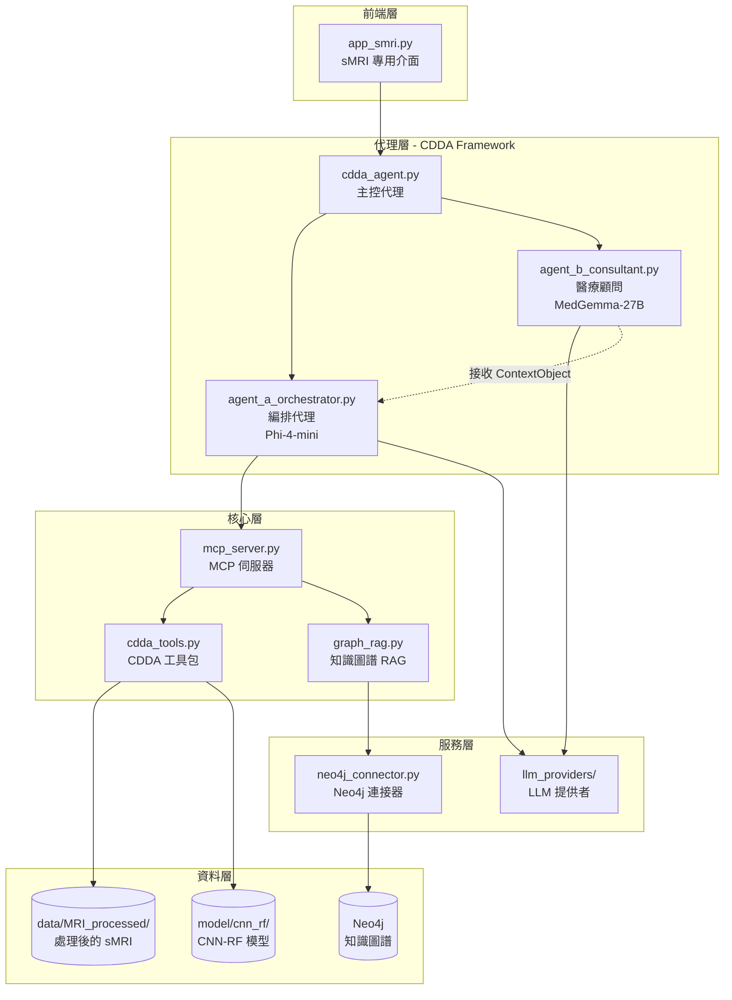
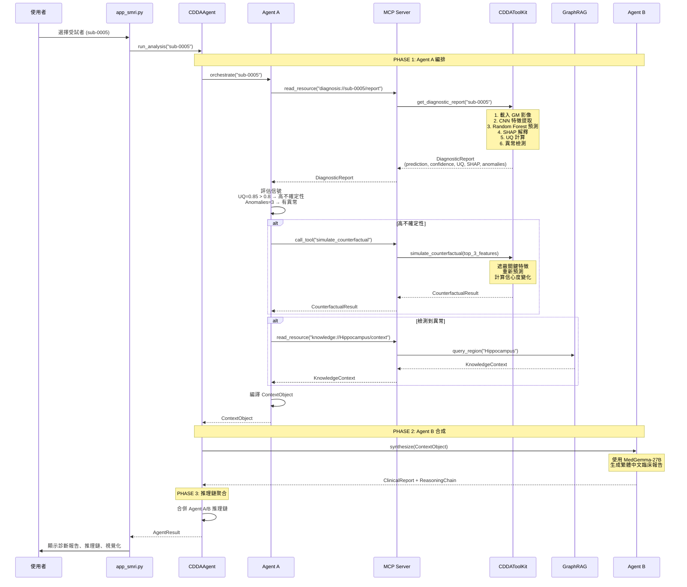

# 系統架構文件 - sMRI 專用版本

**專案名稱**: Cognivex CDDA - sMRI Analysis System  
**建立日期**: 2024-11-21  
**版本**: 2.0 (簡化版 - 專注 sMRI)

---

## 系統概述

### 專案目標
專注於**結構性 MRI (sMRI)** 的阿茲海默症診斷系統，整合：
- **雙 LLM 架構** (Agent A + Agent B)
- **MCP 協議** (Model Context Protocol)
- **A2A 模式** (Agent-to-Agent)
- **反事實分析** (Counterfactual Simulation)
- **知識圖譜** (Knowledge Graph with Neo4j)
- **CNN-RF 模型** (CNN 特徵提取 + Random Forest 分類)

### 分析框架
**CDDA Framework** - 自主診斷代理系統

### 支援的診斷類別
- **AD** - 阿茲海默症 (Alzheimer's Disease)
- **MCI** - 輕度認知障礙 (Mild Cognitive Impairment)
- **NC** - 正常認知 (Normal Cognition)

---

## 整體架構圖



---

## 資料架構

### 實際資料結構

```
data/
└── MRI_processed/           # 處理後的結構性 MRI
    ├── AD/                  # 阿茲海默症患者
    │   └── sub-0005/        # 受試者 ID (有連字號)
    │       ├── sub-0005_GM_to_MNI.nii.gz    # 灰質 (Grey Matter)
    │       ├── sub-0005_FA_to_MNI.nii.gz    # 各向異性分數
    │       └── sub-0005_MD_to_MNI.nii.gz    # 平均擴散率
    ├── MCI/                 # 輕度認知障礙
    │   └── sub-XXXX/
    └── NC/                  # 正常對照組
        └── sub-XXXX/

model/
└── cnn_rf/                  # CNN-RF 模型
    └── rf_model_NC_vs_AD_GM_only.joblib
```

### 資料特徵
- **受試者 ID 格式**: `sub-0005` (四位數，有連字號 `-`)
- **檔案命名**: `sub-0005_GM_to_MNI.nii.gz` (連字號 `-`)
- **影像模態**: GM (灰質), FA (各向異性), MD (平均擴散率)
- **標籤**: AD, MCI, NC
- **總受試者數**: 
  - AD: 23 人
  - MCI: 69 人
  - NC: 40 人

---

## CDDA 分析流程



---

## 核心模組說明

### 1. 前端介面

**app_smri.py** - sMRI 專用 Streamlit 介面
- 受試者選擇 (從 data/MRI_processed 掃描)
- CDDA 設定 (LLM 模式、模型路徑)
- 分析執行和進度顯示
- 結果視覺化 (診斷報告、推理鏈、MRI 檢視器)

### 2. 代理層

**cdda_agent.py** - CDDA 主控代理
- 初始化 Agent A 和 Agent B
- 執行完整 A2A 流程
- 聚合推理鏈
- 返回 AgentResult

**agent_a_orchestrator.py** - 編排代理 (Phi-4-mini)
- 讀取診斷報告 (MCP read_resource)
- 評估 UQ 和異常
- 決策工具調用 (反事實、知識圖譜)
- 編譯 ContextObject

**agent_b_consultant.py** - 醫療顧問 (MedGemma-27B)
- 接收 ContextObject
- 生成繁體中文臨床報告
- 解釋反事實結果
- 標記混合病理

### 3. 核心層

**mcp_server.py** - MCP 協議伺服器
- 資源: `diagnosis://{subject_id}/report`
- 資源: `knowledge://{region}/context`
- 工具: `simulate_counterfactual`
- 工具: `query_knowledge_graph`

**cdda_tools.py** - CDDA 工具包
- `get_diagnostic_report()` - 生成診斷報告
  1. 載入 GM 影像
  2. CNN 特徵提取
  3. Random Forest 預測
  4. SHAP 值計算
  5. 不確定性量化 (UQ)
  6. 異常檢測 (Z-score)
- `simulate_counterfactual()` - 反事實模擬
  1. 遮蔽關鍵特徵
  2. 重新預測
  3. 計算信心度變化
  4. 生成解釋

**graph_rag.py** - 知識圖譜 RAG
- 查詢 Neo4j 獲取腦區臨床資訊
- 生成上下文摘要
- 降級到本地知識庫 (如果 Neo4j 不可用)

### 4. 服務層

**neo4j_connector.py** - Neo4j 連接器
- 連接 Neo4j 資料庫
- 執行 Cypher 查詢

**llm_providers/** - LLM 提供者
- `ollama.py` - 本地 LLM (Ollama)
- `huggingface.py` - HuggingFace 模型
- `error_handling.py` - 錯誤處理和重試

---

## 關鍵設計決策

### 為什麼專注 sMRI？

1. **資料一致性**: sMRI 資料命名統一，減少錯誤
2. **模型表現**: CNN-RF 在 sMRI 上表現優異
3. **臨床價值**: 結構性 MRI 是 AD 診斷的標準工具
4. **系統簡化**: 移除 fMRI 減少複雜度

### 為什麼使用 MRI_processed？

1. **已預處理**: 影像已配準到 MNI 空間
2. **標準化**: 所有影像尺寸和方向一致
3. **特徵提取**: 已提取 GM, FA, MD 模態
4. **模型訓練**: CNN-RF 模型基於此資料訓練

### 為什麼使用 A2A 模式？

1. **責任分離**: Agent A 編排，Agent B 合成
2. **安全性**: Agent B 無工具存取權限
3. **可追蹤性**: 完整的推理鏈記錄
4. **可擴展性**: 易於添加新代理或工具

---

## 執行指南

### 環境需求

```bash
# Python 3.11+
# 依賴套件 (見 pyproject.toml)
```

### 啟動系統

```bash
# 1. 啟動 Neo4j (可選)
neo4j start

# 2. 啟動 Ollama (如果使用本地 LLM)
ollama serve

# 3. 執行 Streamlit 應用
streamlit run app_smri.py
```

### 環境變數

```bash
# .env 檔案
NEO4J_URI=bolt://localhost:7687
NEO4J_USER=neo4j
NEO4J_PASSWORD=your_password

# HuggingFace 模型路徑 (可選)
HF_MODEL_PATH_AGENT_A=D:/hf_models/Phi-4-mini-instruct
HF_MODEL_PATH_AGENT_B=D:/hf_models/medgemma-27b
```

---

## 系統優勢

### ✅ 已解決的問題

1. **資料路徑一致性**: 統一使用 MRI_processed
2. **命名規範**: 受試者 ID 格式統一 (sub-0005)
3. **標籤一致性**: 統一使用 AD, MCI, NC
4. **模型整合**: CNN-RF 模型完整整合
5. **可解釋性**: SHAP + 反事實 + 知識圖譜

### 🎯 核心功能

1. **自主決策**: Agent A 根據 UQ 和異常自動決定工具調用
2. **反事實分析**: 識別關鍵診斷驅動因子
3. **異常檢測**: 標記統計異常的腦區
4. **知識整合**: 查詢知識圖譜提供臨床上下文
5. **雙語報告**: 繁體中文臨床報告
6. **完整追蹤**: 推理鏈記錄所有決策過程

---

## 未來擴展

### 短期 (1-2 週)

- [ ] 增加更多視覺化 (SHAP 圖、腦區熱圖)
- [ ] 批次分析功能
- [ ] 報告匯出 (PDF, JSON)

### 中期 (1-2 月)

- [ ] 支援更多 MRI 模態 (FA, MD)
- [ ] 模型比較功能
- [ ] 歷史分析記錄

### 長期 (3-6 月)

- [ ] API 服務化
- [ ] 多使用者支援
- [ ] 雲端部署

---

**文件版本**: 2.0  
**最後更新**: 2024-11-21  
**維護者**: Development Team
