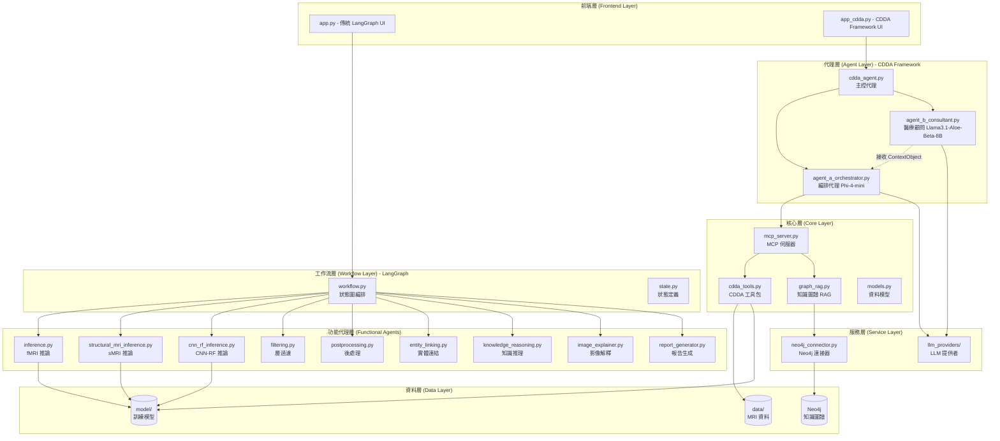
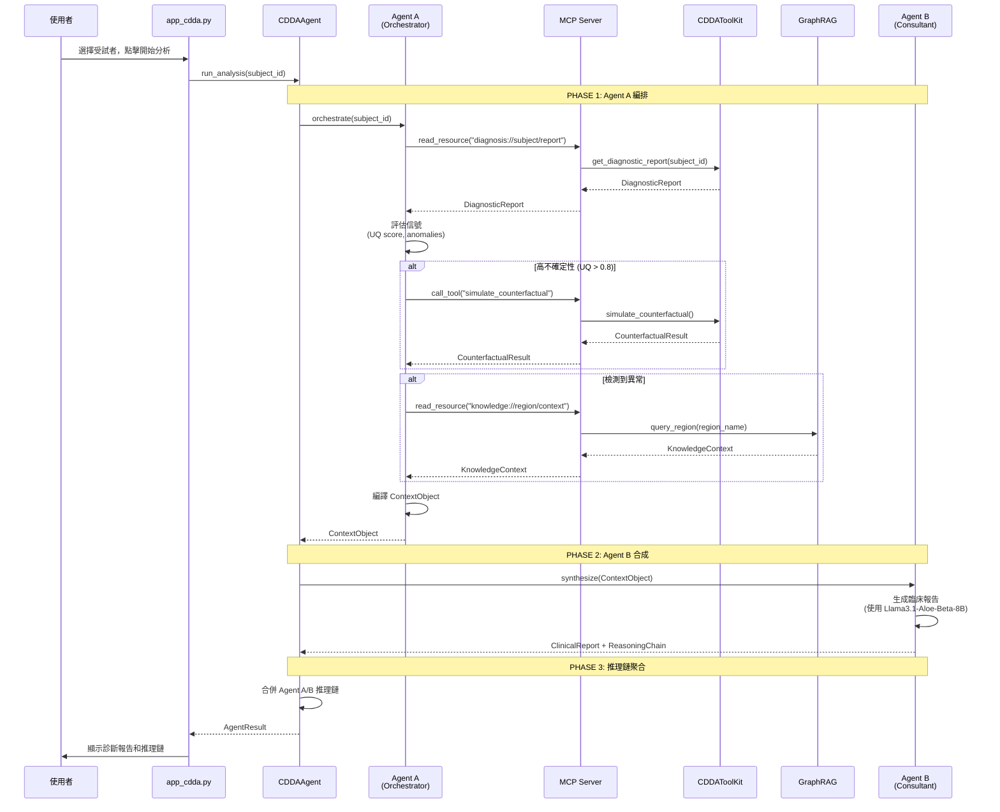
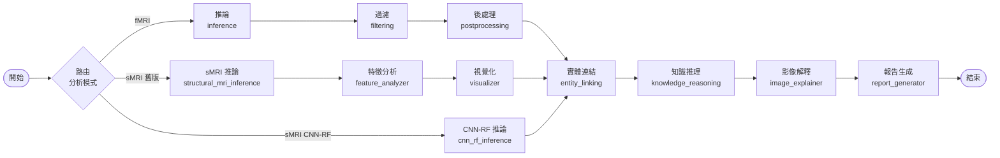
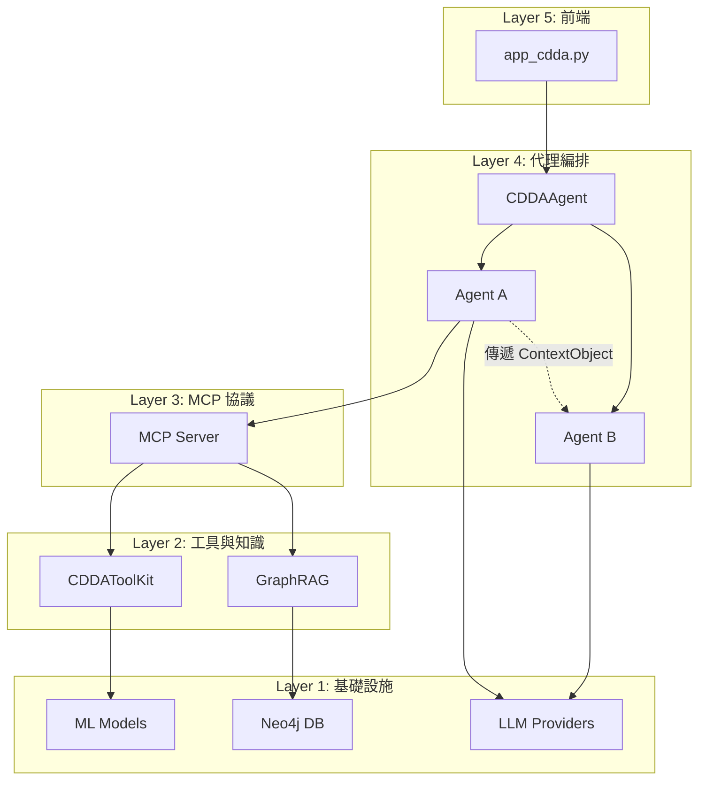
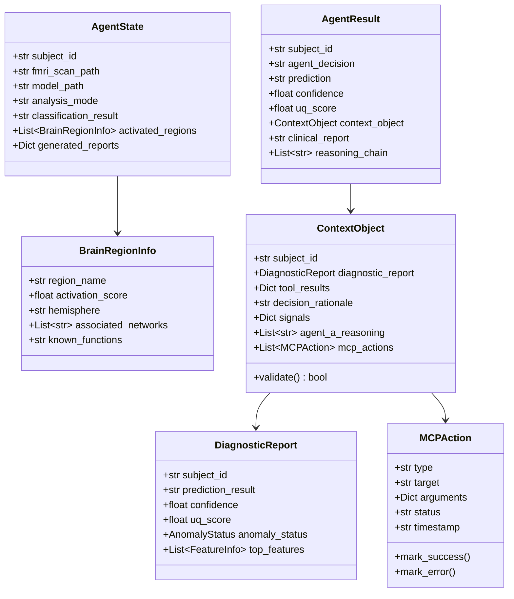

# 系統架構文件 (System Architecture Documentation)

**專案名稱**: Cognivex CDDA - Explainable fMRI Analysis for Alzheimer's Disease  
**建立日期**: 2024-11-21  
**目的**: 完整記錄系統所有程式碼檔案、關係、作用和架構流程

---

## 目錄 (Table of Contents)

1. [系統概述](#系統概述)
2. [整體架構圖](#整體架構圖)
3. [核心模組與檔案清單](#核心模組與檔案清單)
4. [資料流程圖](#資料流程圖)
5. [模組間關係圖](#模組間關係圖)
6. [詳細檔案說明](#詳細檔案說明)
7. [技術堆疊](#技術堆疊)

---

## 系統概述

### 專案目標
本系統是一個基於 AI 的阿茲海默症診斷系統，整合了：
- **雙 LLM 架構** (Agent A + Agent B)
- **MCP 協議** (Model Context Protocol)
- **A2A 模式** (Agent-to-Agent)
- **反事實分析** (Counterfactual Simulation)
- **知識圖譜** (Knowledge Graph with Neo4j)

### 兩種分析框架
1. **CDDA Framework** (推薦) - 自主診斷代理系統
2. **傳統 LangGraph** - 基於狀態圖的工作流

### 支援的影像類型
- **功能性 MRI (fMRI)** - 使用深度學習模型 (ShuffleNet, CapsNet, MCADNNet)
- **結構性 MRI (sMRI)** - 使用機器學習模型 (Random Forest + CNN)

---


## 整體架構圖




## 核心模組與檔案清單

### 1. 前端介面 (Frontend)

| 檔案 | 作用 | 關鍵功能 |
|------|------|----------|
| `app.py` | 傳統 LangGraph 介面 | Streamlit UI，支援 fMRI/sMRI 分析，使用 LangGraph 工作流 |
| `app_cdda.py` | CDDA Framework 介面 | Streamlit UI，支援 CDDA 自主代理系統，雙 LLM 架構 |

### 2. 代理層 (Agent Layer) - CDDA Framework

| 檔案 | 作用 | 模型 | 關鍵功能 |
|------|------|------|----------|
| `app/agents/cdda_agent.py` | CDDA 主控代理 | - | 整合 Agent A/B，執行完整分析流程 |
| `app/agents/agent_a_orchestrator.py` | 編排代理 (Agent A) | Phi-4-mini | MCP 客戶端，讀取資源，調用工具，編譯 ContextObject |
| `app/agents/agent_b_consultant.py` | 醫療顧問 (Agent B) | Llama3.1-Aloe-Beta-8B | 接收 ContextObject，生成臨床報告，無工具存取權限 |

### 3. 工作流層 (Workflow Layer) - LangGraph

| 檔案 | 作用 | 關鍵功能 |
|------|------|----------|
| `app/graph/workflow.py` | 工作流編排 | 定義 LangGraph 狀態圖，路由分析模式 (fMRI/sMRI) |
| `app/graph/state.py` | 狀態定義 | 定義 AgentState 和 BrainRegionInfo 資料結構 |

### 4. 功能代理層 (Functional Agents)

| 檔案 | 作用 | 輸入 | 輸出 |
|------|------|------|------|
| `app/agents/inference.py` | fMRI 推論 | NIfTI 檔案 | 分類結果、激活圖 |
| `app/agents/structural_mri_inference.py` | sMRI 推論 (舊版) | T1 影像 | ROI 特徵、預測 |
| `app/agents/cnn_rf_inference.py` | CNN-RF 推論 (新版) | T1 影像 | 預測、SHAP 值、視覺化 |
| `app/agents/filtering.py` | 層過濾 | 激活層 | 過濾後的層 |
| `app/agents/postprocessing.py` | 後處理 | 過濾層 | 腦區資訊 |
| `app/agents/entity_linking.py` | 實體連結 | 腦區名稱 | 標準化名稱 |
| `app/agents/knowledge_reasoning.py` | 知識推理 | 腦區 | 知識圖譜上下文 |
| `app/agents/image_explainer.py` | 影像解釋 | 激活圖 | Grad-CAM 解釋 |
| `app/agents/report_generator.py` | 報告生成 | 所有結果 | 中英文報告 |
| `app/agents/structural_feature_analyzer.py` | 特徵分析 | ROI 特徵 | 重要性排序 |
| `app/agents/structural_visualizer.py` | 結構視覺化 | 特徵重要性 | 視覺化圖表 |

### 5. 核心層 (Core Layer)

| 檔案 | 作用 | 關鍵功能 |
|------|------|----------|
| `app/core/mcp_server.py` | MCP 伺服器 | 實作 MCP 協議，提供資源讀取和工具調用 |
| `app/core/ml_processing/cdda_tools.py` | CDDA 工具包 | 診斷報告、反事實模擬、不確定性量化 |
| `app/core/knowledge/graph_rag.py` | 知識圖譜 RAG | 查詢 Neo4j，生成臨床上下文 |
| `app/core/models.py` | 資料模型 | 定義所有資料結構 (ContextObject, DiagnosticReport 等) |
| `app/core/prompt_loader.py` | 提示載入器 | 載入 Agent A/B 的系統提示 |

### 6. 服務層 (Service Layer)

| 檔案 | 作用 | 關鍵功能 |
|------|------|----------|
| `app/services/neo4j_connector.py` | Neo4j 連接器 | 連接 Neo4j 資料庫，執行 Cypher 查詢 |
| `app/services/llm_providers/ollama.py` | Ollama 提供者 | 本地 LLM 推論 |
| `app/services/llm_providers/huggingface.py` | HuggingFace 提供者 | HuggingFace 模型推論 |
| `app/services/llm_providers/error_handling.py` | 錯誤處理 | LLM 錯誤重試、JSON 解析恢復 |

### 7. UI 組件 (UI Components)

| 檔案 | 作用 | 關鍵功能 |
|------|------|----------|
| `app/ui/structural_mri_components.py` | sMRI UI 組件 | 渲染結構性 MRI 分析結果 |


## 資料流程圖

### CDDA Framework 分析流程



### 傳統 LangGraph 分析流程




## 模組間關係圖

### CDDA Framework 模組依賴關係



### 資料模型關係




## 詳細檔案說明

### 前端層 (Frontend Layer)

#### app.py
**角色**: 傳統 LangGraph 分析介面  
**功能**:
- Streamlit Web UI
- 支援功能性 MRI (fMRI) 和結構性 MRI (sMRI) 分析
- 模型選擇: ShuffleNet, CapsNet, MCADNNet (fMRI), Random Forest (sMRI)
- 互動式 NIfTI 檢視器 (使用 nilearn)
- 中英文報告顯示

**關鍵依賴**:
- `app.graph.workflow.app` - LangGraph 工作流
- `app.ui.structural_mri_components` - sMRI UI 組件
- `nilearn` - MRI 視覺化

**資料流**:
```
使用者輸入 → LangGraph workflow.invoke() → 顯示結果
```

#### app_cdda.py
**角色**: CDDA Framework 分析介面  
**功能**:
- Streamlit Web UI (CDDA 專用)
- 支援雙 LLM 架構 (Agent A + Agent B)
- HuggingFace 模型路徑設定
- 推理鏈顯示
- 反事實分析和異常檢測結果視覺化

**關鍵依賴**:
- `app.agents.cdda_agent.CDDAAgent` - CDDA 主控代理
- `app.graph.workflow.app` - LangGraph 工作流 (備選)

**資料流**:
```
使用者輸入 → CDDAAgent.run_analysis() → 顯示 AgentResult
```

---

### 代理層 (Agent Layer)

#### app/agents/cdda_agent.py
**角色**: CDDA 主控代理 (A2A 模式)  
**功能**:
- 初始化 Agent A (Orchestrator) 和 Agent B (Consultant)
- 執行完整的 A2A 分析流程
- 聚合雙代理推理鏈
- 儲存推理日誌

**關鍵方法**:
- `run_analysis(subject_id)` - 主分析入口
- `_aggregate_reasoning_chains()` - 合併推理鏈
- `save_reasoning_log()` - 儲存日誌

**資料流**:
```
run_analysis() 
  → Agent A.orchestrate() 
  → Agent B.synthesize(ContextObject) 
  → 聚合推理鏈 
  → 返回 AgentResult
```

#### app/agents/agent_a_orchestrator.py
**角色**: Agent A - 編排代理 (MCP 客戶端)  
**模型**: Phi-4-mini  
**功能**:
- 讀取診斷資源 (MCP read_resource)
- 評估信號 (UQ score, anomalies)
- 決定調用哪些工具
- 編譯 ContextObject 交給 Agent B

**關鍵方法**:
- `orchestrate(subject_id)` - 主編排入口
- `_orchestrate_with_llm()` - LLM 決策模式
- `_orchestrate_with_rules()` - 規則式降級模式
- `_read_diagnostic_report()` - 讀取診斷報告
- `_call_counterfactual_tool()` - 調用反事實工具
- `_compile_context_object()` - 編譯 ContextObject

**決策邏輯**:
```
IF UQ > 0.8 → 調用反事實模擬
IF 檢測到異常 → 查詢知識圖譜
ELSE → 標準流程
```

**資料流**:
```
orchestrate() 
  → MCP.read_resource("diagnosis://...") 
  → 評估信號 
  → [可選] MCP.call_tool("simulate_counterfactual") 
  → [可選] MCP.read_resource("knowledge://...") 
  → 編譯 ContextObject
```

#### app/agents/agent_b_consultant.py
**角色**: Agent B - 醫療顧問 (無工具存取)  
**模型**: Llama3.1-Aloe-Beta-8B  
**功能**:
- 接收 ContextObject (來自 Agent A)
- 生成臨床報告 (繁體中文)
- 解釋反事實結果
- 標記混合病理

**關鍵方法**:
- `synthesize(ContextObject)` - 主合成入口
- `_synthesize_with_llm()` - LLM 合成模式
- `_synthesize_with_template()` - 模板降級模式
- `_generate_anomaly_section()` - 異常分析
- `_generate_counterfactual_section()` - 反事實解釋

**重要限制**:
- **無 MCP 存取權限** - 只能使用 ContextObject 中的資料
- **無工具調用** - 純粹的合成和推理

**資料流**:
```
synthesize(ContextObject) 
  → 格式化上下文 
  → LLM 生成報告 
  → 返回 {clinical_report, reasoning_chain}
```

---

### 工作流層 (Workflow Layer)

#### app/graph/workflow.py
**角色**: LangGraph 狀態圖編排  
**功能**:
- 定義分析工作流的狀態圖
- 路由分析模式 (fMRI / sMRI / CNN-RF)
- 連接所有功能代理節點

**關鍵節點**:
- `inference` - fMRI 推論
- `structural_mri_inference` - sMRI 推論 (舊版)
- `cnn_rf_inference` - CNN-RF 推論 (新版)
- `filtering` - 層過濾
- `post_processing` - 後處理
- `entity_linker` - 實體連結
- `knowledge_reasoner` - 知識推理
- `image_explainer` - 影像解釋
- `report_generator` - 報告生成

**路由邏輯**:
```python
def route_by_analysis_mode(state):
    if state["analysis_mode"] == "structural":
        if state["model_type"] == "cnn_rf":
            return "cnn_rf_inference"
        else:
            return "structural_mri_inference"
    else:
        return "inference"
```

#### app/graph/state.py
**角色**: 狀態定義  
**功能**:
- 定義 `AgentState` TypedDict
- 定義 `BrainRegionInfo` TypedDict
- 儲存分析過程中的所有中間和最終結果

**關鍵欄位**:
- `subject_id`, `fmri_scan_path`, `model_path` - 輸入
- `classification_result`, `activated_regions` - 輸出
- `analysis_mode`, `model_type` - 控制
- `trace_log`, `error_log` - 追蹤


---

### 功能代理層 (Functional Agents)

#### app/agents/inference.py
**角色**: fMRI 深度學習推論  
**功能**:
- 載入 PyTorch 模型 (ShuffleNet, CapsNet, MCADNNet)
- 執行 fMRI 分類
- 生成激活圖

**輸入**: NIfTI 檔案路徑, 模型路徑  
**輸出**: 分類結果 (AD/NC), 激活層資料

#### app/agents/structural_mri_inference.py
**角色**: sMRI 推論 (舊版 - Random Forest)  
**功能**:
- 提取 ROI 特徵 (AAL atlas)
- Random Forest 分類
- 計算預測信心度

**輸入**: T1 影像路徑  
**輸出**: ROI 特徵, 預測結果

#### app/agents/cnn_rf_inference.py
**角色**: CNN-RF 推論 (新版 - CNN + Random Forest)  
**功能**:
- CNN 特徵提取
- Random Forest 分類
- SHAP 值計算 (可解釋性)
- 視覺化生成

**輸入**: T1 影像路徑  
**輸出**: 預測結果, SHAP 值, 視覺化路徑

**關鍵方法**:
- `run_cnn_rf_inference()` - 執行推論
- `run_cnn_rf_inference_with_visualization()` - 推論 + 視覺化

#### app/agents/filtering.py
**角色**: 激活層過濾  
**功能**:
- 過濾低激活層
- 驗證層的有效性

**輸入**: 原始激活層  
**輸出**: 過濾後的有效層

#### app/agents/postprocessing.py
**角色**: 後處理  
**功能**:
- 將激活層映射到腦區
- 計算激活分數
- 生成 BrainRegionInfo

**輸入**: 過濾後的層  
**輸出**: 腦區資訊列表

#### app/agents/entity_linking.py
**角色**: 實體連結  
**功能**:
- 標準化腦區名稱
- 映射到 AAL atlas

**輸入**: 原始腦區名稱  
**輸出**: 標準化名稱

#### app/agents/knowledge_reasoning.py
**角色**: 知識推理  
**功能**:
- 查詢 Neo4j 知識圖譜
- 獲取腦區的臨床上下文
- 生成 RAG 摘要

**輸入**: 腦區名稱列表  
**輸出**: 知識圖譜上下文

#### app/agents/image_explainer.py
**角色**: 影像解釋  
**功能**:
- Grad-CAM 視覺化
- 生成可解釋性圖表

**輸入**: 模型, 影像  
**輸出**: Grad-CAM 圖

#### app/agents/report_generator.py
**角色**: 報告生成  
**功能**:
- 整合所有分析結果
- 生成中英文臨床報告
- 使用 LLM 生成自然語言

**輸入**: AgentState (所有結果)  
**輸出**: 中英文報告

#### app/agents/structural_feature_analyzer.py
**角色**: sMRI 特徵分析  
**功能**:
- 計算特徵重要性
- 排序 ROI 貢獻度

**輸入**: ROI 特徵  
**輸出**: 特徵重要性排序

#### app/agents/structural_visualizer.py
**角色**: sMRI 視覺化  
**功能**:
- 生成特徵重要性圖表
- 生成腦區視覺化

**輸入**: 特徵重要性  
**輸出**: 視覺化圖表路徑

---

### 核心層 (Core Layer)

#### app/core/mcp_server.py
**角色**: MCP 協議伺服器  
**功能**:
- 實作 MCP (Model Context Protocol)
- 提供資源讀取介面 (read_resource)
- 提供工具調用介面 (call_tool)
- 整合 CDDAToolKit 和 GraphRAG

**支援的資源**:
- `diagnosis://{subject_id}/report` - 診斷報告
- `knowledge://{region}/context` - 知識上下文

**支援的工具**:
- `simulate_counterfactual` - 反事實模擬
- `query_knowledge_graph` - 知識圖譜查詢

**關鍵方法**:
- `read_resource(uri)` - 讀取資源
- `call_tool(name, args)` - 調用工具
- `list_resources()` - 列出可用資源
- `list_tools()` - 列出可用工具

#### app/core/ml_processing/cdda_tools.py
**角色**: CDDA 工具包 (Layer 1+2)  
**功能**:
- 診斷報告生成
- 反事實模擬
- 不確定性量化 (UQ)
- 異常檢測 (Z-score)
- SHAP 值計算

**關鍵方法**:
- `get_diagnostic_report(subject_id)` - 生成診斷報告
- `simulate_counterfactual(subject_id, features_to_mask)` - 反事實模擬
- `calculate_uncertainty(predictions)` - 計算不確定性
- `detect_anomalies(features, threshold)` - 檢測異常

**資料流**:
```
載入 MRI 資料 
  → 提取特徵 
  → ML 模型預測 
  → SHAP 解釋 
  → UQ 計算 
  → 異常檢測 
  → 返回 DiagnosticReport
```

#### app/core/knowledge/graph_rag.py
**角色**: 知識圖譜 RAG (Retrieval-Augmented Generation)  
**功能**:
- 查詢 Neo4j 知識圖譜
- 檢索腦區臨床資訊
- 生成上下文摘要
- 降級到本地知識庫 (如果 Neo4j 不可用)

**關鍵方法**:
- `query_region(region_name)` - 查詢單一腦區
- `query_multiple_regions(regions)` - 批次查詢
- `generate_context_summary(contexts)` - 生成摘要

**降級策略**:
```
嘗試 Neo4j 查詢 
  → 如果失敗 → 使用本地知識庫 (JSON)
  → 標記 fallback=True
```

#### app/core/models.py
**角色**: 資料模型定義  
**功能**:
- 定義所有資料結構
- 提供驗證方法
- 提供序列化/反序列化

**主要類別**:
- `ContextObject` - Agent A → Agent B 的交接物件
- `DiagnosticReport` - 診斷報告
- `MCPAction` - MCP 動作記錄
- `AgentResult` - 最終分析結果
- `FeatureInfo` - 特徵資訊
- `AnomalyStatus` - 異常狀態
- `CounterfactualResult` - 反事實結果
- `KnowledgeContext` - 知識上下文

#### app/core/prompt_loader.py
**角色**: 提示載入器  
**功能**:
- 載入 Agent A 系統提示
- 載入 Agent B 系統提示
- 支援變數替換

**提示檔案位置**:
- `config/prompts/agent_a_orchestrator.txt`
- `config/prompts/agent_b_consultant.txt`

---

### 服務層 (Service Layer)

#### app/services/neo4j_connector.py
**角色**: Neo4j 資料庫連接器  
**功能**:
- 連接 Neo4j 資料庫
- 執行 Cypher 查詢
- 錯誤處理和重試

**關鍵方法**:
- `connect()` - 建立連接
- `query(cypher, params)` - 執行查詢
- `close()` - 關閉連接

**環境變數**:
- `NEO4J_URI` - Neo4j 連接 URI
- `NEO4J_USER` - 使用者名稱
- `NEO4J_PASSWORD` - 密碼

#### app/services/llm_providers/ollama.py
**角色**: Ollama LLM 提供者  
**功能**:
- 本地 LLM 推論 (透過 Ollama)
- 支援多種模型 (llama3.1, mistral 等)

**關鍵方法**:
- `handle_text(prompt, model, system_instruction)` - 文字生成
- `check_availability()` - 檢查 Ollama 是否運行
- `list_models()` - 列出可用模型

#### app/services/llm_providers/huggingface.py
**角色**: HuggingFace LLM 提供者  
**功能**:
- HuggingFace 模型推論
- 支援 8-bit 量化
- 本地模型載入

**關鍵方法**:
- `handle_text(prompt, model_path, system_instruction)` - 文字生成
- `get_model_info(model_path)` - 獲取模型資訊
- `load_model(model_path, load_in_8bit)` - 載入模型

**支援的模型**:
- Phi-4-mini (Agent A)
- Llama3.1-Aloe-Beta-8B (Agent B)

#### app/services/llm_providers/error_handling.py
**角色**: LLM 錯誤處理  
**功能**:
- LLM 調用重試機制
- JSON 解析恢復
- 錯誤日誌記錄

**關鍵方法**:
- `parse_json_with_recovery(text)` - 強健的 JSON 解析
- `log_llm_error(error, context)` - 記錄錯誤
- `retry_with_backoff(func)` - 重試裝飾器

**錯誤類型**:
- `LLMRetryExhausted` - 重試次數耗盡
- `LLMParsingError` - JSON 解析失敗
- `LLMConnectionError` - 連接失敗

---

### UI 組件層 (UI Components)

#### app/ui/structural_mri_components.py
**角色**: sMRI UI 組件  
**功能**:
- 渲染分析模式選擇器
- 渲染結構性 MRI 結果
- 顯示 ROI 特徵和視覺化

**關鍵方法**:
- `render_analysis_mode_selector()` - 模式選擇器
- `render_structural_results(state, ground_truth)` - 結果顯示


## 技術堆疊

### 前端框架
- **Streamlit** - Web UI 框架
- **Plotly** - 互動式圖表
- **Nilearn** - MRI 視覺化

### 深度學習框架
- **PyTorch** - 深度學習模型
- **TorchVision** - 影像處理
- **SHAP** - 模型可解釋性

### 機器學習
- **Scikit-learn** - Random Forest, SVM
- **Joblib** - 模型序列化

### 影像處理
- **NiBabel** - NIfTI 檔案處理
- **OpenCV** - 影像處理
- **Scikit-image** - 影像分析

### 工作流編排
- **LangGraph** - 狀態圖工作流
- **LangChain** - LLM 應用框架

### LLM 整合
- **Ollama** - 本地 LLM 推論
- **HuggingFace Transformers** - 模型載入
- **Google Generative AI** - Gemini API (備選)
- **LiteLLM** - 統一 LLM 介面

### 知識圖譜
- **Neo4j** - 圖資料庫
- **py2neo** / **neo4j-driver** - Python 驅動

### 資料處理
- **NumPy** - 數值計算
- **Pandas** - 資料處理
- **Matplotlib** - 繪圖
- **Seaborn** - 統計視覺化

### 其他工具
- **python-dotenv** - 環境變數管理
- **tqdm** - 進度條
- **absl-py** - 命令列工具

---

## 關鍵設計模式

### 1. Agent-to-Agent (A2A) 模式
**目的**: 分離編排邏輯和臨床推理

```
Agent A (Orchestrator)
  ↓ 編譯 ContextObject
Agent B (Consultant)
  ↓ 生成臨床報告
最終結果
```

**優點**:
- 清晰的責任分離
- Agent B 無工具存取 (安全性)
- 完整的推理鏈追蹤

### 2. MCP (Model Context Protocol) 模式
**目的**: 標準化資源和工具存取

```
Agent A (MCP Client)
  ↓ read_resource / call_tool
MCP Server
  ↓ 路由請求
CDDAToolKit / GraphRAG
```

**優點**:
- 統一的介面
- 易於擴展新資源/工具
- 錯誤處理集中化

### 3. 降級策略 (Fallback Strategy)
**目的**: 確保系統穩健性

```
嘗試 LLM 決策
  ↓ 失敗
降級到規則式邏輯
```

**降級點**:
- Agent A: LLM → 規則式編排
- Agent B: LLM → 模板式合成
- GraphRAG: Neo4j → 本地知識庫

### 4. 狀態圖模式 (State Graph Pattern)
**目的**: 清晰的工作流編排

```
LangGraph StateGraph
  ↓ 定義節點和邊
  ↓ 條件路由
執行工作流
```

**優點**:
- 視覺化工作流
- 易於修改和擴展
- 狀態追蹤

---

## 資料目錄結構

```
data/
├── fMRI/                    # 功能性 MRI 資料
│   ├── AD/                  # 阿茲海默症患者
│   │   └── sub-XXXX/
│   │       └── *.nii.gz
│   └── NC/                  # 正常對照組
│       └── sub-XXXX/
│           └── *.nii.gz
│
├── sMRI/                    # 結構性 MRI 資料
│   ├── AD/
│   │   └── sub-XXXX/
│   │       └── *_T1.nii.gz
│   └── NC/
│       └── sub-XXXX/
│           └── *_T1.nii.gz
│
├── MRI_processed/           # 處理後的 MRI 資料
│   ├── AD/
│   │   └── sub-XXXX/
│   │       ├── *_GM_to_MNI.nii.gz
│   │       ├── *_FA_to_MNI.nii.gz
│   │       └── *_MD_to_MNI.nii.gz
│   ├── MCI/
│   └── NC/
│
├── roi_features.csv         # ROI 特徵資料
│
└── kg/                      # 知識圖譜資料
    └── brain_regions.json

model/
├── shufflenet/              # ShuffleNet 模型
│   └── fold_3_best_model.pth
├── capsnet/                 # CapsNet 模型
│   └── best_capsnet_rnn.pth
├── mcadnnet/                # MCADNNet 模型
│   └── ._best_overall_model.pth
└── cnn_rf/                  # CNN-RF 模型
    └── rf_model_NC_vs_AD_GM_only.joblib

config/
├── prompts/                 # LLM 提示
│   ├── agent_a_orchestrator.txt
│   └── agent_b_consultant.txt
└── schemas/                 # 資料結構定義

output/                      # 輸出結果
├── visualizations/          # 視覺化圖表
├── reports/                 # 生成的報告
└── logs/                    # 推理日誌
```

---

## 環境變數設定

```bash
# Neo4j 設定
NEO4J_URI=bolt://localhost:7687
NEO4J_USER=neo4j
NEO4J_PASSWORD=your_password

# Ollama 設定 (可選)
OLLAMA_HOST=http://localhost:11434

# HuggingFace 模型路徑 (可選)
HF_MODEL_PATH_AGENT_A=D:/hf_models/Phi-4-mini-instruct
HF_MODEL_PATH_AGENT_B=D:\hf_models\Llama3.1-Aloe-Beta-8B
```

---

## 執行流程

### 啟動 CDDA Framework

```bash
# 1. 啟動 Neo4j (可選)
neo4j start

# 2. 啟動 Ollama (如果使用本地 LLM)
ollama serve

# 3. 執行 Streamlit 應用
streamlit run app_cdda.py
```

### 啟動傳統 LangGraph

```bash
streamlit run app.py
```

---

## 系統限制與已知問題

### 1. 記憶體需求
- **HuggingFace 模型**: 需要大量 GPU 記憶體
  - Phi-4-mini: ~8GB (FP16) 或 ~4GB (4-bit)
  - Llama3.1-Aloe-Beta-8B: ~16GB (FP16) 或 ~8GB (4-bit)
- **建議**: 使用 4-bit 量化或降級到 Ollama

### 2. Neo4j 依賴
- **問題**: 如果 Neo4j 不可用，知識圖譜功能受限
- **解決**: 自動降級到本地知識庫 (JSON)

### 3. LLM 可用性
- **問題**: LLM 調用可能失敗 (網路、模型不存在等)
- **解決**: 自動降級到規則式/模板式邏輯

### 4. 資料格式
- **要求**: NIfTI 檔案必須符合特定命名規範
- **問題**: 不同資料來源的命名可能不一致

### 5. 模型路徑
- **問題**: 硬編碼的模型路徑可能在不同環境中失效
- **建議**: 使用環境變數或配置檔案

---

## 未來改進方向

### 1. 模組化改進
- 將硬編碼路徑移到配置檔案
- 統一錯誤處理機制
- 增加單元測試覆蓋率

### 2. 效能優化
- 模型快取機制
- 批次處理支援
- 非同步 LLM 調用

### 3. 功能擴展
- 支援更多 MRI 模態 (DTI, ASL 等)
- 多語言報告生成
- 互動式推理鏈編輯

### 4. 部署優化
- Docker 容器化
- API 服務化
- 雲端部署支援

---

## 參考文件

- `README.md` - 專案概述
- `QUICK_REFERENCE.md` - 快速參考
- `QUICK_START_HUGGINGFACE.md` - HuggingFace 設定指南
- `docs/CDDA_Architecture_Spec.md` - CDDA 架構規格
- `docs/CDDA_WEB_INTEGRATION_COMPLETE.md` - Web 整合文件
- `docs/HUGGINGFACE_SETUP.md` - HuggingFace 設定

---

**文件版本**: 1.0  
**最後更新**: 2024-11-21  
**維護者**: Development Team
