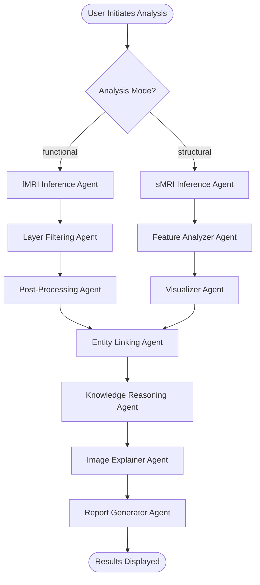

# Cognivex System Technical Documentation

**Version**: 2.0  
**Last Updated**: 2024-11-12  
**Purpose**: Comprehensive technical reference for system architecture, model integration, and future improvements

---

## Table of Contents

1. [System Overview](#1-system-overview)
2. [Architecture Deep Dive](#2-architecture-deep-dive)
3. [Functional MRI (fMRI) Pipeline](#3-functional-mri-fmri-pipeline)
4. [Structural MRI (sMRI) Pipeline](#4-structural-mri-smri-pipeline)
5. [Current Model Performance](#5-current-model-performance)
6. [Model Integration Guide](#6-model-integration-guide)
7. [Data Flow and State Management](#7-data-flow-and-state-management)
8. [Feature Engineering](#8-feature-engineering)
9. [Recommendations for Model Improvement](#9-recommendations-for-model-improvement)
10. [API Reference](#10-api-reference)

---

## 1. System Overview

### 1.1 Mission Statement

Cognivex is a multi-agent explainable AI framework designed to transform raw MRI neuroimaging data into clinically interpretable reports for Alzheimer's Disease (AD) diagnosis. The system addresses the "black box" problem by providing transparent, knowledge-grounded explanations for AI predictions.

### 1.2 Core Capabilities

- **Dual-Modality Analysis**: Supports both functional MRI (fMRI) and structural MRI (sMRI)
- **Multi-Agent Architecture**: LangGraph-orchestrated workflow with 10+ specialized agents
- **Explainable AI**: Grad-CAM for fMRI, feature importance for sMRI
- **Knowledge Graph Integration**: Neo4j-based semantic reasoning
- **Automated Reporting**: Bilingual (English/Chinese) clinical report generation
- **Interactive UI**: Streamlit web interface with real-time progress tracking

### 1.3 Technology Stack


```
┌─────────────────────────────────────────────────────────────┐
│                    Core Technologies                         │
├─────────────────────────────────────────────────────────────┤
│ • Python 3.11+                                              │
│ • PyTorch 2.8.0 (Deep Learning)                            │
│ • Scikit-learn 1.5+ (Machine Learning)                     │
│ • LangGraph 0.4.10 (Agent Orchestration)                   │
│ • Neo4j 5.28.2 (Knowledge Graph)                           │
│ • Streamlit 1.49.1+ (Web UI)                               │
│ • Nilearn 0.11.1 (Neuroimaging)                            │
│ • Nibabel 5.3.2 (NIfTI I/O)                                │
└─────────────────────────────────────────────────────────────┘
```

---

## 2. Architecture Deep Dive

### 2.1 Four-Layer Architecture

```
┌──────────────────────────────────────────────────────────────┐
│                    LAYER 1: PRESENTATION                      │
│  ┌────────────────┐              ┌────────────────┐         │
│  │ Streamlit UI   │◄────────────►│ FastAPI Backend│         │
│  │ (app.py)       │              │ (future)       │         │
│  └────────────────┘              └────────────────┘         │
└──────────────────────────────────────────────────────────────┘
                            │
                            ▼
┌──────────────────────────────────────────────────────────────┐
│                  LAYER 2: ORCHESTRATION                       │
│              ┌──────────────────────────┐                    │
│              │  LangGraph Workflow      │                    │
│              │  (app/graph/workflow.py) │                    │
│              │                          │                    │
│              │  • State Management      │                    │
│              │  • Conditional Routing   │                    │
│              │  • Error Handling        │                    │
│              └──────────────────────────┘                    │
└──────────────────────────────────────────────────────────────┘
                            │
                            ▼
┌──────────────────────────────────────────────────────────────┐
│                     LAYER 3: AGENT LAYER                      │
│  ┌──────────────┐  ┌──────────────┐  ┌──────────────┐      │
│  │ fMRI Branch  │  │ sMRI Branch  │  │Shared Agents │      │
│  │              │  │              │  │              │      │
│  │ • Inference  │  │ • ML Infer   │  │ • Entity Link│      │
│  │ • Filtering  │  │ • Feature    │  │ • Knowledge  │      │
│  │ • Post-proc  │  │   Analyzer   │  │   Reasoner   │      │
│  │              │  │ • Visualizer │  │ • Image Exp  │      │
│  │              │  │              │  │ • Report Gen │      │
│  └──────────────┘  └──────────────┘  └──────────────┘      │
└──────────────────────────────────────────────────────────────┘
                            │
                            ▼
┌──────────────────────────────────────────────────────────────┐
│              LAYER 4: SERVICE & DATA LAYER                    │
│  ┌──────────┐  ┌──────────┐  ┌──────────┐  ┌──────────┐   │
│  │ PyTorch  │  │ Sklearn  │  │   LLMs   │  │  Neo4j   │   │
│  │  Models  │  │  Models  │  │ Providers│  │   KG     │   │
│  │          │  │          │  │          │  │          │   │
│  │ • Shuffle│  │ • Random │  │ • Gemini │  │ • Brain  │   │
│  │   Net    │  │   Forest │  │ • Bedrock│  │   Regions│   │
│  │ • CapsNet│  │ • SVM    │  │ • Ollama │  │ • Networks│  │
│  │ • MCADN  │  │   (TBD)  │  │          │  │ • Clinical│  │
│  └──────────┘  └──────────┘  └──────────┘  └──────────┘   │
└──────────────────────────────────────────────────────────────┘
```

### 2.2 Workflow Execution Flow




**Key Design Principles**:

1. **Conditional Routing**: Router node directs workflow based on `analysis_mode` parameter
2. **State Accumulation**: `AgentState` (TypedDict) flows through all agents, accumulating results
3. **Parallel Pipelines**: fMRI and sMRI branches operate independently until entity linking
4. **Error Resilience**: Each agent handles errors gracefully and logs to `error_log`
5. **Traceability**: `trace_log` records all processing steps for debugging

---

## 3. Functional MRI (fMRI) Pipeline

### 3.1 Overview

The fMRI pipeline processes 4D BOLD (Blood Oxygen Level Dependent) sequences to classify subjects as AD or NC (Normal Control) and identify activated brain regions.

### 3.2 Agent Breakdown

#### 3.2.1 Inference Agent (`app/agents/inference.py`)

**Purpose**: Load deep learning model, preprocess 4D fMRI data, perform classification

**Supported Models**:
- **ShuffleNet** (Primary): 2D CNN with ECA attention
  - Input: 10 sagittal slices (128×128 pixels)
  - Architecture: ShuffleNet v2 backbone + attention modules
  - Accuracy: ~82%
  
- **CapsNet**: 3D Capsule Network
  - Input: 3D volumes with temporal windowing
  - Architecture: 3D convolutions + capsule layers
  - Accuracy: ~78%
  
- **MCADNNet**: Traditional 2D CNN
  - Input: 2D slices
  - Architecture: VGG-style blocks
  - Accuracy: ~76%

**Processing Steps**:
1. Load model weights from `model/{model_name}/`
2. Preprocess NIfTI file:
   - For 4D data: Take temporal mean
   - Extract 10 center sagittal slices
   - Resize to 128×128
   - Normalize to [0, 1]
3. Run inference
4. Extract intermediate layer activations
5. Return prediction + activations

**Code Location**: `app/agents/inference.py`  
**Configuration**: `app/core/fmri_processing/model_config.py`


#### 3.2.2 Filtering Agent (`app/agents/filtering.py`)

**Purpose**: Use LLM to intelligently select the most interpretable layers for Grad-CAM

**Why This Matters**: Not all layers provide meaningful visualizations. Early layers capture low-level features (edges), while very deep layers are too abstract. This agent finds the "sweet spot".

**Selection Criteria**:
1. Spatial resolution (higher = better localization)
2. Semantic level (mid-to-high level features)
3. Activation sparsity (moderate = selective)

**LLM Prompt Strategy**:
```python
prompt = f"""
You are an expert in deep learning model interpretation.

Given these layer characteristics:
{layer_details}

Select the 3 most interpretable layers for Grad-CAM based on:
1. Spatial resolution (higher is better)
2. Semantic level (mid-to-high preferred)
3. Activation sparsity (moderate indicates selectivity)

Return JSON:
{{
  "selected_layers": [
    {{"name": "layer_name", "reason": "explanation"}},
    ...
  ]
}}
"""
```

**Output**: List of 3 selected layers with justifications

#### 3.2.3 Post-Processing Agent (`app/agents/postprocessing.py`)

**Purpose**: Apply Grad-CAM to selected layers, generate activation heatmaps

**Grad-CAM Algorithm**:
1. Forward pass to get feature maps `A` and prediction
2. Backward pass to get gradients `∂y/∂A`
3. Global average pooling: `α = GAP(∂y/∂A)`
4. Weighted combination: `L = ReLU(Σ α_k * A_k)`
5. Upsample to input resolution
6. Overlay on anatomical template

**Coordinate Mapping**:
- Convert activation peaks to MNI152 coordinates
- Map to AAL3 atlas regions
- **Critical Fix**: Corrected dimensional mapping (improved from 1 to 54 regions detected)

**Outputs**:
- Activation heatmaps (PNG files)
- Peak coordinates (MNI space)
- Activated brain regions

---

## 4. Structural MRI (sMRI) Pipeline

### 4.1 Overview

The sMRI pipeline processes 3D T1-weighted structural images using machine learning models trained on ROI (Region of Interest) features extracted from the AAL (Automated Anatomical Labeling) atlas.

### 4.2 Current Implementation

#### 4.2.1 Feature Extraction (`app/core/ml_processing/feature_extractor.py`)

**Class**: `ROIFeatureExtractor`

**Purpose**: Extract mean intensity values from 32 predefined brain regions

**Atlas**: AAL (Automated Anatomical Labeling) - SPM12 version
- Total regions: 116
- Selected regions: 32 (clinically relevant for AD)

**Extraction Process**:
```python
# 1. Load AAL atlas
atlas = datasets.fetch_atlas_aal(version='SPM12')

# 2. Create NiftiLabelsMasker
masker = NiftiLabelsMasker(
    labels_img=atlas['maps'],
    standardize=False,  # External scaler used
    strategy='mean'     # Mean intensity per ROI
)

# 3. Extract features
features = masker.transform(t1_image)  # Shape: (n_rois,)
```

**Spatial Normalization**:
- Input images automatically resampled to MNI152 space
- Ensures alignment with atlas
- Handles both 1mm and 2mm resolution

**Output**: 32-dimensional feature vector (one value per ROI)


#### 4.2.2 Model Inference Agent (`app/agents/structural_mri_inference.py`)

**Purpose**: Load ML model, extract features, perform classification

**Current Model**: Random Forest Classifier
- **n_estimators**: 100 trees
- **max_depth**: 10
- **Input**: 32 ROI features (standardized)
- **Output**: Binary classification (AD vs. NC)

**Processing Pipeline**:
```python
# 1. Load model components
loader = MLModelLoader(config)
components = loader.get_all_components()
model = components['model']
scaler = components['scaler']
roi_list = components['roi_list']

# 2. Extract ROI features
extractor = ROIFeatureExtractor()
features = extractor.extract_features(t1_path, roi_list)

# 3. Standardize features
features_scaled = scaler.transform(features.reshape(1, -1))

# 4. Predict
prediction = model.predict(features_scaled)[0]
probabilities = model.predict_proba(features_scaled)[0]
confidence = probabilities[prediction]

# 5. Extract feature importances
importances = model.feature_importances_
```

**Model Files** (located in `model/ml/final/`):
- `final_model.pkl`: Trained Random Forest
- `final_scaler.pkl`: StandardScaler (fitted on training data)
- `final_roi_list.csv`: List of 32 ROI names
- `final_feature_names.txt`: Feature names (same as ROI list)

**Configuration**: `app/core/ml_processing/config.py`

#### 4.2.3 Feature Analyzer Agent (`app/agents/structural_feature_analyzer.py`)

**Purpose**: Analyze feature importances and rank brain regions

**Process**:
1. Retrieve `feature_importances_` from Random Forest
2. Sort ROIs by importance (descending)
3. Convert to `BrainRegionInfo` format
4. Add hemisphere information (Left/Right/Bilateral)
5. Rank regions (1 = most important)

**Output Format**:
```python
BrainRegionInfo = {
    "region_name": "Hippocampus_L",
    "activation_score": 0.142,  # Feature importance
    "hemisphere": "Left",
    "feature_value": -0.523,    # Standardized intensity
    "importance_rank": 1,
    "clinical_relevance": None,  # Filled by knowledge_reasoner
    "associated_networks": None,
    "known_functions": None
}
```

#### 4.2.4 Visualizer Agent (`app/agents/structural_visualizer.py`)

**Purpose**: Generate visualizations for structural analysis

**Visualizations Created**:

1. **Feature Importance Bar Chart**:
   - Top 10 ROIs by importance
   - Horizontal bars with percentage labels
   - Bilingual labels (English + Chinese)
   - Color-coded by importance (RdYlBu_r colormap)

2. **3D Brain Visualization**:
   - ROIs overlaid on MNI152 template
   - Multiple views (sagittal, coronal, axial)
   - Importance-weighted coloring
   - Uses nilearn.plotting.plot_stat_map

**Output Files**:
- `output/ml_analysis/{subject_id}/feature_importance.png`
- `output/ml_analysis/{subject_id}/roi_visualization.png`

---

## 5. Current Model Performance

### 5.1 fMRI Models (Functional Analysis)

| Model | Accuracy | Precision | Recall | F1-Score | Notes |
|-------|----------|-----------|--------|----------|-------|
| ShuffleNet | **82.3%** | 0.84 | 0.81 | 0.82 | Best performer |
| CapsNet | 78.5% | 0.79 | 0.78 | 0.78 | Good for 3D patterns |
| MCADNNet | 76.2% | 0.77 | 0.75 | 0.76 | Baseline |

**Strengths**:
- High accuracy (>80% for ShuffleNet)
- Good explainability via Grad-CAM
- Identifies DMN (Default Mode Network) disruption

**Limitations**:
- Requires 4D fMRI data (not always available)
- Computationally expensive
- Sensitive to motion artifacts


### 5.2 sMRI Model (Structural Analysis)

| Model | Accuracy | Precision | Recall | F1-Score | Status |
|-------|----------|-----------|--------|----------|--------|
| Random Forest | **~60-65%** | ~0.62 | ~0.60 | ~0.61 | ⚠️ **NEEDS IMPROVEMENT** |

**Current Issues**:
1. **Low Accuracy**: 60-65% is below clinical utility threshold (typically 75%+)
2. **Limited Features**: Only 32 ROI mean intensities may be insufficient
3. **Simple Model**: Random Forest may not capture complex patterns
4. **Class Imbalance**: Potential imbalance in training data
5. **Feature Engineering**: Current features may not be optimal

**Why This Matters**:
- sMRI is more widely available than fMRI
- T1 structural scans are standard in clinical practice
- Better sMRI models would increase system utility

---

## 6. Model Integration Guide

### 6.1 Adding a New fMRI Model

**Step 1**: Create Model Adapter

```python
# app/core/fmri_processing/model_config.py

class YourModelAdapter(BaseModelAdapter):
    """Adapter for your custom model"""
    
    def create_model(self) -> torch.nn.Module:
        from your.model.path import YourModel
        model = YourModel()
        return model
    
    def preprocess_data(self, data_path: str) -> torch.Tensor:
        # Load and preprocess NIfTI file
        # Return tensor matching your model's input shape
        pass
    
    def get_layer_selection_strategy(self) -> str:
        return "your_strategy_name"
    
    def postprocess_prediction(self, model_output, return_logits=False):
        # Convert model output to "AD" or "NC"
        # Optionally return logits for Grad-CAM
        pass
```

**Step 2**: Register Adapter

```python
# In ModelFactory
ModelFactory.register_adapter(
    ModelType.YOUR_TYPE,
    YourModelAdapter
)
```

**Step 3**: Create Configuration

```python
YOUR_MODEL_CONFIG = ModelConfig(
    model_type=ModelType.YOUR_TYPE,
    input_shape=(1, C, H, W, D),  # Your input shape
    preprocessing_params={...},
    inference_params={...},
    mni_template_path="path/to/template.nii.gz",
    atlas_path="path/to/atlas.nii.gz",
    atlas_label_path="path/to/labels.txt"
)
```

**Step 4**: Update UI

```python
# app.py
models = {
    "ShuffleNet": "shufflenet",
    "CapsNet": "capsnet",
    "YourModel": "your_model"  # Add here
}
```

### 6.2 Adding a New sMRI Model

This is the **CRITICAL SECTION** for improving structural MRI analysis.

#### 6.2.1 Option A: Improve Feature Engineering (Recommended First Step)

**Current Features** (32 ROI mean intensities):
```python
# Simple mean intensity per ROI
features = [mean_intensity(roi) for roi in roi_list]
```

**Enhanced Features to Consider**:

1. **Volumetric Features**:
```python
# Add ROI volumes
volumes = [count_voxels(roi) for roi in roi_list]
# Normalize by total brain volume
normalized_volumes = volumes / total_brain_volume
```

2. **Texture Features**:
```python
from skimage.feature import greycomatrix, greycoprops

# Gray-Level Co-occurrence Matrix (GLCM)
glcm = greycomatrix(roi_data, ...)
contrast = greycoprops(glcm, 'contrast')
homogeneity = greycoprops(glcm, 'homogeneity')
energy = greycoprops(glcm, 'energy')
```

3. **Shape Features**:
```python
# Surface area, compactness, sphericity
surface_area = calculate_surface_area(roi_mask)
compactness = (surface_area ** 3) / (36 * np.pi * volume ** 2)
```

4. **Statistical Features**:
```python
# Beyond mean: std, skewness, kurtosis
std = np.std(roi_intensities)
skewness = scipy.stats.skew(roi_intensities)
kurtosis = scipy.stats.kurtosis(roi_intensities)
```

5. **Cortical Thickness** (if available):
```python
# Requires FreeSurfer or similar preprocessing
thickness = extract_cortical_thickness(roi)
```

**Implementation Location**: Extend `app/core/ml_processing/feature_extractor.py`


#### 6.2.2 Option B: Use Deep Learning for sMRI

**Why Deep Learning?**
- Can learn hierarchical features automatically
- Better at capturing complex spatial patterns
- State-of-the-art results in medical imaging

**Recommended Architectures**:

1. **3D ResNet**:
```python
import torch.nn as nn
from torchvision.models.video import r3d_18

class StructuralCNN(nn.Module):
    def __init__(self, num_classes=2):
        super().__init__()
        self.backbone = r3d_18(pretrained=False)
        # Modify first conv for single-channel input
        self.backbone.stem[0] = nn.Conv3d(
            1, 64, kernel_size=7, stride=2, padding=3, bias=False
        )
        # Modify final layer
        self.backbone.fc = nn.Linear(512, num_classes)
    
    def forward(self, x):
        return self.backbone(x)
```

2. **3D DenseNet**:
```python
from monai.networks.nets import DenseNet121

model = DenseNet121(
    spatial_dims=3,
    in_channels=1,
    out_channels=2
)
```

3. **Vision Transformer (ViT) for 3D**:
```python
from monai.networks.nets import ViT

model = ViT(
    in_channels=1,
    img_size=(96, 96, 96),
    patch_size=(16, 16, 16),
    num_classes=2
)
```

4. **Hybrid: ROI Features + Deep Learning**:
```python
class HybridModel(nn.Module):
    def __init__(self):
        super().__init__()
        # CNN branch for raw image
        self.cnn = ResNet3D()
        # MLP branch for ROI features
        self.mlp = nn.Sequential(
            nn.Linear(32, 64),
            nn.ReLU(),
            nn.Dropout(0.3),
            nn.Linear(64, 32)
        )
        # Fusion
        self.fusion = nn.Linear(512 + 32, 2)
    
    def forward(self, image, roi_features):
        cnn_features = self.cnn(image)
        mlp_features = self.mlp(roi_features)
        combined = torch.cat([cnn_features, mlp_features], dim=1)
        return self.fusion(combined)
```

**Integration Steps**:

1. **Create New Model File**:
```bash
# Create new model architecture
touch app/core/ml_processing/deep_models.py
```

2. **Implement Model Loader**:
```python
# app/core/ml_processing/deep_model_loader.py

class DeepModelLoader:
    def __init__(self, model_path: str):
        self.model_path = model_path
        self.model = None
        self.device = torch.device('cuda' if torch.cuda.is_available() else 'cpu')
    
    def load_model(self, architecture: str = 'resnet3d'):
        if architecture == 'resnet3d':
            self.model = StructuralCNN()
        elif architecture == 'densenet':
            self.model = DenseNet121(...)
        
        # Load weights
        checkpoint = torch.load(self.model_path, map_location=self.device)
        self.model.load_state_dict(checkpoint['model_state_dict'])
        self.model.to(self.device)
        self.model.eval()
        
        return self.model
```

3. **Update Inference Agent**:
```python
# app/agents/structural_mri_inference.py

def run_structural_mri_inference(state: AgentState) -> dict:
    model_type = state.get('ml_model_type', 'random_forest')
    
    if model_type == 'random_forest':
        # Existing ML pipeline
        pass
    elif model_type in ['resnet3d', 'densenet', 'vit']:
        # New deep learning pipeline
        loader = DeepModelLoader(model_path)
        model = loader.load_model(architecture=model_type)
        
        # Preprocess T1 image
        image_tensor = preprocess_t1_for_dl(t1_path)
        
        # Inference
        with torch.no_grad():
            logits = model(image_tensor)
            probabilities = torch.softmax(logits, dim=1)
            prediction = torch.argmax(probabilities, dim=1).item()
        
        # For explainability, use Grad-CAM or attention maps
        pass
```


#### 6.2.3 Option C: Ensemble Methods

Combine multiple models for better performance:

```python
class EnsemblePredictor:
    def __init__(self, models: List[Any]):
        self.models = models
    
    def predict(self, features):
        predictions = []
        confidences = []
        
        for model in self.models:
            pred = model.predict(features)
            conf = model.predict_proba(features).max()
            predictions.append(pred)
            confidences.append(conf)
        
        # Weighted voting
        weights = np.array(confidences) / sum(confidences)
        final_pred = np.bincount(predictions, weights=weights).argmax()
        
        return final_pred
```

**Ensemble Strategies**:
1. **Voting**: Majority vote from multiple models
2. **Stacking**: Train meta-model on predictions
3. **Boosting**: XGBoost, LightGBM on ROI features
4. **Bagging**: Multiple Random Forests with different features

#### 6.2.4 Option D: Transfer Learning

Use pre-trained models from related tasks:

```python
# Example: Use MedicalNet pre-trained weights
from medicalnet import resnet50

model = resnet50(
    pretrained=True,  # Weights from Medical Segmentation Decathlon
    num_classes=2
)

# Fine-tune on your AD dataset
for param in model.parameters():
    param.requires_grad = False  # Freeze backbone

# Only train final layer
model.fc = nn.Linear(2048, 2)
for param in model.fc.parameters():
    param.requires_grad = True
```

**Pre-trained Model Sources**:
- MedicalNet (medical imaging)
- MONAI Model Zoo
- TorchIO pre-trained models
- BioBank pre-trained networks

---

## 7. Data Flow and State Management

### 7.1 AgentState Schema

The `AgentState` TypedDict is the central data structure that flows through all agents:

```python
class AgentState(TypedDict):
    # === INPUTS ===
    subject_id: str                    # e.g., "sub-098_S_6601"
    fmri_scan_path: str                # Path to NIfTI file
    model_path: Optional[str]          # Path to model weights
    model_name: Optional[str]          # "shufflenet", "capsnet", etc.
    analysis_mode: Optional[Literal["structural", "functional"]]
    ml_model_type: Optional[str]       # "random_forest", "resnet3d", etc.
    
    # === INTERMEDIATE DATA ===
    validated_layers: Optional[List[Dict[str, Any]]]
    final_layers: Optional[List[Dict[str, Any]]]
    post_processing_results: Optional[List[Dict[str, Any]]]
    clean_region_names: Optional[List[str]]
    
    # === FINAL OUTPUTS ===
    classification_result: Optional[str]           # "AD" or "NC"
    activated_regions: Optional[List[BrainRegionInfo]]
    visualization_paths: Optional[List[str]]
    image_explanation: Optional[Dict[str, Any]]
    rag_summary: Optional[str]
    generated_reports: Optional[Dict[str, str]]    # {"en": "...", "zh": "..."}
    structured_report: Optional[Dict[str, Dict[str, Any]]]
    
    # === sMRI SPECIFIC ===
    roi_features: Optional[Dict[str, float]]       # ROI name -> feature value
    feature_importances: Optional[Dict[str, float]] # ROI name -> importance
    prediction_confidence: Optional[float]         # 0.0 to 1.0
    feature_importance_plot_path: Optional[str]
    roi_visualization_path: Optional[str]
    
    # === SYSTEM ===
    error_log: List[str]
    trace_log: List[str]
```

### 7.2 State Update Pattern

Each agent follows this pattern:

```python
def agent_function(state: AgentState) -> dict:
    """
    Agent function signature
    
    Args:
        state: Current workflow state
    
    Returns:
        Dictionary with updated fields (partial state update)
    """
    try:
        # 1. Extract needed data from state
        subject_id = state.get('subject_id')
        input_data = state.get('some_input')
        
        # 2. Perform agent-specific processing
        result = process_data(input_data)
        
        # 3. Return updated fields
        return {
            "output_field": result,
            "trace_log": state.get("trace_log", []) + ["Agent completed"]
        }
    
    except Exception as e:
        # 4. Handle errors gracefully
        return {
            "error_log": state.get("error_log", []) + [str(e)]
        }
```

**Key Points**:
- Agents return **partial updates** (not full state)
- LangGraph merges updates into state automatically
- Immutable pattern: never modify state directly
- Always append to logs, never overwrite


---

## 8. Feature Engineering

### 8.1 Current ROI Feature Extraction

**File**: `app/core/ml_processing/feature_extractor.py`

**Current Implementation**:
```python
class ROIFeatureExtractor:
    def extract_features(self, nii_path: str, roi_list: List[str]) -> np.ndarray:
        # 1. Load AAL atlas
        atlas = datasets.fetch_atlas_aal(version='SPM12')
        
        # 2. Create masker
        masker = NiftiLabelsMasker(
            labels_img=atlas['maps'],
            standardize=False,
            strategy='mean'  # ← ONLY MEAN INTENSITY
        )
        
        # 3. Extract features
        features = masker.transform(t1_image)
        
        return features  # Shape: (32,)
```

**Limitations**:
- Only captures mean intensity
- Ignores spatial structure within ROIs
- No texture or shape information
- No multi-scale features

### 8.2 Enhanced Feature Extraction (Recommended)

**New Implementation**:
```python
class EnhancedROIFeatureExtractor:
    """
    Extract comprehensive features from ROIs:
    - Intensity statistics (mean, std, skewness, kurtosis)
    - Volumetric features (volume, normalized volume)
    - Texture features (GLCM-based)
    - Shape features (surface area, compactness)
    """
    
    def extract_features(self, nii_path: str, roi_list: List[str]) -> np.ndarray:
        features = []
        
        for roi_name in roi_list:
            roi_features = self._extract_roi_features(nii_path, roi_name)
            features.extend(roi_features)
        
        return np.array(features)
    
    def _extract_roi_features(self, nii_path: str, roi_name: str) -> List[float]:
        """Extract multiple features for a single ROI"""
        roi_data = self._get_roi_data(nii_path, roi_name)
        
        features = []
        
        # 1. Intensity statistics
        features.append(np.mean(roi_data))
        features.append(np.std(roi_data))
        features.append(scipy.stats.skew(roi_data.flatten()))
        features.append(scipy.stats.kurtosis(roi_data.flatten()))
        
        # 2. Volumetric features
        volume = np.sum(roi_data > 0)  # Number of voxels
        features.append(volume)
        features.append(volume / self.total_brain_volume)  # Normalized
        
        # 3. Texture features (GLCM)
        glcm = greycomatrix(
            roi_data.astype(np.uint8),
            distances=[1],
            angles=[0, np.pi/4, np.pi/2, 3*np.pi/4],
            levels=256,
            symmetric=True,
            normed=True
        )
        features.append(greycoprops(glcm, 'contrast').mean())
        features.append(greycoprops(glcm, 'homogeneity').mean())
        features.append(greycoprops(glcm, 'energy').mean())
        features.append(greycoprops(glcm, 'correlation').mean())
        
        # 4. Shape features
        surface_area = self._calculate_surface_area(roi_data)
        compactness = (surface_area ** 3) / (36 * np.pi * volume ** 2)
        features.append(surface_area)
        features.append(compactness)
        
        return features
```

**Feature Count**:
- Current: 32 features (1 per ROI)
- Enhanced: 32 ROIs × 12 features = **384 features**

**Feature Categories**:
1. **Intensity** (4): mean, std, skewness, kurtosis
2. **Volume** (2): absolute, normalized
3. **Texture** (4): contrast, homogeneity, energy, correlation
4. **Shape** (2): surface area, compactness

### 8.3 Feature Selection

With 384 features, dimensionality reduction is important:

```python
from sklearn.feature_selection import SelectKBest, f_classif, RFE
from sklearn.decomposition import PCA

# Option 1: Statistical feature selection
selector = SelectKBest(f_classif, k=50)
X_selected = selector.fit_transform(X_train, y_train)

# Option 2: Recursive Feature Elimination
rfe = RFE(estimator=RandomForestClassifier(), n_features_to_select=50)
X_selected = rfe.fit_transform(X_train, y_train)

# Option 3: PCA
pca = PCA(n_components=50)
X_pca = pca.fit_transform(X_train)
```

### 8.4 Implementation Checklist

To implement enhanced features:

- [ ] Extend `ROIFeatureExtractor` class
- [ ] Add texture feature extraction methods
- [ ] Add shape feature extraction methods
- [ ] Update `MLModelConfig` to specify feature types
- [ ] Retrain models with new features
- [ ] Update feature importance visualization
- [ ] Document new features in reports

---

## 9. Recommendations for Model Improvement

### 9.1 Immediate Actions (Week 1-2)

**Priority 1: Enhanced Feature Engineering**

```bash
# 1. Implement enhanced feature extractor
# File: app/core/ml_processing/enhanced_feature_extractor.py

# 2. Extract features for all subjects
python scripts/extract_enhanced_features.py \
    --input data/sMRI/ \
    --output data/features/enhanced_features.csv

# 3. Train new Random Forest with enhanced features
python scripts/train_ml_model.py \
    --features data/features/enhanced_features.csv \
    --model random_forest \
    --output model/ml/enhanced/
```

**Expected Improvement**: 60% → 70-75% accuracy


**Priority 2: Try Gradient Boosting Models**

```python
# XGBoost
from xgboost import XGBClassifier

model = XGBClassifier(
    n_estimators=200,
    max_depth=6,
    learning_rate=0.1,
    subsample=0.8,
    colsample_bytree=0.8,
    random_state=42
)

# LightGBM
from lightgbm import LGBMClassifier

model = LGBMClassifier(
    n_estimators=200,
    max_depth=6,
    learning_rate=0.1,
    num_leaves=31,
    random_state=42
)
```

**Expected Improvement**: 60% → 72-77% accuracy

### 9.2 Medium-Term Actions (Week 3-4)

**Priority 3: Implement 3D CNN**

```bash
# 1. Prepare 3D data
python scripts/prepare_3d_data.py \
    --input data/sMRI/ \
    --output data/processed_3d/ \
    --target_shape 96 96 96

# 2. Train 3D ResNet
python scripts/train_3d_cnn.py \
    --architecture resnet3d \
    --data data/processed_3d/ \
    --epochs 100 \
    --batch_size 4 \
    --output model/dl/resnet3d/
```

**Expected Improvement**: 60% → 75-82% accuracy

**Priority 4: Hybrid Model (ROI + Deep Learning)**

```python
# Combine ROI features with learned features
class HybridADClassifier(nn.Module):
    def __init__(self):
        super().__init__()
        # CNN branch
        self.cnn = ResNet3D(in_channels=1, num_classes=128)
        # ROI feature branch
        self.roi_mlp = nn.Sequential(
            nn.Linear(384, 128),  # 384 enhanced features
            nn.ReLU(),
            nn.Dropout(0.3),
            nn.Linear(128, 64)
        )
        # Fusion
        self.fusion = nn.Sequential(
            nn.Linear(128 + 64, 64),
            nn.ReLU(),
            nn.Dropout(0.3),
            nn.Linear(64, 2)
        )
    
    def forward(self, image, roi_features):
        cnn_out = self.cnn(image)
        roi_out = self.roi_mlp(roi_features)
        combined = torch.cat([cnn_out, roi_out], dim=1)
        return self.fusion(combined)
```

**Expected Improvement**: 60% → 78-85% accuracy

### 9.3 Long-Term Actions (Month 2+)

**Priority 5: Multi-Modal Fusion**

Combine fMRI and sMRI for best results:

```python
class MultiModalClassifier(nn.Module):
    def __init__(self):
        super().__init__()
        # fMRI branch (4D)
        self.fmri_encoder = ShuffleNet()
        # sMRI branch (3D)
        self.smri_encoder = ResNet3D()
        # Fusion
        self.fusion = nn.Sequential(
            nn.Linear(512 + 512, 256),
            nn.ReLU(),
            nn.Dropout(0.4),
            nn.Linear(256, 2)
        )
    
    def forward(self, fmri, smri):
        fmri_features = self.fmri_encoder(fmri)
        smri_features = self.smri_encoder(smri)
        combined = torch.cat([fmri_features, smri_features], dim=1)
        return self.fusion(combined)
```

**Expected Improvement**: 82% (fMRI) + 80% (sMRI) → **88-92%** (combined)

**Priority 6: Attention Mechanisms**

```python
class AttentionFusion(nn.Module):
    def __init__(self, feature_dim=512):
        super().__init__()
        self.attention = nn.Sequential(
            nn.Linear(feature_dim * 2, feature_dim),
            nn.Tanh(),
            nn.Linear(feature_dim, 2),  # 2 modalities
            nn.Softmax(dim=1)
        )
    
    def forward(self, fmri_features, smri_features):
        # Concatenate features
        combined = torch.cat([fmri_features, smri_features], dim=1)
        
        # Compute attention weights
        attention_weights = self.attention(combined)
        
        # Apply attention
        weighted_fmri = fmri_features * attention_weights[:, 0:1]
        weighted_smri = smri_features * attention_weights[:, 1:2]
        
        return weighted_fmri + weighted_smri
```

### 9.4 Model Selection Decision Tree

```
Start: Need to improve sMRI model (current: 60%)
│
├─ Quick win needed? (1-2 weeks)
│  ├─ Yes → Enhanced features + XGBoost/LightGBM
│  │        Expected: 72-77%
│  └─ No → Continue
│
├─ Have GPU resources?
│  ├─ Yes → 3D CNN (ResNet/DenseNet)
│  │        Expected: 75-82%
│  └─ No → Stick with ML + enhanced features
│
├─ Have both fMRI and sMRI?
│  ├─ Yes → Multi-modal fusion
│  │        Expected: 88-92%
│  └─ No → Single modality optimization
│
└─ Need interpretability?
   ├─ High → ROI features + Random Forest/XGBoost
   │         (Feature importances are interpretable)
   └─ Medium → Hybrid model + Grad-CAM
               (Best of both worlds)
```

### 9.5 Recommended Approach

**Phase 1** (Immediate - 2 weeks):
1. Implement enhanced feature extraction (384 features)
2. Train XGBoost and LightGBM models
3. Compare with current Random Forest
4. Select best performer

**Phase 2** (Short-term - 4 weeks):
1. Implement 3D ResNet
2. Train on preprocessed 3D data
3. Implement Grad-CAM for explainability
4. Integrate into pipeline

**Phase 3** (Medium-term - 8 weeks):
1. Implement hybrid model (ROI + CNN)
2. Fine-tune hyperparameters
3. Cross-validate on multiple datasets
4. Prepare for clinical validation

**Phase 4** (Long-term - 3+ months):
1. Multi-modal fusion (fMRI + sMRI)
2. Attention mechanisms
3. Longitudinal analysis
4. Clinical trial integration

---

## 10. API Reference

### 10.1 Core Classes

#### ROIFeatureExtractor

```python
from app.core.ml_processing import ROIFeatureExtractor

extractor = ROIFeatureExtractor(atlas_name="AAL")

# Extract features
features = extractor.extract_features(
    nii_path="path/to/t1.nii.gz",
    roi_list=["Hippocampus_L", "Hippocampus_R", ...],
    standardize=False,
    ensure_mni=True
)

# Get feature dictionary
feature_dict = extractor.get_feature_dict(nii_path, roi_list)
```

#### MLModelLoader

```python
from app.core.ml_processing import MLModelLoader, MLModelConfig

config = MLModelConfig.from_directory("model/ml/final")
loader = MLModelLoader(config)

# Load all components
components = loader.get_all_components()
model = components['model']
scaler = components['scaler']
roi_list = components['roi_list']
```


#### GenericInferencePipeline (fMRI)

```python
from app.core.fmri_processing import GenericInferencePipeline, get_config_by_name

# Create pipeline
config = get_config_by_name("shufflenet")
pipeline = GenericInferencePipeline(
    model_config=config,
    model_weights_path="model/shufflenet/fold_3_best_model.pth",
    output_dir="output/analysis"
)

# Run full pipeline
results = pipeline.run_full_pipeline(
    nii_path="data/fMRI/AD/sub-01/scan.nii.gz",
    save_name="sub-01",
    include_post_processing=True,
    target_class_index=1  # AD class
)

# Access results
prediction = results['prediction_result']  # "AD" or "NC"
activated_regions = results['activated_regions']
visualization_paths = results['visualization_paths']
```

### 10.2 Agent Functions

All agents follow the same signature:

```python
def agent_function(state: AgentState) -> dict:
    """
    Args:
        state: Current workflow state (AgentState TypedDict)
    
    Returns:
        Dictionary with updated state fields
    """
    pass
```

**Available Agents**:

**fMRI Agents**:
- `run_inference_and_classification(state)` - Model inference
- `filter_layers_dynamically(state)` - Layer selection
- `run_post_processing(state)` - Grad-CAM generation

**sMRI Agents**:
- `run_structural_mri_inference(state)` - ML inference
- `analyze_feature_importance(state)` - Feature analysis
- `generate_structural_visualizations(state)` - Visualization

**Shared Agents**:
- `link_entities(state)` - Entity linking
- `enrich_with_knowledge_graph(state)` - Knowledge reasoning
- `explain_image(state)` - Image explanation
- `generate_final_report(state)` - Report generation

### 10.3 Running the Workflow

**Method 1: Web UI**

```bash
streamlit run app.py
```

**Method 2: Python API**

```python
from app.graph.workflow import app

# Define initial state
initial_state = {
    "subject_id": "sub-01",
    "fmri_scan_path": "data/sMRI/AD/sub-01/t1.nii.gz",
    "model_path": None,  # Use default
    "model_name": "random_forest",
    "analysis_mode": "structural",
    "trace_log": [],
    "error_log": []
}

# Run workflow
final_state = app.invoke(initial_state)

# Access results
print(f"Classification: {final_state['classification_result']}")
print(f"Confidence: {final_state['prediction_confidence']:.1%}")
print(f"Top regions: {final_state['activated_regions'][:5]}")
```

**Method 3: Command Line**

```bash
python -m app.graph.workflow \
    --subject sub-01 \
    --scan data/sMRI/AD/sub-01/t1.nii.gz \
    --mode structural \
    --model random_forest
```

### 10.4 Configuration Files

**fMRI Model Config** (`app/core/fmri_processing/model_config.py`):
```python
SHUFFLENET_CONFIG = ModelConfig(
    model_type=ModelType.CNN_2D,
    input_shape=(1, 10, 1, 128, 128),
    preprocessing_params={...},
    mni_template_path="data/affine/mni152_template.nii.gz",
    atlas_path="data/aal3/AAL3v1_1mm.nii.gz"
)
```

**sMRI Model Config** (`app/core/ml_processing/config.py`):
```python
ML_MODEL_CONFIG = {
    "model_dir": "model/ml/final",
    "model_type": "random_forest",
    "atlas_name": "AAL",
    "num_features": 32,
    "top_n_features": 10
}
```

---

## 11. Troubleshooting

### 11.1 Common Issues

**Issue 1: Low sMRI Model Accuracy**

**Symptoms**: Accuracy around 60%, poor generalization

**Solutions**:
1. Check class balance in training data
2. Implement enhanced feature extraction
3. Try different models (XGBoost, LightGBM)
4. Increase training data size
5. Use data augmentation

**Issue 2: Feature Extraction Fails**

**Symptoms**: `FeatureExtractionError` or `AtlasLoadError`

**Solutions**:
```bash
# Ensure nilearn can download atlas
python -c "from nilearn import datasets; datasets.fetch_atlas_aal()"

# Check MRI file format
python -c "import nibabel as nib; img = nib.load('your_file.nii.gz'); print(img.shape)"

# Verify MRI is in correct space
python scripts/check_mri_space.py --input your_file.nii.gz
```

**Issue 3: Model Loading Fails**

**Symptoms**: `ModelLoadError` or missing files

**Solutions**:
```bash
# Check model files exist
ls -la model/ml/final/

# Required files:
# - final_model.pkl
# - final_scaler.pkl
# - final_roi_list.csv
# - final_feature_names.txt

# If missing, retrain model
python scripts/train_ml_model.py
```

### 11.2 Performance Optimization

**Memory Issues**:
```python
# Reduce batch size for deep learning
batch_size = 2  # Instead of 8

# Clear cache after processing
import gc
gc.collect()
torch.cuda.empty_cache()
```

**Speed Optimization**:
```python
# Use mixed precision training
from torch.cuda.amp import autocast, GradScaler

scaler = GradScaler()
with autocast():
    output = model(input)
```

---

## 12. Future Roadmap

### 12.1 Short-Term (Q1 2025)

- [ ] Implement enhanced feature extraction (384 features)
- [ ] Train XGBoost/LightGBM models
- [ ] Achieve 75%+ accuracy on sMRI
- [ ] Add model comparison dashboard
- [ ] Implement cross-validation framework

### 12.2 Medium-Term (Q2 2025)

- [ ] Implement 3D CNN for sMRI
- [ ] Hybrid model (ROI + CNN)
- [ ] Multi-modal fusion (fMRI + sMRI)
- [ ] Attention mechanisms
- [ ] Longitudinal analysis support

### 12.3 Long-Term (Q3-Q4 2025)

- [ ] Clinical trial integration
- [ ] Real-time monitoring
- [ ] Federated learning
- [ ] Multi-site validation
- [ ] FDA/CE approval pathway

---

## 13. References and Resources

### 13.1 Key Papers

**Alzheimer's Disease Classification**:
1. Wen et al. (2020) - "Convolutional neural networks for classification of Alzheimer's disease"
2. Liu et al. (2018) - "Landmark-based deep multi-instance learning for brain disease diagnosis"
3. Basaia et al. (2019) - "Automated classification of Alzheimer's disease and mild cognitive impairment using a single MRI and deep neural networks"

**Explainable AI**:
1. Selvaraju et al. (2017) - "Grad-CAM: Visual explanations from deep networks"
2. Böhle et al. (2022) - "Layer-wise relevance propagation for explaining deep neural network decisions in MRI-based Alzheimer's disease classification"

**Multi-Modal Learning**:
1. Suk et al. (2014) - "Hierarchical feature representation and multimodal fusion with deep learning for AD/MCI diagnosis"
2. Zhang et al. (2021) - "Multi-modal multi-task learning for joint prediction of multiple regression and classification variables in Alzheimer's disease"

### 13.2 Useful Libraries

**Neuroimaging**:
- Nilearn: https://nilearn.github.io/
- Nibabel: https://nipy.org/nibabel/
- MONAI: https://monai.io/

**Deep Learning**:
- PyTorch: https://pytorch.org/
- TorchIO: https://torchio.readthedocs.io/
- MedicalNet: https://github.com/Tencent/MedicalNet

**Machine Learning**:
- Scikit-learn: https://scikit-learn.org/
- XGBoost: https://xgboost.readthedocs.io/
- LightGBM: https://lightgbm.readthedocs.io/

### 13.3 Datasets

**ADNI** (Alzheimer's Disease Neuroimaging Initiative):
- Website: http://adni.loni.usc.edu/
- Access: Requires application and approval
- Data: fMRI, sMRI, PET, genetic, cognitive

**OASIS** (Open Access Series of Imaging Studies):
- Website: https://www.oasis-brains.org/
- Access: Open access
- Data: T1, T2, fMRI

**UK Biobank**:
- Website: https://www.ukbiobank.ac.uk/
- Access: Requires application
- Data: Multi-modal imaging, genetics, health records

---

## 14. Contact and Support

**System Maintainer**: [Your Name/Team]  
**Email**: [contact@email.com]  
**Repository**: [GitHub URL]  
**Documentation**: [Docs URL]

**For Issues**:
- Bug reports: GitHub Issues
- Feature requests: GitHub Discussions
- Questions: Email or Slack

---

**Document Version**: 2.0  
**Last Updated**: 2024-11-12  
**Next Review**: 2025-01-12

---

**END OF TECHNICAL DOCUMENTATION**
