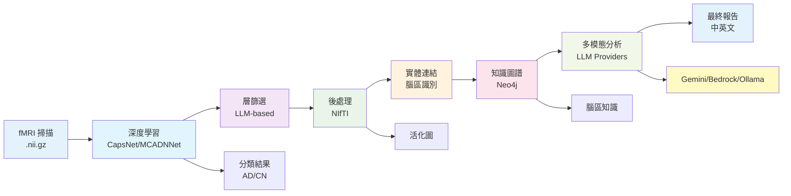
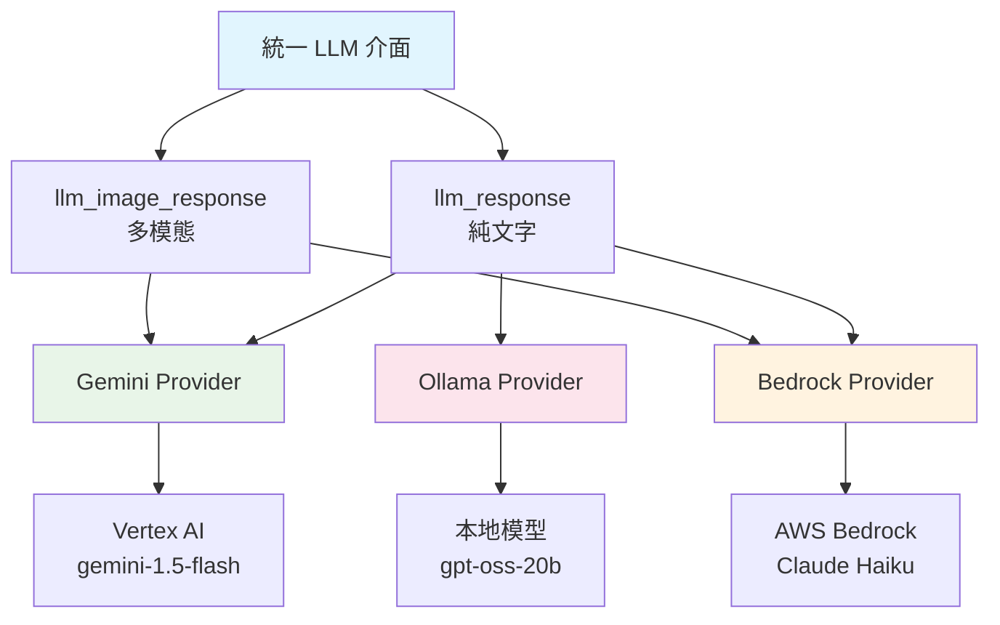

# Cognivex 使用手冊與完整教學指南

## 📖 目錄

1. [系統概述](#系統概述)
2. [系統架構](#系統架構)
3. [安裝指南](#安裝指南)
4. [環境配置](#環境配置)
5. [資料準備](#資料準備)
6. [使用指南](#使用指南)
7. [Web 介面使用](#web-介面使用)
8. [命令列操作](#命令列操作)
9. [故障排除](#故障排除)
10. [維護與升級](#維護與升級)
11. [開發者指南](#開發者指南)
12. [FAQ 常見問題](#faq-常見問題)

---

## 系統概述

**Cognivex** 是一個基於多智能體的可解釋人工智慧框架，專門用於阿茲海默症的功能性磁振造影（fMRI）分析。系統整合了深度學習模型、知識圖譜推理、以及大型語言模型，提供完整的從原始 fMRI 數據到臨床報告的自動化分析流程。

### 🎯 核心功能

- **🧠 智能多智能體系統**: 基於 LangGraph 的 7 節點序列化處理管道
- **🔍 動態可解釋層選擇**: 使用 LLM 智能選擇最有意義的神經網絡層進行可視化
- **🔗 知識圖譜整合**: Neo4j 圖資料庫結合 GraphRAG 進行語義推理
- **📄 雙語報告生成**: 自動生成中英文臨床分析報告
- **🖥️ 互動式網頁介面**: Streamlit 基礎的用戶友好操作介面
- **🔬 科學驗證**: 能自動識別預設模式網絡（DMN）的活化模式

### 🏗️ 技術特色

- **模型無關設計**: 支援 CapsNet-RNN 和 MCADNNet 等多種深度學習模型
- **座標系統修正**: 修正了維度映射錯誤，從 1 個腦區檢測提升至 54 個腦區
- **完整狀態管理**: 智能 UI 鎖定系統，防止分析過程中的誤操作
- **即時進度追蹤**: 分階段進度顯示和狀態更新

---

## 系統架構

### 🔄 LangGraph 工作流架構

```mermaid
graph LR
    A[START] --> B[推理節點<br/>Inference Node]
    B --> C[篩選節點<br/>Filtering Node] 
    C --> D[後處理節點<br/>Post-processing Node]
    D --> E[實體連結節點<br/>Entity Linking Node]
    E --> F[知識推理節點<br/>Knowledge Reasoning Node]
    F --> G[影像解釋節點<br/>Image Explanation Node]
    G --> H[報告生成節點<br/>Report Generation Node]
    H --> I[END]
  
    style A fill:#f0f0f0
    style B fill:#e1f5fe
    style C fill:#f3e5f5
    style D fill:#e8f5e8
    style E fill:#fff3e0
    style F fill:#fce4ec
    style G fill:#f1f8e9
    style H fill:#e3f2fd
    style I fill:#f0f0f0
```



### 🏢 系統組件架構

```
semantic-KG/
├── app/                      # 新版 LangGraph 分析管道
│   ├── agents/               # 管道節點實現
│   │   ├── inference.py      # 模型推理和分類
│   │   ├── filtering.py      # 動態層篩選
│   │   ├── postprocessing.py # 活化圖處理
│   │   ├── entity_linking.py # 腦區實體連結
│   │   ├── knowledge_reasoning.py # Neo4j 知識整合
│   │   ├── image_explainer.py # 視覺分析
│   │   └── report_generator.py # 臨床報告合成
│   ├── core/                 # 核心處理工具
│   │   ├── fmri_processing/  # fMRI 分析管道
│   │   ├── knowledge_graph/  # 知識圖譜查詢工具
│   │   └── vision/           # 影像解釋工具
│   ├── graph/                # LangGraph 工作流定義
│   │   ├── state.py          # AgentState 狀態架構
│   │   └── workflow.py       # 完整管道工作流
│   └── services/             # 外部服務連接器
│       ├── llm_providers/    # 模組化 LLM 供應商
│       │   ├── __init__.py   # 統一呼叫介面
│       │   ├── gemini.py     # Google Vertex AI Gemini
│       │   ├── bedrock.py    # AWS Bedrock Claude
│       │   └── ollama.py     # Ollama 本地推理
│       └── neo4j_connector.py # Neo4j 資料庫介面
├── agents/                   # 舊版 Google ADK 系統（向後兼容）
├── data/                     # fMRI 資料集 (AD/CN 受試者)
├── model/                    # 訓練完成的神經網絡權重
├── scripts/                  # 資料處理和訓練腳本
├── graphql/                  # Neo4j 知識圖譜
└── app.py                   # Streamlit 網頁介面
```

### 📊 資料流架構



### 🤖 LLM 供應商架構



---

## 安裝指南

### 📋 系統需求

#### 硬體需求

- **GPU**: NVIDIA GPU 配備 CUDA 支援（推薦用於訓練/推理）
- **記憶體**: 16GB+ RAM 用於處理 fMRI 資料
- **儲存空間**: 50GB+ 用於資料集和模型權重
- **Neo4j 資料庫**: 運行中的 Neo4j 資料庫實例（本地或遠端）

#### 軟體需求

- **作業系統**: Ubuntu 20.04+ / macOS 12+ / Windows 11
- **Python**: 3.11+ (配置為 `>=3.11,<3.14`)
- **CUDA**: CUDA 11.8+ (用於 GPU 加速)
- **Docker**: Docker Desktop (可選，用於 Neo4j)

### 🚀 安裝步驟

#### 步驟 1: 下載專案

```bash
# 複製專案庫
git clone [repository-url]
cd semantic-KG

# 或者從現有專案目錄開始
cd /path/to/semantic-KG
```

#### 步驟 2: Python 環境設置

```bash
# 建議使用 Poetry（推薦方式）
# 安裝 Poetry
curl -sSL https://install.python-poetry.org | python3 -

# 安裝專案相依套件
poetry install

# 激活虛擬環境
poetry shell
```

**或者使用 pip:**

```bash
# 創建虛擬環境
python3 -m venv .venv

# 激活虛擬環境
# Linux/macOS:
source .venv/bin/activate
# Windows:
.venv\Scripts\activate

# 安裝相依套件
pip install -r requirements.txt
```

#### 步驟 3: PyTorch 和 CUDA 設置

```bash
# 推薦的 CUDA PyTorch 安裝方式
python -m pip install light-the-torch
python -m light_the_torch install --upgrade torch torchaudio torchvision

# 或使用 Poetry 任務
poetry run poe autoinstall-torch-cuda

# 驗證 CUDA 安裝
python -c "import torch; print(f'CUDA available: {torch.cuda.is_available()}')"
```

#### 步驟 4: Neo4j 資料庫設置

#### 步驟 4: LLM 服務設定

**Google Vertex AI 設定（推薦）**

```bash
# 下載 GCP 服務帳號金鑰（JSON 檔案）
# 放置在專案根目錄：gcp-service-account.json

# 設定環境變數
export GOOGLE_APPLICATION_CREDENTIALS="./gcp-service-account.json"
export GOOGLE_CLOUD_PROJECT="your-project-id"
export GOOGLE_CLOUD_LOCATION="us-central1"

# 驗證 Vertex AI 連接
python -c "from app.services.llm_providers.gemini import handle_chat; print('Vertex AI connected')"
```

**AWS Bedrock 設定（可選）**

```bash
# 設定 AWS 認證
export AWS_ACCESS_KEY_ID="your_access_key"
export AWS_SECRET_ACCESS_KEY="your_secret_key"
export AWS_DEFAULT_REGION="us-east-1"

# 安裝 AWS CLI
pip install boto3

# 驗證 Bedrock 連接
python -c "from app.services.llm_providers.bedrock import handle_text; print('Bedrock ready')"
```

**Ollama 本地設定（可選）**

```bash
# 安裝 Ollama
curl -fsSL https://ollama.ai/install.sh | sh

# 啓動 Ollama 服務
ollama serve

# 下載模型
ollama pull llama3.2
ollama pull qwen2.5:14b

# 驗證連接
curl http://localhost:11434/api/tags
```

#### 步驟 5: Neo4j 資料庫設置

**選項 A: 使用 Docker（推薦）**

```bash
# 啟動 Neo4j 容器
docker run -d \
    --name neo4j-fmri \
    -p 7474:7474 -p 7687:7687 \
    -e NEO4J_AUTH=neo4j/your_password \
    -v neo4j_data:/data \
    neo4j:5.28.2

# 驗證連接
docker logs neo4j-fmri
```

**選項 B: 本地安裝**

```bash
# Ubuntu/Debian
wget -O - https://debian.neo4j.com/neotechnology.gpg.key | sudo apt-key add -
echo 'deb https://debian.neo4j.com stable 5' | sudo tee -a /etc/apt/sources.list.d/neo4j.list
sudo apt-get update
sudo apt-get install neo4j

# 啟動服務
sudo systemctl enable neo4j
sudo systemctl start neo4j
sudo systemctl status neo4j
```

#### 步驟 6: 環境變數配置

創建專案根目錄下的 `.env` 檔案：

```bash
# .env 檔案配置
# Neo4j 知識圖譜設定
NEO4J_URI=bolt://localhost:7687
NEO4J_USER=neo4j
NEO4J_PASSWORD=your_neo4j_password

# 主要 LLM 供應商：Google Vertex AI
GOOGLE_CLOUD_PROJECT=your_gcp_project_id
GOOGLE_CLOUD_LOCATION=us-central1
GOOGLE_APPLICATION_CREDENTIALS=./gcp-service-account.json
GOOGLE_GENAI_USE_VERTEXAI=1

# 備用 LLM 供應商：AWS Bedrock
AWS_ACCESS_KEY_ID=your_aws_access_key
AWS_SECRET_ACCESS_KEY=your_aws_secret_key
AWS_DEFAULT_REGION=us-east-1

# 本地 LLM 供應商：Ollama
OLLAMA_BASE_URL=http://localhost:11434

# 可選：雲端部署設定
PROJECT_ID=your_gcp_project_id
LOCATION=your_gcp_location
BUCKET_ID=your_gcp_bucket
```

### 🤖 LLM 供應商選擇指南

Cognivex 支援多種 LLM 供應商，您可以根據需求選擇：

#### 1. **Google Vertex AI Gemini**（推薦）
- **優點**：優異的多模態能力，特別適合影像分析
- **支援模型**：`gemini-1.5-flash`、`gemini-1.5-pro`
- **適用場景**：生產環境、需要多模態分析
- **成本**：中等（按使用量計費）

#### 2. **AWS Bedrock Claude**（備用）
- **優點**：優異的文本理解和生成能力
- **支援模型**：`anthropic.claude-haiku-4-5-20251001-v1:0`
- **適用場景**：需要高品質文本生成、企業環境
- **成本**：低（Haiku 模型相對便宜）

#### 3. **Ollama 本地推理**（開發/離線）
- **優點**：完全本地化、無網路成本、數據隱私
- **支援模型**：`llama3.2`、`qwen2.5:14b`、其他開源模型
- **適用場景**：開發測試、離線環境、數據盧欧嚴格
- **成本**：無（但需要本地 GPU 資源）

---

## 環境配置

### 🔧 知識圖譜建置

建置 Neo4j 知識圖譜是系統運行的必要步驟：

```bash
# 建置 Neo4j 圖資料庫
python -m tools.build_neo4j

# 驗證連接並測試查詢
python -c "from app.services.neo4j_connector import Neo4jConnector; client = Neo4jConnector(); print('Neo4j connected successfully!')"

# 檢查圖資料統計
python -m scripts.capsnet.build_kg  # 檢視知識圖譜統計資訊
```

### 📂 資料目錄結構設置

創建必要的資料目錄結構：

```bash
# 創建資料目錄
mkdir -p data/{raw,processed,slices}
mkdir -p data/raw/{AD,CN}
mkdir -p model/{capsnet,macadnnet}
mkdir -p output/{activations,brain_maps,visualizations}
mkdir -p graphql/visualizations

# 設置權限
chmod -R 755 data/ model/ output/ graphql/
```

### 🧪 系統驗證測試

運行系統組件測試確保配置正確：

```bash
# 測試 Neo4j 連接
python -m tests.brain_region

# 測試模型載入
python -m tests.model_info

# 測試 fMRI 資料載入
python -m tests.nii_check

# 測試 LLM 服務連接
python -m tests.image_explain

# 測試多種 LLM 供應商
python -c "from app.services.llm_providers import llm_response; print(llm_response('Hello', llm_provider='gemini'))"
python -c "from app.services.llm_providers import llm_response; print(llm_response('Hello', llm_provider='aws_bedrock'))" 
python -c "from app.services.llm_providers import llm_response; print(llm_response('Hello', llm_provider='gpt-oss-20b', model='llama3.2'))"

# 測試完整管道（使用範例資料）
python -m tests.vertex
```

---

## 資料準備

### 📥 下載必要檔案

#### 1. fMRI 資料集

從雲端儲存下載預處理的 fMRI 資料：

```bash
# 下載連結（需要替換為實際連結）
# https://u.pcloud.link/publink/show?code=kZEgL15ZhlezDWqfUEY3MkFwUK9Gtui7w0T7

# 解壓縮到正確位置
unzip data.zip
cp -r extracted_data/raw/* data/raw/

# 驗證資料結構
ls -la data/raw/AD/
ls -la data/raw/CN/
```

#### 2. 預訓練模型權重

下載預訓練的模型權重：

```bash
# 下載模型權重（需要替換為實際連結）
# https://u.pcloud.link/publink/show?code=kZ7gL15ZoCYrxwMqwwQmmBYDWfDmuy2GB4Ly

# 放置模型檔案
cp best_capsnet_rnn.pth model/capsnet/
cp mcadnnet_weights.pth model/macadnnet/

# 驗證模型檔案
ls -la model/capsnet/
ls -la model/macadnnet/
```

### 📁 資料目錄結構

完整的資料目錄結構應如下所示：

```
data/
├── raw/                    # 原始 fMRI 資料
│   ├── AD/                # 阿茲海默症患者
│   │   ├── sub-01/        # 受試者 1
│   │   │   └── dswausub-xxx_task-rest_bold.nii.gz
│   │   ├── sub-02/        # 受試者 2
│   │   └── ...
│   └── CN/                # 健康對照組
│       ├── sub-01/
│       │   └── dswausub-xxx_task-rest_bold.nii.gz
│       ├── sub-02/
│       └── ...
├── processed/             # 處理中間結果
└── slices/               # 2D 切片影像（如使用切片訓練）

model/
├── capsnet/               # CapsNet-RNN 模型權重
│   └── best_capsnet_rnn.pth
└── macadnnet/            # MCADNNet 模型權重
    └── best_model.pth

output/                    # 分析結果
├── activations/           # 神經網絡活化圖
├── brain_maps/           # 腦區分析結果
└── visualizations/       # 生成的圖表和熱力圖

graphql/                  # 知識圖譜資料
├── semantic_graph.graphml
├── nodes.csv
├── edges.csv
└── visualizations/
```

### 🔍 資料驗證

驗證資料完整性和格式：

```bash
# 檢查 fMRI 檔案格式和完整性
python -m scripts.group.check_map

# 驗證模型權重可載入性
python -m tests.model_info

# 檢查資料集統計資訊
find data/raw/AD -name "*.nii.gz" | wc -l
find data/raw/CN -name "*.nii.gz" | wc -l
```

---

## 使用指南

### 🌐 主要使用方式

Cognivex 提供兩種主要的使用方式：

1. **Web 介面**（推薦新用戶）: 透過 Streamlit 圖形化介面
2. **命令列介面**（適合批次處理）: 直接執行 Python 腳本

### 🖥️ Web 介面快速開始

最簡單的使用方式是透過 Web 介面：

```bash
# 啟動 Web 應用程式
streamlit run app.py

# 或使用 Poetry
poetry run streamlit run app.py

# 應用程式將在 http://localhost:8501 啟動
```

### ⚡ 快速分析流程

對於急於看到結果的用戶，以下是最快的分析流程：

1. **確保環境準備就緒**:

   - Neo4j 資料庫運行中
   - `.env` 檔案配置正確
   - fMRI 資料和模型權重已下載
2. **啟動 Web 介面**:

   ```bash
   streamlit run app.py
   ```
3. **在 Web 介面中**:

   - 選擇受試者（例如 `sub-01`）
   - 選擇模型（推薦 `CapsNet`）
   - 點擊 "Start Analysis"
   - 等待分析完成（約 3-5 分鐘）
4. **檢視結果**:

   - 查看腦區活化圖
   - 閱讀中英文臨床報告
   - 使用互動式腦部檢視器

---

## Web 介面使用

### 🖱️ 介面概覽

Streamlit Web 介面包含以下主要區域：

#### 側邊欄控制區

- **受試者選擇器**: 從可用的 fMRI 資料中選擇受試者
- **模型選擇器**: 選擇分析模型（CapsNet / MCADNNet）
- **分析控制按鈕**: 開始分析和緊急停止功能
- **模型資訊顯示**: 顯示選中模型的詳細資訊

#### 主要顯示區域

- **進度追蹤**: 即時分析進度和狀態更新
- **結果展示**: 分析完成後的結果顯示區域
- **互動式檢視器**: 可展開的 3D 腦部影像檢視器
- **報告分頁**: 中英文臨床報告並排顯示

### 📱 使用操作流程

#### 步驟 1: 啟動應用

```bash
# 進入專案目錄
cd /path/to/semantic-KG

# 啟動應用
streamlit run app.py
```

瀏覽器將自動打開或手動訪問 `http://localhost:8501`

#### 步驟 2: 選擇分析參數

1. **選擇受試者**:

   - 在側邊欄的 "Select Subject" 下拉選單中選擇
   - 系統會自動顯示受試者的真實標籤（AD 或 CN）
   - 受試者 ID 格式通常為 `sub-01`, `sub-02` 等
2. **選擇推理模型**:

   - **CapsNet**: 3D 膠囊網絡，適合複雜 3D fMRI 模式
   - **MCADNNet**: 2D 卷積神經網絡，計算效率高
3. **檢視模型資訊**:

   - 系統會顯示選中模型的類型、描述和適用場景

#### 步驟 3: 開始分析

1. 點擊 "Start Analysis" 按鈕
2. 系統會進入分析模式:
   - 所有控制項被鎖定，防止誤操作
   - 顯示即時進度條和狀態訊息
   - 各階段進度更新：
     - 準備分析...（10%）
     - 載入資料檔案...（20%）
     - 開始大腦分析工作流...（30%）
     - 運行 AI 分析管道...（50%）
     - 完成結果...（90%）
     - 分析成功完成！（100%）

#### 步驟 4: 檢視分析結果

分析完成後，結果區域將顯示：

1. **腦區活化圖**:

   - 高解析度的大腦活化熱力圖
   - 疊加在標準腦部解剖結構上
   - 顯示 fMRI 分析中檢測到的活化區域
2. **預測驗證**:

   - 並排顯示真實標籤和模型預測
   - 綠色勾號（✅）表示預測正確
   - 紅色叉號（❌）表示預測錯誤
3. **互動式 fMRI 檢視器**:

   - 可展開的區域，顯示原始 fMRI 掃描
   - 時間點滑桿：選擇不同的 fMRI 時間體積
   - 3D 腦部切片檢視器，支援多方向檢視
4. **雙語臨床報告**:

   - **English Report**: 完整的英文臨床分析報告
   - **中文報告**: 繁體中文臨床分析報告
   - 報告包含：
     - 分類結果和信心度
     - 檢測到的活化腦區及其功能
     - 與阿茲海默症相關的病理學解釋
     - 臨床建議和進一步檢查建議

### 🛡️ 安全功能

#### 智能狀態管理

- **分析期間鎖定**: 分析運行時，所有控制項自動禁用
- **參數變更檢測**: 改變受試者或模型會自動重置結果
- **緊急停止**: 提供 "Force Stop Analysis" 按鈕中斷長時間運行的分析

#### 錯誤處理

- 檔案缺失自動檢測和錯誤提示
- 網絡連接問題的友好錯誤訊息
- 分析失敗時的自動狀態恢復

### 🎛️ 高級功能

#### 互動式腦部檢視器

- **4D fMRI 支援**: 自動檢測並處理 4D fMRI 資料
- **時間軸導航**: 滑桿控制檢視不同時間點的腦部活動
- **多視角檢視**: 支援軸狀面、冠狀面、矢狀面檢視
- **顏色映射**: 可調整的顏色對比和閾值設定

#### 結果匯出

雖然 Web 介面主要用於檢視，但可以：

- 右鍵保存腦部活化圖
- 複製文本報告內容
- 使用瀏覽器的列印功能保存完整報告

---

## 命令列操作

### 🔧 完整分析管道

對於批次處理或自動化需求，可使用命令列直接執行分析管道：

#### 方法 1: 使用 LangGraph 工作流

```bash
# 直接執行 LangGraph 管道
python -m app.graph.workflow

# 或者透過 Python 腳本自定義輸入
python -c "
from app.graph.workflow import app
result = app.invoke({
    'subject_id': 'sub-01',
    'fmri_scan_path': 'data/raw/CN/sub-01/scan.nii.gz',
    'model_path': 'model/capsnet/best_capsnet_rnn.pth',
    'error_log': [],
    'trace_log': []
})
print('Analysis completed:', result.get('classification_result'))
"
```

#### 方法 2: 使用舊版 Google ADK 系統

```bash
# 執行完整的多智能體管道
python -m agents.agent

# 或使用後端執行器
python -m backend.backend_runner
```

### 🧪 單步驟分析命令

#### 模型訓練

```bash
# 訓練 CapsNet-RNN 模型（主要模型）
python -m scripts.capsnet.train

# 訓練 MCADNNet 模型（替代模型）
python -m scripts.macadnnet.train

# 準備訓練資料
python -m scripts.data_prepare
```

#### 單一模型推理

```bash
# CapsNet-RNN 推理
python -m scripts.capsnet.infer

# MCADNNet 推理，指定模型和輸入檔案
python -m scripts.macadnnet.inference \
    --model model/macadnnet/best_model.pth \
    --input data/raw/AD/sub-14/dswausub-098_S_6601_task-rest_bold.nii.gz
```

#### 群組層級分析管道

這是進行批次分析的完整流程，需要按順序執行：

```bash
# 1. 對所有受試者產生活化圖
python -m scripts.group.infer

# 2. 將活化張量轉換為 NIfTI 格式
python -m scripts.group.act_nii

# 3. 重新取樣活化圖到標準圖譜空間
python -m scripts.group.resample

# 4. 產生定量腦區統計
python -m scripts.group.brain_map

# 5. (可選) 計算群組平均活化圖
python -m scripts.group.get_avg_act

# 6. (可選) 檢查生成的圖譜
python -m scripts.group.check_map
```

### 🕸️ 知識圖譜操作

```bash
# 建置 Neo4j 圖資料庫
python -m tools.build_neo4j

# 產生 Cypher 查詢
python -m tools.generate_cypher

# 測試知識圖譜連接
python -c "from app.services.neo4j_connector import Neo4jConnector; client = Neo4jConnector(); print('Neo4j connected successfully!')"
```

### 🧪 系統測試和驗證

```bash
# 測試活化圖擷取
python -m tests.check_act

# 驗證腦區映射
python -m tests.brain_region

# 檢查模型資訊
python -m tests.model_info

# 測試個別組件
python -m tests.image_explain
python -m tests.vertex  # Google ADK 整合測試
```

### 📊 批次處理腳本範例

創建自定義批次處理腳本：

```python
# batch_analysis.py
from app.graph.workflow import app
import glob
import json

# 取得所有受試者
subjects = glob.glob("data/raw/*/sub-*")
results = {}

for subject_path in subjects:
    subject_id = subject_path.split('/')[-1]
    nii_files = glob.glob(f"{subject_path}/*.nii.gz")
  
    if nii_files:
        print(f"Processing {subject_id}...")
    
        state = {
            "subject_id": subject_id,
            "fmri_scan_path": nii_files[0],
            "model_path": "model/capsnet/best_capsnet_rnn.pth",
            "error_log": [],
            "trace_log": []
        }
    
        try:
            result = app.invoke(state)
            results[subject_id] = {
                "classification": result.get("classification_result"),
                "activated_regions": len(result.get("activated_regions", [])),
                "status": "success"
            }
        except Exception as e:
            results[subject_id] = {"status": "error", "error": str(e)}

# 保存結果
with open("batch_results.json", "w") as f:
    json.dump(results, f, indent=2)

print("Batch processing completed. Results saved to batch_results.json")
```

執行批次處理：

```bash
python batch_analysis.py
```

---

## 故障排除

### 🚨 常見問題與解決方案

#### 1. CUDA/GPU 相關問題

**問題**: CUDA 不可用或 GPU 記憶體不足

```bash
RuntimeError: CUDA out of memory
torch.cuda.is_available() returns False
```

**解決方案**:

```bash
# 檢查 CUDA 安裝
nvidia-smi
python -c "import torch; print(torch.cuda.is_available())"

# 重新安裝 PyTorch (推薦方法)
python -m pip install light-the-torch
python -m light_the_torch install --upgrade torch torchaudio torchvision

# 或使用 CPU 版本 (較慢但穩定)
pip install torch torchvision torchaudio --index-url https://download.pytorch.org/whl/cpu
```

#### 2. Neo4j 資料庫連接問題

**問題**: Neo4j 連接失敗

```bash
ServiceUnavailable: Failed to establish connection to Neo4j database
```

**解決方案**:

```bash
# 檢查 Neo4j 服務狀態
sudo systemctl status neo4j
docker ps | grep neo4j

# 重新啟動 Neo4j
sudo systemctl restart neo4j
# 或 Docker
docker restart neo4j-fmri

# 檢查連接埠和防火牆
netstat -an | grep 7687
telnet localhost 7687

# 驗證 .env 檔案配置
cat .env | grep NEO4J
```

#### 3. Google API 金鑰問題

**問題**: Google API 認證失敗

```bash
google.api_core.exceptions.Unauthenticated: Request is missing required authentication credential
```

**解決方案**:

```bash
# 檢查 API 金鑰設定
echo $GOOGLE_API_KEY
grep GOOGLE_API_KEY .env

# 重新載入環境變數
source .env
export GOOGLE_API_KEY="your_actual_api_key"

# 測試 API 連接
python -c "
import google.generativeai as genai
genai.configure(api_key='your_api_key')
print('API key is valid')
"
```

#### 4. 檔案路徑和權限問題

**問題**: 找不到檔案或權限被拒

```bash
FileNotFoundError: No such file or directory
PermissionError: [Errno 13] Permission denied
```

**解決方案**:

```bash
# 檢查檔案存在性
ls -la data/raw/
ls -la model/capsnet/

# 修正權限
chmod -R 755 data/ model/ output/
chown -R $USER:$USER data/ model/ output/

# 檢查磁碟空間
df -h

# 建立缺失目錄
mkdir -p data/raw/{AD,CN} model/{capsnet,macadnnet} output/{activations,brain_maps,visualizations}
```

#### 5. 記憶體不足問題

**問題**: 系統記憶體不足

```bash
MemoryError: Unable to allocate array
RuntimeError: [enforce fail at alloc_cpu.cpp] out of memory
```

**解決方案**:

```bash
# 檢查系統記憶體使用
free -h
htop

# 清理 Python 快取
pip cache purge
python -c "import torch; torch.cuda.empty_cache()"

# 調整批次大小（修改程式碼）
# 在相關的 Python 檔案中減少 batch_size 參數

# 增加交換空間（臨時解決）
sudo swapon --show
sudo fallocate -l 4G /swapfile
sudo chmod 600 /swapfile
sudo mkswap /swapfile
sudo swapon /swapfile
```

#### 6. Streamlit Web 應用問題

**問題**: Web 應用無法啟動或載入緩慢

```bash
streamlit run app.py
ValueError: Session state is corrupted
```

**解決方案**:

```bash
# 清除 Streamlit 快取
streamlit cache clear

# 重新啟動新的 session
rm -rf ~/.streamlit/
streamlit run app.py

# 檢查連接埠占用
lsof -i :8501
kill -9 <PID>

# 指定不同連接埠
streamlit run app.py --server.port 8502
```

### 🔍 診斷工具

#### 系統健康檢查腳本

創建一個自動診斷腳本：

```bash
# 創建 health_check.py
cat > health_check.py << 'EOF'
#!/usr/bin/env python3
import os
import sys
import torch
import subprocess
import requests
from pathlib import Path

def check_python_version():
    version = sys.version_info
    print(f"✅ Python version: {version.major}.{version.minor}.{version.micro}")
    if version.major < 3 or version.minor < 11:
        print("❌ Python 3.11+ is required")
        return False
    return True

def check_cuda():
    cuda_available = torch.cuda.is_available()
    print(f"{'✅' if cuda_available else '⚠️'} CUDA available: {cuda_available}")
    if cuda_available:
        print(f"   GPU count: {torch.cuda.device_count()}")
        print(f"   GPU name: {torch.cuda.get_device_name(0)}")
    return True

def check_env_file():
    env_path = Path('.env')
    if env_path.exists():
        print("✅ .env file found")
        with open(env_path) as f:
            content = f.read()
            required_vars = ['NEO4J_URI', 'NEO4J_USERNAME', 'NEO4J_PASSWORD', 'GOOGLE_API_KEY']
            for var in required_vars:
                if var in content:
                    print(f"   ✅ {var} is set")
                else:
                    print(f"   ❌ {var} is missing")
        return True
    else:
        print("❌ .env file not found")
        return False

def check_neo4j():
    try:
        response = requests.get('http://localhost:7474', timeout=5)
        print(f"✅ Neo4j web interface responding: {response.status_code}")
        return True
    except:
        print("❌ Neo4j not accessible on localhost:7474")
        return False

def check_data_structure():
    required_dirs = [
        'data/raw/AD',
        'data/raw/CN', 
        'model/capsnet',
        'model/macadnnet',
        'output'
    ]
  
    all_good = True
    for dir_path in required_dirs:
        if Path(dir_path).exists():
            print(f"✅ Directory exists: {dir_path}")
        else:
            print(f"❌ Directory missing: {dir_path}")
            all_good = False
  
    return all_good

def main():
    print("🔍 Neuro-Compass System Health Check")
    print("="*40)
  
    checks = [
        check_python_version,
        check_cuda,
        check_env_file,
        check_neo4j,
        check_data_structure
    ]
  
    results = []
    for check in checks:
        try:
            result = check()
            results.append(result)
        except Exception as e:
            print(f"❌ Error in {check.__name__}: {e}")
            results.append(False)
        print()
  
    if all(results):
        print("🎉 All checks passed! System is ready.")
    else:
        print("⚠️ Some issues found. Please address them before proceeding.")
  
    return all(results)

if __name__ == "__main__":
    sys.exit(0 if main() else 1)
EOF

# 執行健康檢查
python health_check.py
```

#### 詳細日誌記錄

啟用詳細的日誌記錄進行除錯：

```bash
# 設定日誌等級環境變數
export PYTHONPATH="${PYTHONPATH}:."
export LOG_LEVEL=DEBUG

# 執行帶有詳細日誌的分析
python -m app.graph.workflow 2>&1 | tee analysis.log

# 檢查日誌檔案
grep -i error analysis.log
grep -i warning analysis.log
```

---

## 維護與升級

### 🔄 定期維護任務

#### 每週維護

```bash
# 清理暫存檔案
find output/ -name "*.tmp" -delete
find /tmp -name "*fmri*" -delete 2>/dev/null || true

# 檢查磁碟空間
df -h

# 更新 Python 套件安全性更新
pip list --outdated
poetry show --outdated

# 檢查 Neo4j 資料庫效能
echo "CALL dbms.procedures() YIELD name WHERE name CONTAINS 'monitor'" | cypher-shell
```

#### 每月維護

```bash
# 完整系統備份
tar -czf neuro_compass_backup_$(date +%Y%m%d).tar.gz \
    .env model/ graphql/ data/processed/

# 清理 Docker 映像檔（如使用）
docker system prune -f

# 檢查並更新相依套件
poetry update
pip install --upgrade pip
```

### 📦 系統升級流程

#### 升級到新版本

```bash
# 1. 備份當前版本
cp -r . ../neuro-compass-backup-$(date +%Y%m%d)

# 2. 取得最新程式碼
git fetch origin
git checkout main
git pull origin main

# 3. 更新相依套件
poetry install
poetry update

# 4. 遷移資料庫（如需要）
python -m tools.migrate_neo4j

# 5. 執行升級測試
python -m tests.upgrade_test

# 6. 重新啟動服務
sudo systemctl restart neo4j
pkill -f streamlit
```

#### 配置檔案遷移

如果 `.env` 檔案格式有變更：

```bash
# 備份舊配置
cp .env .env.backup

# 檢查新的配置範本
cat .env.template

# 合併配置（手動或使用工具）
python -c "
import os
from pathlib import Path

old_config = Path('.env.backup').read_text()
new_template = Path('.env.template').read_text()

# 提取舊值並應用到新範本
# (實際實現會更複雜)
print('Please manually merge .env.backup into .env using the new template')
"
```

### 🎯 效能優化

#### Neo4j 資料庫優化

```bash
# 調整 Neo4j 設定
sudo nano /etc/neo4j/neo4j.conf

# 關鍵設定：
# server.memory.heap.initial_size=2G
# server.memory.heap.max_size=4G
# server.memory.pagecache.size=1G

# 重建索引
echo "CALL db.index.fulltext.createNodeIndex('entities', ['Entity'], ['name', 'type'])" | cypher-shell

# 重新啟動 Neo4j
sudo systemctl restart neo4j
```

#### Python 記憶體優化

```python
# 在分析腳本中加入記憶體優化
import gc
import torch

def optimize_memory():
    """記憶體優化函數"""
    gc.collect()
    if torch.cuda.is_available():
        torch.cuda.empty_cache()
  
# 在關鍵位置呼叫
optimize_memory()
```

### 🔐 安全性更新

#### 定期安全檢查

```bash
# 檢查 Python 套件安全漏洞
pip audit
poetry audit

# 更新有安全漏洞的套件
pip install --upgrade vulnerable-package
poetry update vulnerable-package

# 檢查 Neo4j 安全設定
curl -u neo4j:password http://localhost:7474/db/manage/server/info
```

#### 憑證輪換

```bash
# 更新 API 金鑰（Google API 範例）
# 1. 在 Google Cloud Console 產生新金鑰
# 2. 更新 .env 檔案
sed -i 's/GOOGLE_API_KEY=old_key/GOOGLE_API_KEY=new_key/' .env

# 3. 重新啟動相關服務
pkill -f streamlit
streamlit run app.py &

# 更新 Neo4j 密碼
echo "ALTER CURRENT USER SET PASSWORD FROM 'old_password' TO 'new_password'" | cypher-shell -u neo4j -p old_password
```

---

## 開發者指南

### 🛠️ 開發環境設置

#### 設置開發環境

```bash
# 複製專案並切換到開發分支
git clone [repository-url]
cd semantic-KG
git checkout develop

# 安裝開發相依套件
poetry install --with dev
poetry run pre-commit install

# 設置開發環境變數
cp .env.template .env.dev
nano .env.dev  # 編輯開發設定
```

#### 程式碼品質工具

```bash
# 程式碼格式化
poetry run black .
poetry run isort .

# 靜態分析
poetry run flake8 .
poetry run mypy .

# 測試覆蓋率
poetry run pytest --cov=app tests/
poetry run coverage html  # 產生 HTML 報告
```

### 🏗️ 架構解析

#### LangGraph 工作流

系統的核心是基於 LangGraph 的 7 節點序列化管道：

```python
# app/graph/workflow.py 結構解析
from langgraph.graph import StateGraph, START, END
from .state import AgentState

# 建立工作流
workflow = StateGraph(AgentState)

# 7 個主要節點
nodes = [
    ("inference", run_inference_and_classification),      # 模型推理
    ("filtering", filter_layers_dynamically),             # 動態層篩選
    ("post_processing", run_post_processing),             # 後處理
    ("entity_linker", link_entities),                     # 實體連結
    ("knowledge_reasoner", enrich_with_knowledge_graph),  # 知識推理
    ("image_explainer", explain_image),                   # 影像解釋
    ("report_generator", generate_final_report)           # 報告生成
]

# 順序連接所有節點
for i, (name, func) in enumerate(nodes):
    workflow.add_node(name, func)
    if i == 0:
        workflow.add_edge(START, name)
    else:
        prev_name = nodes[i-1][0]
        workflow.add_edge(prev_name, name)
    if i == len(nodes) - 1:
        workflow.add_edge(name, END)
```

#### AgentState 狀態管理

狀態物件包含所有中間結果和最終輸出：

```python
# app/graph/state.py 結構解析
class AgentState(TypedDict):
    # 輸入資料
    subject_id: str                           # 受試者 ID
    fmri_scan_path: str                       # fMRI 檔案路徑
    model_path: Optional[str]                 # 模型權重路徑
    model_name: Optional[str]                 # 模型名稱
  
    # 中間處理結果
    validated_layers: Optional[List[Dict]]    # 驗證的模型層
    final_layers: Optional[List[Dict]]        # 篩選後的層
    post_processing_results: Optional[List]   # 後處理結果
    clean_region_names: Optional[List[str]]   # 清理的腦區名稱
  
    # 最終輸出
    classification_result: Optional[str]      # AD/CN 分類結果
    activated_regions: Optional[List[BrainRegionInfo]]  # 活化腦區
    visualization_paths: Optional[List[str]]  # 視覺化圖片路徑
    image_explanation: Optional[Dict]         # 影像解釋
    rag_summary: Optional[str]               # 知識摘要
    generated_reports: Optional[Dict[str, str]]  # 中英文報告
  
    # 系統日誌
    error_log: List[str]                     # 錯誤日誌
    trace_log: List[str]                     # 執行追蹤
```

### 🔌 擴展開發

#### 新增自定義節點

1. **建立新節點函數**:

```python
# app/agents/custom_node.py
from app.graph.state import AgentState
from typing import Any, Dict

def custom_analysis_node(state: AgentState) -> Dict[str, Any]:
    """自定義分析節點"""
  
    # 從狀態取得輸入
    subject_id = state["subject_id"]
    current_results = state.get("post_processing_results", [])
  
    # 執行自定義分析
    custom_results = perform_custom_analysis(current_results)
  
    # 更新狀態
    state["trace_log"].append(f"Custom analysis completed for {subject_id}")
    state["custom_results"] = custom_results
  
    return state

def perform_custom_analysis(input_data):
    """實際的自定義分析邏輯"""
    # 實現你的分析邏輯
    pass
```

2. **整合到工作流**:

```python
# 修改 app/graph/workflow.py
from app.agents.custom_node import custom_analysis_node

# 加入新節點
workflow.add_node("custom_analyzer", custom_analysis_node)

# 調整邊連接
workflow.add_edge("post_processing", "custom_analyzer")
workflow.add_edge("custom_analyzer", "entity_linker")
```

#### 新增模型支援

1. **建立模型配置**:

```python
# app/core/fmri_processing/model_config.py 擴展
class CustomModelConfig(ModelConfig):
    """自定義模型配置"""
  
    def __init__(self):
        super().__init__()
        self.model_name = "custom_model"
        self.layer_selection_strategy = "custom_strategy"
        self.target_layers = ["custom_layer_1", "custom_layer_2"]
  
    def validate_layers(self, model) -> List[Dict]:
        """驗證自定義模型的層"""
        # 實現層驗證邏輯
        pass
```

2. **註冊到模型工廠**:

```python
# app/core/fmri_processing/model_factory.py
from .model_config import CustomModelConfig

class ModelFactory:
    @staticmethod
    def create_config(model_name: str):
        configs = {
            "capsnet": CapsNetConfig(),
            "mcadnnet": MCADNNetConfig(),
            "custom_model": CustomModelConfig()  # 新增
        }
        return configs.get(model_name, CapsNetConfig())
```

### 🧪 測試開發

#### 單元測試

```python
# tests/test_workflow.py
import pytest
from app.graph.workflow import app
from app.graph.state import AgentState

class TestWorkflow:
    def test_inference_node(self):
        """測試推理節點"""
        initial_state = {
            "subject_id": "test_sub",
            "fmri_scan_path": "test_path.nii.gz",
            "model_path": "test_model.pth",
            "error_log": [],
            "trace_log": []
        }
    
        # 測試單個節點
        from app.agents.inference import run_inference_and_classification
        result = run_inference_and_classification(initial_state)
    
        assert "classification_result" in result
        assert result["classification_result"] in ["AD", "CN"]
  
    def test_full_workflow(self):
        """測試完整工作流"""
        initial_state = {
            "subject_id": "test_sub",
            "fmri_scan_path": "data/test/test.nii.gz",
            "model_path": "model/test/test.pth",
            "error_log": [],
            "trace_log": []
        }
    
        result = app.invoke(initial_state)
    
        # 驗證所有必要欄位存在
        required_fields = [
            "classification_result",
            "activated_regions",
            "generated_reports"
        ]
    
        for field in required_fields:
            assert field in result
            assert result[field] is not None

# 執行測試
# poetry run pytest tests/test_workflow.py -v
```

#### 整合測試

```python
# tests/test_integration.py
import pytest
import tempfile
from pathlib import Path

class TestIntegration:
    @pytest.fixture
    def temp_data_dir(self):
        """建立臨時測試資料"""
        with tempfile.TemporaryDirectory() as temp_dir:
            # 建立測試資料結構
            test_dir = Path(temp_dir)
            (test_dir / "data/raw/CN/sub-test").mkdir(parents=True)
            (test_dir / "model/capsnet").mkdir(parents=True)
        
            yield test_dir
  
    def test_neo4j_integration(self):
        """測試 Neo4j 整合"""
        from app.services.neo4j_connector import Neo4jConnector
    
        connector = Neo4jConnector()
        result = connector.test_connection()
        assert result is True
  
    def test_llm_integration(self):
        """測試 LLM 服務整合"""
        from app.services.llm_provider import LLMProvider
    
        provider = LLMProvider()
        response = provider.generate_text("Test prompt")
        assert len(response) > 0
```

### 📊 效能分析

#### 分析工具使用

```python
# 效能分析腳本
# performance_analysis.py
import time
import psutil
import torch
from app.graph.workflow import app

def measure_performance():
    """測量系統效能"""
  
    # 記錄系統狀態
    cpu_percent = psutil.cpu_percent(interval=1)
    memory_info = psutil.virtual_memory()
    gpu_memory = torch.cuda.memory_allocated() if torch.cuda.is_available() else 0
  
    print(f"初始 CPU 使用率: {cpu_percent}%")
    print(f"初始記憶體使用: {memory_info.percent}%")
    print(f"初始 GPU 記憶體: {gpu_memory / 1024**2:.2f} MB")
  
    # 執行分析並測量時間
    start_time = time.time()
  
    initial_state = {
        "subject_id": "perf_test",
        "fmri_scan_path": "data/raw/CN/sub-01/scan.nii.gz",
        "model_path": "model/capsnet/best_capsnet_rnn.pth",
        "error_log": [],
        "trace_log": []
    }
  
    result = app.invoke(initial_state)
  
    end_time = time.time()
  
    # 記錄最終狀態
    final_cpu = psutil.cpu_percent(interval=1)
    final_memory = psutil.virtual_memory()
    final_gpu_memory = torch.cuda.memory_allocated() if torch.cuda.is_available() else 0
  
    print(f"\n分析完成時間: {end_time - start_time:.2f} 秒")
    print(f"最終 CPU 使用率: {final_cpu}%")
    print(f"最終記憶體使用: {final_memory.percent}%")
    print(f"最終 GPU 記憶體: {final_gpu_memory / 1024**2:.2f} MB")
    print(f"GPU 記憶體增加: {(final_gpu_memory - gpu_memory) / 1024**2:.2f} MB")

if __name__ == "__main__":
    measure_performance()
```

#### 瓶頸識別

```bash
# 使用 Python profiler
python -m cProfile -o profile_output.prof -m app.graph.workflow

# 分析結果
python -c "
import pstats
p = pstats.Stats('profile_output.prof')
p.sort_stats('tottime').print_stats(20)
"

# 使用 line_profiler（需安裝）
pip install line_profiler
kernprof -l -v your_script.py
```

---

## FAQ 常見問題

### ❓ 系統使用相關

**Q: 分析一個受試者需要多長時間？**
A: 通常需要 3-5 分鐘，具體取決於：

- 硬體配置（GPU 加速可大幅縮短時間）
- fMRI 資料大小
- 選擇的模型複雜度
- Neo4j 資料庫響應速度

**Q: 系統支援哪些 fMRI 資料格式？**
A: 目前支援：

- NIfTI 格式（.nii, .nii.gz）
- 4D fMRI 資料（時間序列）
- ADNI 資料集格式
- 標準 MNI 空間資料

**Q: 可以同時分析多個受試者嗎？**
A: Web 介面一次只能分析一個受試者，但可使用命令列進行批次處理：

```bash
python batch_analysis.py  # 自定義批次腳本
```

**Q: 如何解釋分析結果？**
A: 系統提供多層次解釋：

1. **分類結果**: AD（阿茲海默症）或 CN（認知正常）
2. **腦區活化圖**: 顯示異常活化區域
3. **知識圖譜關聯**: 解釋活化區域與疾病的關係
4. **臨床報告**: 中英文詳細解釋和建議

### ❓ 技術問題

**Q: 遇到 "CUDA out of memory" 錯誤怎麼辦？**
A: 解決步驟：

1. 檢查 GPU 記憶體使用: `nvidia-smi`
2. 關閉其他使用 GPU 的程式
3. 重新啟動 Python 程序
4. 如果問題持續，可使用 CPU 版本（較慢）

**Q: Neo4j 連接失敗怎麼辦？**
A: 檢查順序：

1. 確認 Neo4j 服務運行: `sudo systemctl status neo4j`
2. 檢查連接埠: `netstat -an | grep 7687`
3. 驗證 `.env` 檔案中的認證資訊
4. 測試連接: `telnet localhost 7687`

**Q: 為什麼我的分析結果中只檢測到很少的腦區？**
A: 這可能是由於：

1. **模型權重問題**: 確保使用正確的預訓練權重
2. **資料品質**: 檢查 fMRI 資料的預處理品質
3. **座標系統**: 新版系統已修正座標映射問題
4. **閾值設定**: 可能需要調整活化閾值

**Q: 系統報告的語言可以自定義嗎？**
A: 目前支援中英文雙語報告。如需其他語言，需要修改 `app/agents/report_generator.py` 中的提示詞。

### ❓ 安裝和配置

**Q: Python 版本要求是什麼？**
A: 需要 Python 3.11 或更高版本（< 3.14）。檢查版本：

```bash
python --version
python3 --version
```

**Q: 可以在沒有 GPU 的環境下運行嗎？**
A: 可以，但會較慢。系統會自動偵測硬體並選擇適當的執行方式：

- CUDA GPU（最快）
- Apple Silicon MPS（Mac M1/M2）
- CPU（最慢但穩定）

**Q: Docker 部署支援嗎？**
A: 目前主要支援原生安裝，但可以使用 Docker 運行 Neo4j：

```bash
docker run -d --name neo4j-fmri -p 7474:7474 -p 7687:7687 \
    -e NEO4J_AUTH=neo4j/password neo4j:5.28.2
```

**Q: 在 Windows 上能運行嗎？**
A: 可以，但建議：

1. 使用 WSL2（Windows Subsystem for Linux）
2. 或在 Windows 上直接使用 Python 3.11+
3. 確保正確安裝 CUDA（如使用 GPU）

### ❓ 效能和優化

**Q: 如何提升分析速度？**
A: 優化建議：

1. **使用 GPU**: 確保 CUDA 正確安裝
2. **增加記憶體**: 至少 16GB RAM
3. **SSD 儲存**: 將資料和模型存於 SSD
4. **Neo4j 優化**: 調整記憶體設定
5. **批次處理**: 避免頻繁的模型載入

**Q: 系統記憶體使用量很大怎麼辦？**
A: 記憶體管理：

```python
# 在分析後清理記憶體
import gc
import torch

gc.collect()
torch.cuda.empty_cache()
```

**Q: 可以在雲端運行嗎？**
A: 可以，推薦配置：

- **AWS**: p3.2xlarge 或 g4dn.xlarge
- **Google Cloud**: n1-highmem-4 + T4 GPU
- **Azure**: Standard_NC6s_v3

### ❓ 資料和模型

**Q: 如何取得預訓練模型權重？**
A: 從提供的雲端連結下載：

```bash
# 下載並放置到正確目錄
wget [model-download-url] -O model/capsnet/best_capsnet_rnn.pth
```

**Q: 可以使用自己的 fMRI 資料嗎？**
A: 可以，但需要確保：

1. 格式為 NIfTI（.nii 或 .nii.gz）
2. 座標系統為 MNI 空間
3. 檔案結構符合要求：
   ```
   data/raw/[condition]/[subject]/[filename].nii.gz
   ```

**Q: 如何訓練自定義模型？**
A: 使用提供的訓練腳本：

```bash
# CapsNet-RNN 訓練
python -m scripts.capsnet.train

# MCADNNet 訓練  
python -m scripts.macadnnet.train
```

**Q: 支援其他疾病的分析嗎？**
A: 目前專注於阿茲海默症，但架構是可擴展的。要支援其他疾病需要：

1. 相應的訓練資料
2. 特定疾病的知識圖譜
3. 修改分類標籤和報告模板

### ❓ 開發和客製化

**Q: 如何新增自定義分析步驟？**
A: 參考開發者指南，主要步驟：

1. 建立新的節點函數
2. 更新 AgentState 類型定義
3. 修改工作流圖結構
4. 測試新功能

**Q: 可以整合其他 LLM 服務嗎？**
A: 可以！新的模組化架構讓 LLM 整合更容易：

```python
# 在 app/services/llm_providers/ 中新增 custom_provider.py
def handle_text(prompt: str, *, model: str, **kwargs) -> str:
    """自定義 LLM 呼叫實現。"""
    # 實現你的 LLM API 呼叫
    pass

def handle_image(prompt: str, *, image_path, model: str, **kwargs) -> str:
    """自定義多模態呼叫實現（如果支援）。"""
    # 實現多模態功能
    pass
```

然後在 `__init__.py` 中註冊:
```python
from app.services.llm_providers import custom_provider

def llm_response(prompt, *, llm_provider, model=None, **kwargs):
    if llm_provider == "custom":
        return custom_provider.handle_text(prompt=prompt, model=model, **kwargs)
    # ... 其他供應商
```

**Q: 如何客製化知識圖譜？**
A: 修改 `tools/build_neo4j.py` 和相關的圖資料檔案：

1. 準備新的節點和關係資料
2. 更新 Cypher 查詢模板
3. 重新建置圖資料庫

**Q: 系統有 API 介面嗎？**
A: 目前主要提供 Web 介面和命令列工具。如需 API，可以基於現有的 LangGraph 工作流包裝 FastAPI：

```python
# api.py 範例
from fastapi import FastAPI
from pydantic import BaseModel
from app.graph.workflow import app as workflow_app

app = FastAPI()

class AnalysisRequest(BaseModel):
    subject_id: str
    fmri_scan_path: str
    model_path: str
    llm_provider: str = "gemini"  # 允許選擇 LLM 供應商

@app.post("/analyze")
async def analyze_fmri(request: AnalysisRequest):
    state = {
        "subject_id": request.subject_id,
        "fmri_scan_path": request.fmri_scan_path,
        "model_path": request.model_path,
        "llm_provider": request.llm_provider,
        "error_log": [],
        "trace_log": []
    }
    result = workflow_app.invoke(state)
    return result
```

---

這份使用手冊涵蓋了 Neuro-Compass 系統的所有主要功能和使用方式。如果您有任何其他問題，請參考程式碼註解或聯繫開發團隊。系統會持續更新和改進，請定期檢查是否有新版本發布。
