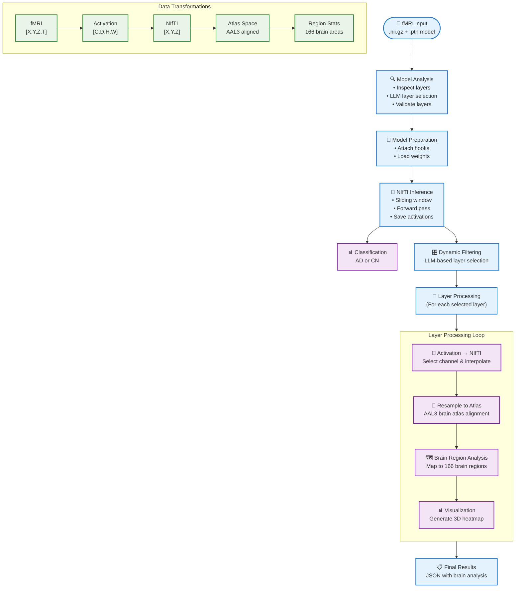

# Act-to-Brain Preprocessing Pipeline

This document describes the detailed preprocessing pipeline implemented in the `MapActBrainAgent` for fMRI Alzheimer's disease analysis.



## Core Pipeline Steps

### 🔍 Model Analysis
Combines model structure inspection, LLM-based layer selection, and validation:
- Analyzes CapsNet-RNN architecture using `torchsummary`
- LLM intelligently selects spatial feature layers (Conv3d, capsules)
- Validates layer existence to prevent runtime errors

### 🔧 Model Preparation
Prepares model for activation capture:
- Attaches forward hooks to selected layers
- Loads pre-trained weights and sets evaluation mode
- Configures optimal device (CUDA/MPS/CPU)

### 🧠 NIfTI Inference
Processes fMRI data through the neural network:
- **Input**: 4D fMRI [X, Y, Z, T] → sliding windows for temporal modeling
- **Processing**: Forward pass with activation capture via hooks
- **Output**: Classification result (AD/CN) + saved activation tensors

### 🎛️ Dynamic Filtering
LLM-based quality control:
- Analyzes activation statistics for each captured layer
- Selects most informative layers for further processing
- Removes layers with poor activation patterns

### 🔄 Layer Processing Loop
For each selected layer, sequential processing:

1. **🧩 Activation → NIfTI**: Select strongest channel, interpolate to fMRI dimensions
2. **🎯 Atlas Alignment**: Resample to AAL3 brain atlas coordinate system
3. **🗺️ Brain Mapping**: Map activations to 166 brain regions with statistics
4. **📊 Visualization**: Generate 3D brain heatmaps and save PNG outputs

## Data Transformation Flow

The pipeline transforms fMRI data through these key stages:

```
fMRI [X,Y,Z,T] → Sliding Windows → Neural Activations [C,D,H,W] → 
Strongest Channel [D,H,W] → Interpolated NIfTI [X,Y,Z] → 
AAL3 Atlas Space → 166 Brain Region Statistics → 3D Visualization
```

## Key Features

- **🤖 LLM-Guided Processing**: Intelligent layer selection and quality control
- **🧠 Neuroanatomical Mapping**: AAL3 atlas with 166 brain regions
- **⚡ Optimized Pipeline**: Sliding window + strongest channel selection
- **🎯 Clinical Focus**: AD/CN classification with explainable activations

## Technical Specs

- **Model**: CapsNet-RNN (3D Conv + Capsule layers)
- **Atlas**: AAL3v1 (166 regions, MNI space)
- **Processing**: Window=5, Stride=3, 99th percentile thresholding
- **Output**: JSON with classification, brain regions, and visualization paths
