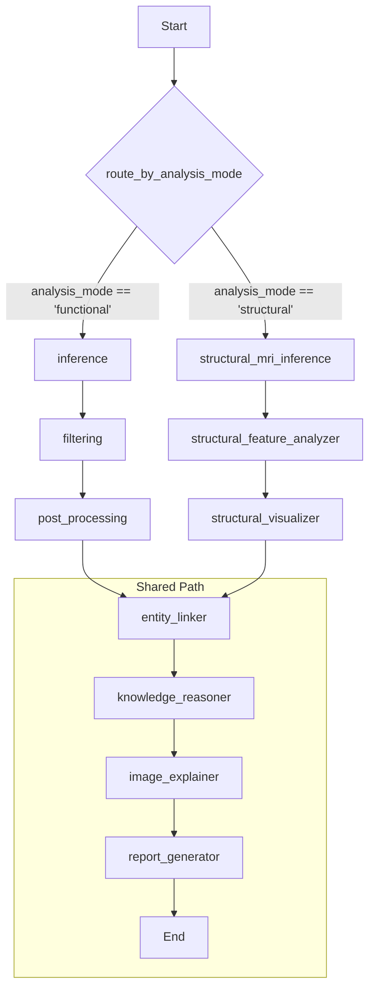

# 系統架構總覽 (System Overview)

## 1. 簡介

本文件旨在提供 Cognivex 分析框架的全面技術概覽。此系統是一個基於 Agent 的多模態分析平台，專為阿茲海默症（AD）的磁振造影（MRI）數據提供可解釋的臨床見解而設計。

系統的核心能力包括：
- **雙模態分析**: 同時支援功能性 MRI (fMRI) 和結構性 MRI (sMRI) 的獨立分析流程。
- **可解釋 AI (XAI)**: 透過深度學習和機器學習模型，結合 Grad-CAM、特徵重要性分析和知識圖譜，生成人類可理解的解釋。
- **自動化報告生成**: 利用大型語言模型 (LLM) 將複雜的分析結果轉化為結構化的中英文臨床報告。
- **模組化與可擴展性**: 基於 LangGraph 和微服務理念設計，易於擴展新的分析模組、模型和數據類型。

## 2. 核心技術棧

- **應用框架**:
  - **Streamlit**: 用於快速開發互動式 Web UI，作為主要的臨床儀表板展示介面。
  - **FastAPI**: 提供高效能的 RESTful API 服務，使分析功能可以被其他系統（如前端應用）以編程方式調用。

- **工作流程編排**:
  - **LangGraph**: 作為系統的神經中樞，用於定義、組織和執行由多個 Agent 組成的複雜分析工作流程。

- **AI / ML 模型**:
  - **PyTorch**: 用於深度學習模型（如 ShuffleNet, CapsNet）的訓練和推論。
  - **Scikit-learn**: 用於傳統機器學習模型（如 Random Forest）的訓練和推論。

- **數據處理與視覺化**:
  - **Nilearn**: 專為神經影像數據設計，用於 MRI 檔案的載入、處理、特徵提取和視覺化。
  - **Pandas / NumPy**: 進行數據操作和數值計算。

- **語言模型與知識圖譜**:
  - **LangChain**: 整合和管理對不同 LLM 供應商的呼叫。
  - **LLM Providers**: 模組化支援 AWS Bedrock, Google Gemini, Ollama 等。
  - **Neo4j**: 作為知識圖譜數據庫，儲存腦區、功能網絡和臨床知識之間的關聯，用於增強報告的深度。

## 3. 系統架構

本系統採用分層架構，將展示、編排、執行和服務等不同職責清晰地分離開來。

```mermaid
graph TD
    subgraph "Presentation Layer (展示層)"
        A[Streamlit UI] <--> C{FastAPI Backend}
    end

    subgraph "Orchestration Layer (編排層)"
        C --> D[LangGraph Workflow Engine]
    end

    subgraph "Agent Layer (執行層)"
        D --> E[fMRI Analysis Agents<br/>(Inference, Filtering, Post-processing...)]
        D --> F[sMRI Analysis Agents<br/>(Inference, Feature Analyzer, Visualizer...)]
        D --> G[Shared Agents<br/>(Entity Linker, Knowledge Reasoner, Report Generator...)]
    end

    subgraph "Service & Data Layer (服務與數據層)"
        E --> H[DL Models<br/>(PyTorch)]
        F --> I[ML Models<br/>(Scikit-learn)]
        G --> J[LLM Providers<br/>(Gemini, Bedrock)]
        G --> K[Knowledge Graph<br/>(Neo4j)]
        H & I & E & F --> L[MRI Data & Atlases<br/>(NIfTI, .pkl)]
    end

    A -- "User Interaction" --> C
    C -- "Start Analysis" --> D
    D -- "Route & Execute" --> E & F & G
    E & F & G -- "Process Data" --> H & I & J & K & L
```

### 3.1. 展示層 (Presentation Layer)

- **Streamlit UI (`app.py`)**:
  - 作為使用者與系統互動的主要入口。
  - 提供分析模式選擇（fMRI/sMRI）、受試者選擇、模型選擇等控制項。
  - 觸發後端分析流程，並以視覺化方式（圖表、指標、腦圖、報告）呈現最終結果。
  - 使用 `@st.cache_resource` 和 `@st.cache_data` 優化效能，避免重複載入模型和數據。

- **FastAPI Backend (`app/api/main.py`)**:
  - 將核心分析功能封裝成 API 端點。
  - 允許與現代前端框架（如 React, Vue）或其他後端服務進行整合。
  - 支援非同步操作和 WebSocket，可用於即時進度更新。

### 3.2. 編排層 (Orchestration Layer)

- **LangGraph Workflow (`app/graph/workflow.py`)**:
  - 系統的核心，定義了所有分析步驟的執行順序和依賴關係。
  - 使用 `AgentState` 作為統一的數據載體，在不同節點（Agent）之間傳遞資訊。
  - 包含一個關鍵的 **路由節點 (`route_by_analysis_mode`)**，它根據 `analysis_mode` 的值（`"functional"` 或 `"structural"`）將工作流程導向不同的分支。

### 3.3. 執行層 (Agent Layer)

每個 Agent 都是一個獨立的 Python 函式，負責執行一項具體的任務。

- **功能性 MRI (fMRI) Agents**:
  - `run_inference_and_classification`: 執行深度學習模型推論。
  - `filter_layers_dynamically`: 根據模型輸出篩選重要的神經網路層。
  - `run_post_processing`: 執行 Grad-CAM 等 XAI 算法，生成活化圖。

- **結構性 MRI (sMRI) Agents**:
  - `run_structural_mri_inference`: 執行機器學習模型（Random Forest）推論。
  - `analyze_feature_importance`: 分析模型的特徵重要性，找出關鍵腦區。
  - `generate_structural_visualizations`: 生成特徵重要性圖表和 3D 腦區視覺化。

- **共享 Agents (Shared Agents)**:
  - `link_entities`: 將分析出的腦區名稱標準化。
  - `enrich_with_knowledge_graph`: 連接 Neo4j 數據庫，查詢腦區的相關功能和臨床知識。
  - `explain_image`: 呼叫多模態 LLM 解釋視覺化圖像。
  - `generate_final_report`: 整合所有分析結果，呼叫 LLM 生成最終的中英文報告。

### 3.4. 服務與數據層 (Service & Data Layer)

- **LLM Providers (`app/services/llm_providers/`)**:
  - 一個抽象層，用於與不同的 LLM API 進行互動。`__init__.py` 作為分派器，根據配置選擇使用 Gemini、Bedrock 或 Ollama。
  - `bedrock.py` 包含自動清理 LLM 輸出的 JSON 格式的邏輯。

- **Neo4j Connector (`app/services/neo4j_connector.py`)**:
  - 提供與 Neo4j 圖數據庫的連接，供 `knowledge_reasoner` Agent 使用。

- **模型與數據**:
  - `model/`: 存放所有預訓練的深度學習和機器學習模型。
  - `data/`: 存放 fMRI 和 sMRI 的 NIfTI 格式數據，以及腦圖譜（Atlas）檔案。

## 4. 核心分析工作流程

系統包含兩個主要的、由路由節點控制的並行工作流程。



### 4.1. 功能性 MRI (fMRI) 流程

1.  **Inference**: 使用 PyTorch 深度學習模型（如 ShuffleNet）對 4D fMRI 數據進行分類預測。
2.  **Filtering & Post-processing**: 應用 Grad-CAM 等 XAI 技術，生成視覺化的腦部活化圖。
3.  **Entity Linker**: 從活化圖中識別出關鍵腦區。
4.  **Shared Path**: 進入共享流程，進行知識圖譜增強和報告生成。

### 4.2. 結構性 MRI (sMRI) 流程

1.  **Inference**: 使用 Scikit-learn 機器學習模型（如 Random Forest）對 3D T1 影像提取的 ROI 特徵進行分類預測。
2.  **Feature Analyzer**: 提取模型的 `feature_importances_`，對腦區按重要性進行排序。
3.  **Visualizer**: 根據特徵重要性生成圖表和 3D 腦圖視覺化。
4.  **Entity Linker**: 標準化重要腦區的名稱。
5.  **Shared Path**: 進入共享流程，進行知識圖譜增強和報告生成。

## 5. 關鍵數據結構

### AgentState (`app/graph/state.py`)

`AgentState` 是一個 `TypedDict`，作為整個工作流程的「數據總線」。它在所有 Agent 之間傳遞，並在每個步驟中被讀取和更新。

其主要欄位包括：
- **Inputs**: `subject_id`, `fmri_scan_path`, `model_name`, `analysis_mode` 等初始輸入。
- **Intermediate Data**: 節點之間傳遞的中間結果，如 `validated_layers`。
- **Final Outputs**: 最終的分析產出，如 `classification_result`, `activated_regions`, `visualization_paths`, `generated_reports`。
- **Structural MRI Specific Outputs**: sMRI 流程特有的輸出，如 `roi_features`, `feature_importances`, `prediction_confidence`。
- **System & Tracing**: `error_log` 和 `trace_log` 用於調試和監控。

這種設計使得數據流清晰可追蹤，並且易於擴展新的數據欄位。

## 6. 模型庫 (Model Zoo)

- **深度學習模型 (fMRI)**:
  - **ShuffleNet**: 高效的 2D CNN，用於處理 fMRI 的 2D 切片。
  - **CapsNet**: 3D 膠囊網絡，用於捕捉複雜的空間層次關係。
  - **MCADNNet**: 傳統的 2D CNN 架構。

- **機器學習模型 (sMRI)**:
  - **Random Forest**: 基於 32 個預選 ROI 特徵的集成學習模型，具有良好的可解釋性。

## 7. 未來擴展方向

- **多模態融合**: 設計新的 Agent，將 fMRI 和 sMRI 的分析結果結合起來，提供更全面的診斷建議。
- **縱向分析**: 支援對同一受試者不同時間點的掃描進行比較分析，以追蹤疾病進展。
- **模型版本管理**: 在 UI 和後端支援選擇不同版本的分析模型。
- **增強批次處理**: 優化 `batch_predict.py` 腳本，並將其整合到 FastAPI 中，以支援大規模數據處理。

---