# semantic-KG Agent Architecture

This document describes the multi-agent architecture for the fMRI Alzheimer's disease neuroimaging analysis pipeline.

```mermaid
graph TD
    %% Entry point
    User[("👤 User Input<br/>fMRI Data + Model")]
    
    %% Root agent
    Root["🧠 Root Agent<br/>fMRIAlzheimerPipeline<br/>(SequentialAgent)"]
    
    %% Sequential pipeline stages
    Stage1["📊 Stage 1: Brain Mapping"]
    Stage2["🔍 Stage 2: Parallel Analysis"]
    Stage3["📋 Stage 3: Report Generation"]
    
    %% Stage 1 - Brain mapping agent
    MapActBrain["🗺️ MapActBrainAgent<br/>(LlmAgent)<br/>- Model inspection & layer selection<br/>- Neural network inference<br/>- Activation analysis & brain mapping<br/>- Results storage & interpretation"]
    
    %% Stage 2 - Parallel agents
    ParallelAgent["⚡ ExplainParallelAgent<br/>(ParallelAgent)"]
    ImageExplain["🖼️ ImageExplainAgent<br/>(LlmAgent)<br/>- Activation map analysis<br/>- Medical interpretation<br/>- Brain region functions"]
    GraphRAG["🕸️ GraphRAGAgent<br/>(LlmAgent)<br/>- Entity linking<br/>- Knowledge graph querying<br/>- Network-level associations"]
    
    %% Stage 3 - Final report
    ReportGen["📄 ReportGeneratorAgent<br/>(LlmAgent)<br/>- Clinical report synthesis<br/>- Multi-stage result integration<br/>- Structured JSON output"]
    
    %% Tools and components
    PipelineTool["🛠️ Pipeline Tool<br/>- CapsNet-RNN model<br/>- Sliding window inference<br/>- AAL3 atlas mapping<br/>- Visualization generation"]
    
    ExplainTool["🔍 Explain Tool<br/>- Activation map analysis<br/>- Region-level interpretation<br/>- Clinical relevance assessment"]
    
    EntityLinker["🔗 Entity Linker Tool<br/>- Brain region name cleaning<br/>- Anatomical term standardization"]
    
    GraphRAGTool["📊 GraphRAG Tool<br/>- Neo4j knowledge graph<br/>- Brain-function-disease relationships<br/>- Network analysis"]
    
    %% Output components
    FinalReport["📋 Final Report<br/>(JSON Schema)<br/>- final_report_markdown<br/>- visualization_path"]
    
    %% Data flow connections
    User --> Root
    Root --> Stage1
    Stage1 --> MapActBrain
    MapActBrain --> PipelineTool
    
    MapActBrain --> Stage2
    Stage2 --> ParallelAgent
    ParallelAgent --> ImageExplain
    ParallelAgent --> GraphRAG
    
    ImageExplain --> ExplainTool
    GraphRAG --> EntityLinker
    GraphRAG --> GraphRAGTool
    
    ParallelAgent --> Stage3
    Stage3 --> ReportGen
    ReportGen --> FinalReport
    
    %% Supporting infrastructure
    subgraph "🏗️ Supporting Infrastructure"
        LLMClient["🤖 LLM Client<br/>(Gemini 2.5 Flash Lite)"]
        Neo4jClient["🗄️ Neo4j Client<br/>(Knowledge Graph)"]
        Utils["⚙️ Utils<br/>(Common functions)"]
    end
    
    %% Data sources and outputs
    subgraph "📁 Data & Models"
        NiiData["🧠 fMRI Data<br/>(.nii.gz files)"]
        Models["🔬 Pre-trained Models<br/>(CapsNet-RNN, MCADNNet)"]
        KnowledgeGraph["🕸️ Knowledge Graph<br/>(Brain-Function-Disease)"]
        Visualizations["📊 Visualizations<br/>(Heatmaps, Brain maps)"]
    end
    
    %% Connect infrastructure
    MapActBrain -.-> LLMClient
    ImageExplain -.-> LLMClient
    GraphRAG -.-> LLMClient
    GraphRAG -.-> Neo4jClient
    ReportGen -.-> LLMClient
    
    %% Connect data sources
    PipelineTool -.-> NiiData
    PipelineTool -.-> Models
    GraphRAGTool -.-> KnowledgeGraph
    PipelineTool -.-> Visualizations
    
    %% Styling
    classDef agentClass fill:#e1f5fe,stroke:#01579b,stroke-width:2px
    classDef toolClass fill:#f3e5f5,stroke:#4a148c,stroke-width:2px
    classDef dataClass fill:#e8f5e8,stroke:#1b5e20,stroke-width:2px
    classDef infraClass fill:#fff3e0,stroke:#e65100,stroke-width:2px
    classDef stageClass fill:#fff9c4,stroke:#f57f17,stroke-width:2px
    
    class Root,MapActBrain,ImageExplain,GraphRAG,ReportGen,ParallelAgent agentClass
    class PipelineTool,ExplainTool,EntityLinker,GraphRAGTool toolClass
    class NiiData,Models,KnowledgeGraph,Visualizations,FinalReport dataClass
    class LLMClient,Neo4jClient,Utils infraClass
    class Stage1,Stage2,Stage3 stageClass
```

## Pipeline Flow Description

### Sequential Processing Stages

1. **Stage 1 - Brain Mapping (`MapActBrainAgent`)**
   - Processes fMRI NIfTI data through deep learning models
   - Extracts neural network activations from selected layers
   - Maps activations to AAL3 brain atlas regions
   - Generates visualization heatmaps and clinical interpretations

2. **Stage 2 - Parallel Analysis (`ExplainParallelAgent`)**
   - **Image Explanation**: Analyzes activation maps for medical insights
   - **Graph RAG**: Queries knowledge graph for brain region functions and disease associations
   - Both sub-agents run in parallel for efficiency

3. **Stage 3 - Report Generation (`ReportGeneratorAgent`)**
   - Synthesizes results from all previous stages
   - Generates structured clinical report in JSON format
   - Includes both markdown report and visualization paths

### Key Features

- **Multi-Agent Coordination**: Uses Google ADK (Agent Development Kit) for orchestration
- **Parallel Processing**: Image analysis and knowledge graph querying run simultaneously
- **Knowledge Integration**: Combines neural network outputs with semantic brain knowledge
- **Clinical Focus**: Specifically designed for Alzheimer's disease detection and analysis
- **Scalable Architecture**: Modular design allows for easy extension and modification

### Technology Stack

- **Agent Framework**: Google ADK (Agent Development Kit)
- **LLM**: Gemini 2.5 Flash Lite for all agents
- **Knowledge Graph**: Neo4j for brain-function-disease relationships
- **Deep Learning**: PyTorch with CapsNet-RNN and MCADNNet architectures
- **Neuroimaging**: AAL3 brain atlas for anatomical mapping
